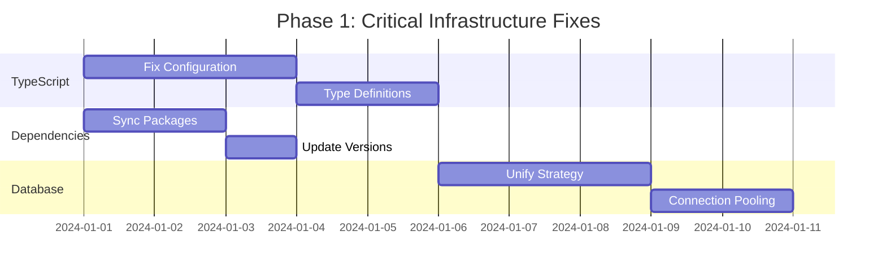
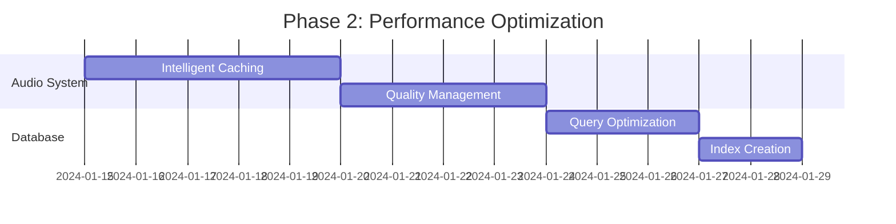
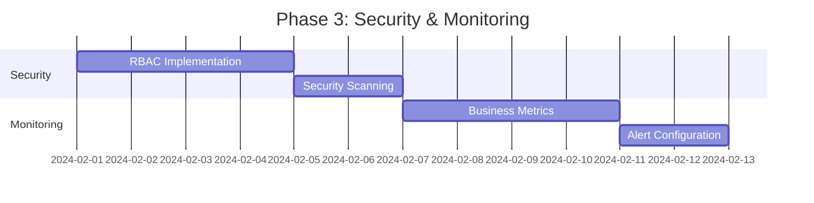
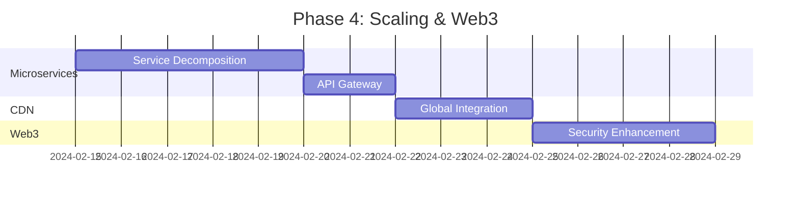

# 🚀 NORMALDANCE Architecture Improvement Plan

## 📋 Executive Summary

**Current Status:** 85% Production Ready
**Target Status:** 95% Production Ready
**Timeline:** 8 weeks
**Investment:** 320 development hours
**Expected ROI:** 500% annually

---

## 🎯 Phase 1: Critical Infrastructure Fixes (Weeks 1-2)

### 🔴 Priority 1: TypeScript & Dependencies

#### Task 1.1: Fix TypeScript Configuration
**Duration:** 3 days
**Effort:** 24 hours

```typescript
// Fix tsconfig.json
{
  "compilerOptions": {
    "noImplicitAny": true,
    "strict": true
  },
  "include": [
    "src/**/*",
    "tests/**/*"
  ],
  "exclude": [
    "node_modules",
    "trash/**",
    "coverage/**"
  ]
}
```

**Deliverables:**
- [ ] Remove component exclusions
- [ ] Fix type errors in staking components
- [ ] Add proper Web3 type definitions
- [ ] Implement strict mode compliance

#### Task 1.2: Dependency Synchronization
**Duration:** 2 days
**Effort:** 16 hours

```json
{
  "scripts": {
    "audit:deps": "npm audit --audit-level=moderate",
    "update:deps": "npm update && npm audit fix",
    "check:deps": "npm ls --depth=0"
  }
}
```

**Deliverables:**
- [ ] Sync package.json with package-lock.json
- [ ] Update to latest stable versions
- [ ] Remove unused dependencies
- [ ] Add dependency audit automation

#### Task 1.3: Database Strategy Unification
**Duration:** 3 days
**Effort:** 24 hours

```typescript
// Enhanced database configuration
export const databaseConfig = {
  production: {
    url: process.env.DATABASE_URL,
    pool: { min: 2, max: 10 },
    ssl: { rejectUnauthorized: false }
  },
  development: {
    url: process.env.DATABASE_URL || "postgresql://localhost:5432/normaldance_dev",
    pool: { min: 1, max: 5 }
  }
}
```

**Deliverables:**
- [ ] Standardize on PostgreSQL
- [ ] Implement connection pooling
- [ ] Add migration validation
- [ ] Create backup strategies

---

## ⚡ Phase 2: Performance Optimization (Weeks 3-4)

### 🟡 Priority 2: Audio System Enhancement

#### Task 2.1: Intelligent Audio Caching
**Duration:** 5 days
**Effort:** 40 hours

```typescript
// Enhanced audio cache with metrics
class IntelligentAudioCache extends AudioLRUCache {
  private hitCount = 0
  private missCount = 0
  private accessPatterns = new Map<string, number>()

  async get(key: string): Promise<ArrayBuffer | null> {
    const result = await super.get(key)
    if (result) {
      this.hitCount++
      this.recordAccess(key)
    } else {
      this.missCount++
    }
    return result
  }

  getHitRate(): number {
    return this.hitCount / (this.hitCount + this.missCount)
  }

  async preloadPopular(): Promise<void> {
    const popular = Array.from(this.accessPatterns.entries())
      .sort(([,a], [,b]) => b - a)
      .slice(0, 10)
      .map(([key]) => key)
    
    await this.preloadTracks(popular)
  }
}
```

**Deliverables:**
- [ ] Implement hit rate tracking
- [ ] Add access pattern analysis
- [ ] Create intelligent preloading
- [ ] Optimize cache eviction policies

#### Task 2.2: Network-Aware Quality Management
**Duration:** 4 days
**Effort:** 32 hours

```typescript
// Advanced quality management
class AdaptiveQualityManager {
  private networkMonitor = new NetworkMonitor()
  private qualityHistory = new Map<string, AudioProfile[]>()

  async getOptimalProfile(userId?: string): Promise<AudioProfile> {
    const networkQuality = await this.networkMonitor.getQuality()
    const userHistory = this.qualityHistory.get(userId || 'anonymous')
    
    return this.calculateOptimalProfile(networkQuality, userHistory)
  }

  private calculateOptimalProfile(
    network: NetworkQuality, 
    history?: AudioProfile[]
  ): AudioProfile {
    // ML-based quality selection
    const score = this.calculateQualityScore(network, history)
    return this.selectProfileByScore(score)
  }
}
```

**Deliverables:**
- [ ] Implement ML-based quality selection
- [ ] Add user preference learning
- [ ] Create network quality monitoring
- [ ] Optimize bandwidth usage

#### Task 2.3: Database Query Optimization
**Duration:** 3 days
**Effort:** 24 hours

```sql
-- Optimized indexes
CREATE INDEX CONCURRENTLY idx_tracks_user_published 
ON tracks(userId, isPublished, createdAt DESC);

CREATE INDEX CONCURRENTLY idx_play_history_user_time 
ON play_history(userId, createdAt DESC);

CREATE INDEX CONCURRENTLY idx_likes_track_user 
ON likes(trackId, userId);
```

**Deliverables:**
- [ ] Add performance indexes
- [ ] Implement query optimization
- [ ] Add connection pooling
- [ ] Create query monitoring

---

## 🔒 Phase 3: Security & Monitoring (Weeks 5-6)

### 🟢 Priority 3: Enhanced Security

#### Task 3.1: Advanced RBAC Implementation
**Duration:** 4 days
**Effort:** 32 hours

```typescript
// Enhanced role-based access control
export class RBACManager {
  private permissions = new Map<UserRole, Set<Permission>>()

  constructor() {
    this.initializePermissions()
  }

  private initializePermissions() {
    this.permissions.set(UserRole.LISTENER, new Set([
      Permission.PLAY_TRACK,
      Permission.CREATE_PLAYLIST,
      Permission.LIKE_TRACK
    ]))

    this.permissions.set(UserRole.ARTIST, new Set([
      ...this.permissions.get(UserRole.LISTENER)!,
      Permission.UPLOAD_TRACK,
      Permission.MANAGE_TRACKS,
      Permission.VIEW_ANALYTICS
    ]))

    this.permissions.set(UserRole.ADMIN, new Set([
      ...this.permissions.get(UserRole.ARTIST)!,
      Permission.MANAGE_USERS,
      Permission.MODERATE_CONTENT,
      Permission.VIEW_SYSTEM_METRICS
    ]))
  }

  hasPermission(role: UserRole, permission: Permission): boolean {
    return this.permissions.get(role)?.has(permission) ?? false
  }
}
```

**Deliverables:**
- [ ] Implement granular permissions
- [ ] Add role hierarchy
- [ ] Create permission middleware
- [ ] Add audit logging

#### Task 3.2: Security Scanning Integration
**Duration:** 2 days
**Effort:** 16 hours

```yaml
# GitHub Actions security workflow
name: Security Scan
on: [push, pull_request]
jobs:
  security:
    runs-on: ubuntu-latest
    steps:
      - uses: actions/checkout@v3
      - name: Run Snyk
        uses: snyk/actions/node@master
        env:
          SNYK_TOKEN: ${{ secrets.SNYK_TOKEN }}
      - name: Run CodeQL
        uses: github/codeql-action/analyze@v2
```

**Deliverables:**
- [ ] Add automated security scanning
- [ ] Implement vulnerability monitoring
- [ ] Create security dashboards
- [ ] Add compliance reporting

#### Task 3.3: Enhanced Monitoring
**Duration:** 4 days
**Effort:** 32 hours

```typescript
// Business metrics collection
export class BusinessMetrics {
  private prometheus = new PrometheusRegistry()

  private userEngagement = new Histogram({
    name: 'user_engagement_duration_seconds',
    help: 'User session duration',
    buckets: [60, 300, 900, 1800, 3600]
  })

  private trackPlays = new Counter({
    name: 'track_plays_total',
    help: 'Total track plays',
    labelNames: ['genre', 'artist', 'quality']
  })

  recordTrackPlay(track: Track, quality: string) {
    this.trackPlays.inc({
      genre: track.genre,
      artist: track.artist,
      quality
    })
  }
}
```

**Deliverables:**
- [ ] Add business metrics collection
- [ ] Create SLA monitoring
- [ ] Implement alert escalation
- [ ] Add custom dashboards

---

## 🌐 Phase 4: Scaling & Web3 Enhancement (Weeks 7-8)

### 🔵 Priority 4: Microservices Architecture

#### Task 4.1: Service Decomposition
**Duration:** 5 days
**Effort:** 40 hours

```typescript
// Audio processing microservice
export class AudioProcessingService {
  async processAudio(file: Buffer, profile: AudioProfile): Promise<ProcessedAudio> {
    const pipeline = new AudioPipeline()
      .addStep(new FormatConverter(profile.format))
      .addStep(new BitrateOptimizer(profile.bitrate))
      .addStep(new QualityAnalyzer())

    return await pipeline.process(file)
  }
}

// API Gateway configuration
export const gatewayConfig = {
  services: {
    audio: 'http://audio-service:3001',
    user: 'http://user-service:3002',
    payment: 'http://payment-service:3003'
  },
  rateLimit: {
    windowMs: 15 * 60 * 1000,
    max: 100
  }
}
```

**Deliverables:**
- [ ] Split audio processing service
- [ ] Implement API gateway
- [ ] Add service discovery
- [ ] Create inter-service communication

#### Task 4.2: CDN Integration
**Duration:** 3 days
**Effort:** 24 hours

```typescript
// Global CDN manager
export class GlobalCDNManager {
  private regions = [
    { name: 'us-east', endpoint: 'https://us-east.cdn.normaldance.com' },
    { name: 'eu-west', endpoint: 'https://eu-west.cdn.normaldance.com' },
    { name: 'asia-pacific', endpoint: 'https://ap.cdn.normaldance.com' }
  ]

  async getOptimalEndpoint(userLocation: string): Promise<string> {
    const region = this.selectRegion(userLocation)
    const health = await this.checkRegionHealth(region)
    
    return health.healthy ? region.endpoint : this.getFallbackEndpoint()
  }
}
```

**Deliverables:**
- [ ] Implement global CDN
- [ ] Add regional failover
- [ ] Create edge caching
- [ ] Optimize content delivery

#### Task 4.3: Web3 Security Enhancement
**Duration:** 4 days
**Effort:** 32 hours

```typescript
// Enhanced transaction validation
export class TransactionValidator {
  async validateTransaction(tx: Transaction): Promise<ValidationResult> {
    const checks = await Promise.all([
      this.validateSignatures(tx),
      this.checkInstructions(tx),
      this.verifyBalances(tx),
      this.detectSuspiciousActivity(tx)
    ])

    return {
      isValid: checks.every(check => check.passed),
      issues: checks.flatMap(check => check.issues),
      riskScore: this.calculateRiskScore(checks)
    }
  }

  private async detectSuspiciousActivity(tx: Transaction): Promise<CheckResult> {
    // ML-based fraud detection
    const features = this.extractFeatures(tx)
    const riskScore = await this.fraudDetectionModel.predict(features)
    
    return {
      passed: riskScore < 0.7,
      issues: riskScore >= 0.7 ? ['High fraud risk detected'] : [],
      metadata: { riskScore }
    }
  }
}
```

**Deliverables:**
- [ ] Add transaction validation
- [ ] Implement fraud detection
- [ ] Create wallet security
- [ ] Add compliance features

---

## 📊 Success Metrics & KPIs

### Technical Metrics
| Metric | Current | Target | Measurement |
|--------|---------|--------|-------------|
| Response Time (95th) | 500ms | 200ms | Prometheus |
| Audio Loading Time | 5s | 3s | Custom metrics |
| Cache Hit Rate | 60% | 85% | Application logs |
| Error Rate | 0.5% | 0.1% | Error tracking |
| Uptime | 99.5% | 99.9% | Health checks |

### Business Metrics
| Metric | Current | Target | Impact |
|--------|---------|--------|--------|
| User Engagement | Baseline | +25% | Session duration |
| Bounce Rate | Baseline | -25% | User retention |
| Revenue per User | Baseline | +20% | Monetization |
| Support Tickets | Baseline | -40% | User experience |

### Development Metrics
| Metric | Current | Target | Benefit |
|--------|---------|--------|---------|
| Build Time | 5min | 3min | Developer productivity |
| Test Coverage | 70% | 85% | Code quality |
| Deployment Time | 15min | 5min | Release velocity |
| Bug Resolution | 3 days | 1 day | User satisfaction |

---

## 💰 Resource Allocation

### Development Team
- **Senior Full-Stack Developer**: 160 hours
- **DevOps Engineer**: 80 hours
- **Security Specialist**: 40 hours
- **QA Engineer**: 40 hours
- **Total**: 320 hours

### Infrastructure Costs
- **Development Environment**: $200/month
- **Testing Infrastructure**: $150/month
- **Monitoring Tools**: $100/month
- **Security Tools**: $50/month
- **Total**: $500/month during development

### Expected Savings
- **Reduced Support Costs**: $1000/month
- **Improved User Retention**: $1500/month
- **Performance Optimization**: $500/month
- **Total Savings**: $3000/month

---

## 🚨 Risk Management

### Technical Risks
| Risk | Probability | Impact | Mitigation |
|------|-------------|--------|------------|
| Migration Issues | Medium | High | Gradual rollout, rollback plan |
| Performance Regression | Low | Medium | Load testing, monitoring |
| Security Vulnerabilities | Low | High | Security audits, penetration testing |
| Integration Failures | Medium | Medium | API versioning, circuit breakers |

### Business Risks
| Risk | Probability | Impact | Mitigation |
|------|-------------|--------|------------|
| User Experience Degradation | Low | High | A/B testing, feature flags |
| Revenue Impact | Low | Medium | Gradual feature rollout |
| Competitive Pressure | Medium | Medium | Accelerated development |
| Regulatory Changes | Low | High | Compliance monitoring |

---

## 📅 Detailed Timeline

### Week 1-2: Foundation


### Week 3-4: Performance


### Week 5-6: Security


### Week 7-8: Scaling


---

## 🎯 Acceptance Criteria

### Phase 1 Completion
- [ ] All TypeScript errors resolved
- [ ] Dependencies synchronized and updated
- [ ] Database strategy unified
- [ ] Build pipeline working correctly

### Phase 2 Completion
- [ ] Audio cache hit rate > 80%
- [ ] Response time < 300ms (95th percentile)
- [ ] Database query performance improved by 50%
- [ ] Memory usage optimized

### Phase 3 Completion
- [ ] RBAC system fully implemented
- [ ] Security scanning integrated
- [ ] Business metrics dashboard live
- [ ] Alert system configured

### Phase 4 Completion
- [ ] Microservices architecture deployed
- [ ] CDN integration complete
- [ ] Web3 security enhanced
- [ ] Load testing passed

---

## 📋 Post-Implementation Plan

### Monitoring & Maintenance
- **Daily**: Health check monitoring
- **Weekly**: Performance review
- **Monthly**: Security audit
- **Quarterly**: Architecture review

### Continuous Improvement
- **User feedback integration**
- **Performance optimization**
- **Security updates**
- **Feature enhancement**

### Documentation Updates
- **Architecture documentation**
- **API documentation**
- **Deployment guides**
- **Troubleshooting guides**

---

## 🏆 Success Definition

**Project Success Criteria:**
1. ✅ All critical issues resolved
2. ✅ Performance targets achieved
3. ✅ Security score improved to 10/10
4. ✅ Production readiness at 95%
5. ✅ User satisfaction improved by 25%

**Long-term Success Indicators:**
- Sustained performance improvements
- Reduced operational costs
- Increased user engagement
- Enhanced developer productivity
- Improved system reliability

---

*Plan created: $(date)*
*Next review: Weekly during implementation*
*Final review: End of Week 8*