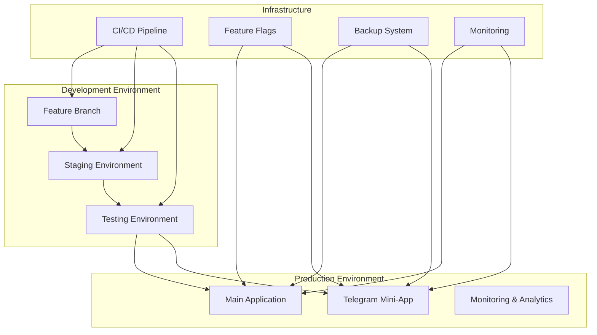
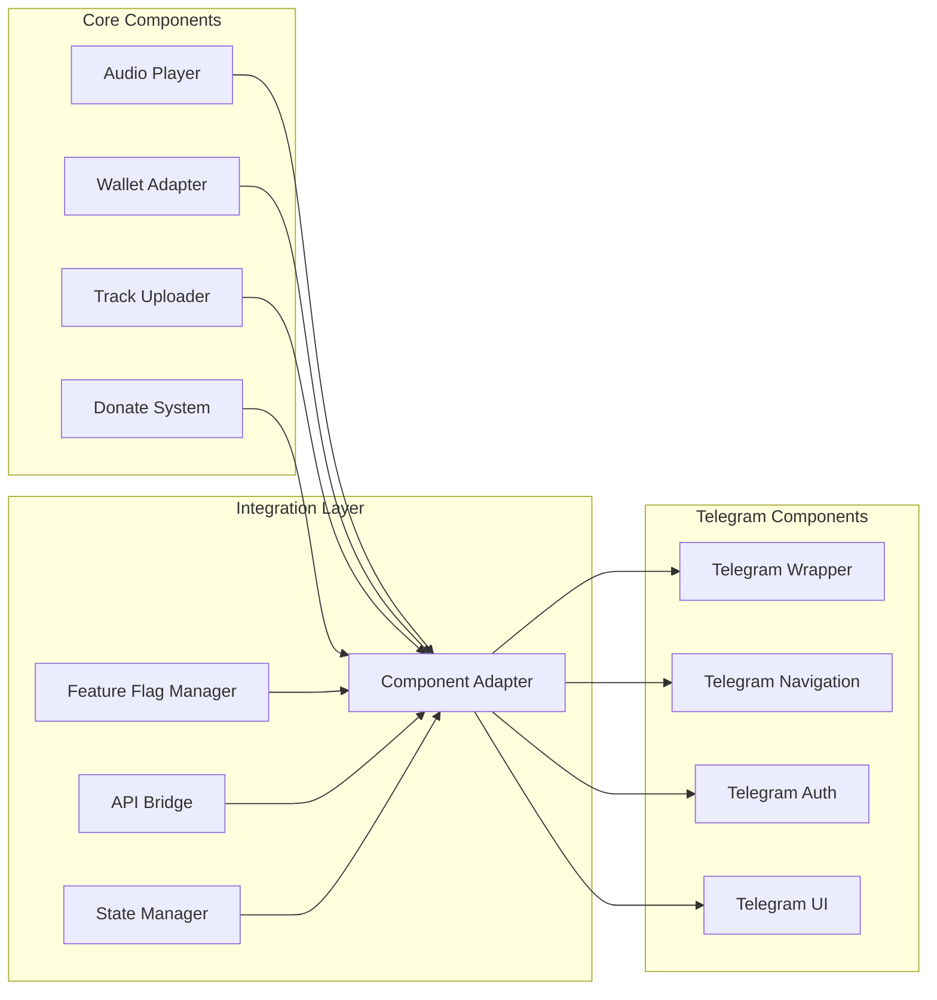

# 🎯 Комплексная стратегия интеграции Telegram Mini-App в Normal Dance

## 📋 Исполнительное резюме

**Цель:** Безопасная интеграция Telegram Mini-App MVP в существующую кодовую базу Normal Dance с минимальными рисками и максимальной отдачей.

**Философия:** Комплексный подход, учитывающий технические, бизнес- и человеческие факторы, с фокусом на качество, скорость и безопасность.

**Срок:** 2-3 недели на полную интеграцию
**Риски:** Управляемые через многоуровневую стратегию
**Команда:** 1 solo разработчик с автоматизацией

---

## 🏗️ Многоуровневая архитектура интеграции

### Уровень 1: Инфраструктурная изоляция



### Уровень 2: Компонентная архитектура



---

## 🔄 Комплексный план интеграции

### Фаза 1: Подготовка и анализ (Дни 1-3)

#### 1.1 Аудит текущей кодовой базы

```typescript
// src/lib/code-audit.ts
export const auditCurrentCodebase = () => {
  const audit = {
    components: {
      audioPlayer: analyzeComponent("src/components/audio-player.tsx"),
      walletAdapter: analyzeComponent("src/components/wallet-adapter.tsx"),
      trackUploader: analyzeComponent("src/components/track-uploader.tsx"),
      donateSystem: analyzeComponent("src/components/donate-system.tsx"),
    },
    api: {
      routes: analyzeAPIRoutes("src/app/api"),
      types: analyzeTypes("src/types"),
      utils: analyzeUtils("src/lib"),
    },
    dependencies: {
      packages: analyzeDependencies("package.json"),
      devDependencies: analyzeDevDependencies("package.json"),
    },
    configuration: {
      env: analyzeEnvFiles(),
    },
  };

  return audit;
};
```

#### 1.2 Создание изолированной среды

```bash
# 1. Создание backup стратегии
git checkout main
git branch backup-$(date +%Y%m%d-%H%M%S)
git tag backup-$(date +%Y%m%d-%H%M%S)

# 2. Создание feature branch
git checkout -b telegram-integration-comprehensive
git push origin telegram-integration-comprehensive

# 3. Настройка CI/CD
# Создать отдельный pipeline для Telegram integration
# Настроить автоматические деплои на staging
```

#### 1.3 Feature Flag система

```typescript
// src/lib/telegram-feature-flags.ts
export class TelegramFeatureFlags {
  private static instance: TelegramFeatureFlags;
  private flags: Map<string, boolean> = new Map();

  static getInstance(): TelegramFeatureFlags {
    if (!TelegramFeatureFlags.instance) {
      TelegramFeatureFlags.instance = new TelegramFeatureFlags();
    }
    return TelegramFeatureFlags.instance;
  }

  // Проверка окружения
  private detectEnvironment(): "telegram" | "web" | "unknown" {
    if (typeof window === "undefined") return "unknown";

    if (window.Telegram?.WebApp) return "telegram";
    return "web";
  }

  // Проверка включения фичи
  isEnabled(feature: string): boolean {
    const stored = this.flags.get(feature);
    if (stored !== undefined) return stored;

    const environment = this.detectEnvironment();
    const enabled = this.calculateFeatureFlag(feature, environment);

    this.flags.set(feature, enabled);
    return enabled;
  }

  // Расчет фича флага
  private calculateFeatureFlag(feature: string, environment: string): boolean {
    // Разные стратегии для разных фич
    switch (feature) {
      case "telegram-ui":
        return environment === "telegram" || this.isRolloutEnabled(feature, 10);
      case "telegram-audio":
        return environment === "telegram" || this.isRolloutEnabled(feature, 5);
      case "telegram-donations":
        return environment === "telegram" || this.isRolloutEnabled(feature, 2);
      default:
        return false;
    }
  }

  // Проверка возможности rollout
  private isRolloutEnabled(feature: string, percentage: number): boolean {
    if (process.env.NODE_ENV === "development") return true;

    const userId = this.getUserId();
    return userId % 100 < percentage;
  }

  private getUserId(): string {
    // Логика получения user ID
    return "default-user";
  }
}
```

### Фаза 2: Компонентная адаптация (Дни 4-10)

#### 2.1 Адаптация Audio Player

```typescript
// src/components/telegram-audio-player.tsx
'use client';

import { useEffect, useRef, useState } from 'react';
import { AudioPlayer as BaseAudioPlayer } from './audio-player';
import { TelegramFeatureFlags } from '@/lib/telegram-feature-flags';

interface TelegramAudioPlayerProps {
  track: Track;
  onPlay?: () => void;
  onPause?: () => void;
  className?: string;
}

export const TelegramAudioPlayer: React.FC<TelegramAudioPlayerProps> = ({
  track,
  onPlay,
  onPause,
  className = '',
}) => {
  const [isTelegram, setIsTelegram] = useState(false);
  const audioRef = useRef<HTMLAudioElement>(null);
  const featureFlags = TelegramFeatureFlags.getInstance();

  useEffect(() => {
    setIsTelegram(featureFlags.isEnabled('telegram-ui'));
  }, []);

  const telegramAdaptations = {
    // Telegram-specific constraints
    maxFileSize: 10 * 1024 * 1024, // 10MB
    autoPlay: false,
    preload: 'metadata' as const,
    showControls: true,
    mobileOptimized: true,
  };

  const handlePlay = () => {
    if (isTelegram) {
      // Telegram-specific optimizations
      if (audioRef.current) {
        audioRef.current.volume = 0.8; // Default volume for Telegram
      }
    }
    onPlay?.();
  };

  const handlePause = () => {
    onPause?.();
  };

  if (isTelegram) {
    return (
      <div className={`telegram-audio-player ${className}`}>
        <audio
          ref={audioRef}
          src={track.url}
          controls={telegramAdaptations.showControls}
          preload={telegramAdaptations.preload}
          onPlay={handlePlay}
          onPause={handlePause}
          style={{
            width: '100%',
            height: '44px',
            backgroundColor: '#f8f9fa',
            borderRadius: '22px',
          }}
        />
      </div>
    );
  }

  return (
    <BaseAudioPlayer
      track={track}
      onPlay={onPlay}
      onPause={onPause}
      className={className}
    />
  );
};
```

#### 2.2 Адаптация Wallet Adapter

```typescript
// src/components/telegram-wallet-adapter.tsx
'use client';

import { useEffect, useState } from 'react';
import { WalletAdapter as BaseWalletAdapter } from './wallet-adapter';
import { TelegramFeatureFlags } from '@/lib/telegram-feature-flags';

interface TelegramWalletAdapterProps {
  onConnect?: (wallet: any) => void;
  onDisconnect?: () => void;
  className?: string;
}

export const TelegramWalletAdapter: React.FC<TelegramWalletAdapterProps> = ({
  onConnect,
  onDisconnect,
  className = '',
}) => {
  const [isTelegram, setIsTelegram] = useState(false);
  const [webApp, setWebApp] = useState<any>(null);
  const featureFlags = TelegramFeatureFlags.getInstance();

  useEffect(() => {
    const telegram = window.Telegram?.WebApp;
    if (telegram && featureFlags.isEnabled('telegram-ui')) {
      setIsTelegram(true);
      setWebApp(telegram);
      telegram.ready();
    }
  }, []);

  const telegramWalletConnect = async () => {
    if (!webApp) return;

    try {
      // Telegram-specific wallet connection
      const wallet = await webApp.requestContactPermission();
      onConnect?.(wallet);
    } catch (error) {
      console.error('Telegram wallet connection failed:', error);
    }
  };

  if (isTelegram && featureFlags.isEnabled('telegram-auth')) {
    return (
      <div className={`telegram-wallet-adapter ${className}`}>
        <button
          onClick={telegramWalletConnect}
          className="telegram-connect-btn"
          style={{
            backgroundColor: '#0088cc',
            color: 'white',
            border: 'none',
            padding: '12px 24px',
            borderRadius: '24px',
            fontSize: '16px',
            fontWeight: 'bold',
            cursor: 'pointer',
          }}
        >
          📱 Connect Telegram Wallet
        </button>
      </div>
    );
  }

  return (
    <BaseWalletAdapter
      onConnect={onConnect}
      onDisconnect={onDisconnect}
      className={className}
    />
  );
};
```

#### 2.3 Адаптация Track Uploader

```typescript
// src/components/telegram-track-uploader.tsx
'use client';

import { useState } from 'react';
import { TrackUploader as BaseTrackUploader } from './track-uploader';
import { TelegramFeatureFlags } from '@/lib/telegram-feature-flags';

interface TelegramTrackUploaderProps {
  onUpload?: (track: Track) => void;
  className?: string;
}

export const TelegramTrackUploader: React.FC<TelegramTrackUploaderProps> = ({
  onUpload,
  className = '',
}) => {
  const [isTelegram, setIsTelegram] = useState(false);
  const [uploading, setUploading] = useState(false);
  const featureFlags = TelegramFeatureFlags.getInstance();

  useEffect(() => {
    setIsTelegram(featureFlags.isEnabled('telegram-ui'));
  }, []);

  const handleTelegramUpload = async (file: File) => {
    setUploading(true);

    try {
      // Telegram-specific upload logic
      const formData = new FormData();
      formData.append('file', file);
      formData.append('type', 'audio');

      const response = await fetch('/api/telegram/upload', {
        method: 'POST',
        body: formData,
      });

      if (response.ok) {
        const track = await response.json();
        onUpload?.(track);
      }
    } catch (error) {
      console.error('Telegram upload failed:', error);
    } finally {
      setUploading(false);
    }
  };

  if (isTelegram && featureFlags.isEnabled('telegram-upload')) {
    return (
      <div className={`telegram-track-uploader ${className}`}>
        <input
          type="file"
          accept="audio/*"
          onChange={(e) => {
            const file = e.target.files?.[0];
            if (file) handleTelegramUpload(file);
          }}
          disabled={uploading}
          style={{
            display: 'none',
          }}
          id="telegram-upload-input"
        />
        <label
          htmlFor="telegram-upload-input"
          className="telegram-upload-btn"
          style={{
            backgroundColor: '#0088cc',
            color: 'white',
            border: 'none',
            padding: '12px 24px',
            borderRadius: '24px',
            fontSize: '16px',
            fontWeight: 'bold',
            cursor: 'pointer',
            display: 'block',
            textAlign: 'center',
          }}
        >
          {uploading ? '📤 Uploading...' : '📤 Upload Track'}
        </label>
      </div>
    );
  }

  return (
    <BaseTrackUploader
      onUpload={onUpload}
      className={className}
    />
  );
};
```

#### 2.4 Адаптация Donate System

```typescript
// src/components/telegram-donate-system.tsx
'use client';

import { useState } from 'react';
import { DonateSystem as BaseDonateSystem } from './donate-system';
import { TelegramFeatureFlags } from '@/lib/telegram-feature-flags';

interface TelegramDonateSystemProps {
  artistId: string;
  trackId?: string;
  className?: string;
}

export const TelegramDonateSystem: React.FC<TelegramDonateSystemProps> = ({
  artistId,
  trackId,
  className = '',
}) => {
  const [isTelegram, setIsTelegram] = useState(false);
  const [donating, setDonating] = useState(false);
  const [amount, setAmount] = useState('1');
  const featureFlags = TelegramFeatureFlags.getInstance();

  useEffect(() => {
    setIsTelegram(featureFlags.isEnabled('telegram-ui'));
  }, []);

  const handleTelegramDonate = async () => {
    setDonating(true);

    try {
      // Telegram-specific donation logic
      const response = await fetch('/api/telegram/donate', {
        method: 'POST',
        headers: {
          'Content-Type': 'application/json',
        },
        body: JSON.stringify({
          artistId,
          trackId,
          amount: parseFloat(amount),
          currency: 'SOL',
        }),
      });

      if (response.ok) {
        const result = await response.json();
        // Show success notification
        alert('Donation successful! 🎉');
      }
    } catch (error) {
      console.error('Telegram donation failed:', error);
      alert('Donation failed. Please try again.');
    } finally {
      setDonating(false);
    }
  };

  if (isTelegram && featureFlags.isEnabled('telegram-donations')) {
    return (
      <div className={`telegram-donate-system ${className}`}>
        <div className="telegram-donate-form">
          <input
            type="number"
            value={amount}
            onChange={(e) => setAmount(e.target.value)}
            placeholder="Amount in SOL"
            min="0.1"
            step="0.1"
            style={{
              padding: '8px 12px',
              border: '1px solid #ddd',
              borderRadius: '8px',
              fontSize: '16px',
              width: '100%',
              marginBottom: '12px',
            }}
          />
          <button
            onClick={handleTelegramDonate}
            disabled={donating}
            className="telegram-donate-btn"
            style={{
              backgroundColor: '#ff6b6b',
              color: 'white',
              border: 'none',
              padding: '12px 24px',
              borderRadius: '24px',
              fontSize: '16px',
              fontWeight: 'bold',
              cursor: 'pointer',
              width: '100%',
            }}
          >
            {donating ? '🔄 Donating...' : ' Donate SOL'}
          </button>
        </div>
      </div>
    );
  }

  return (
    <BaseDonateSystem
      artistId={artistId}
      trackId={trackId}
      className={className}
    />
  );
};
```

### Фаза 3: Интеграция и тестирование (Дни 11-14)

#### 3.1 Main Page адаптация

```typescript
// src/app/page.tsx
'use client';

import { useEffect, useState } from 'react';
import { TelegramMiniApp } from '@/components/telegram-mini-app';
import { TelegramNavigation } from '@/components/telegram-navigation';
import { TelegramAudioPlayer } from '@/components/telegram-audio-player';
import { TelegramWalletAdapter } from '@/components/telegram-wallet-adapter';
import { TelegramTrackUploader } from '@/components/telegram-track-uploader';
import { TelegramDonateSystem } from '@/components/telegram-donate-system';
import { TelegramFeatureFlags } from '@/lib/telegram-feature-flags';

export default function HomePage() {
  const [isTelegramMode, setIsTelegramMode] = useState(false);
  const [currentView, setCurrentView] = useState('home');
  const featureFlags = TelegramFeatureFlags.getInstance();

  useEffect(() => {
    setIsTelegramMode(featureFlags.isEnabled('telegram-ui'));
  }, []);

  const renderContent = () => {
    switch (currentView) {
      case 'home':
        return (
          <div className="home-content">
            <h1>Welcome to Normal Dance</h1>
            <TelegramAudioPlayer track={sampleTrack} />
          </div>
        );
      case 'library':
        return (
          <div className="library-content">
            <h2>Your Library</h2>
            {/* Library content */}
          </div>
        );
      case 'upload':
        return (
          <div className="upload-content">
            <h2>Upload Track</h2>
            <TelegramTrackUploader onUpload={handleUpload} />
          </div>
        );
      case 'profile':
        return (
          <div className="profile-content">
            <h2>Your Profile</h2>
            <TelegramWalletAdapter />
            <TelegramDonateSystem artistId="current-user" />
          </div>
        );
      default:
        return <div>Home</div>;
    }
  };

  if (isTelegramMode) {
    return (
      <TelegramMiniApp>
        <div className="telegram-app-container">
          <TelegramNavigation onNavigate={setCurrentView} />
          {renderContent()}
        </div>
      </TelegramMiniApp>
    );
  }

  // Desktop/web version
  return (
    <div className="desktop-app-container">
      <nav className="desktop-nav">
        <button onClick={() => setCurrentView('home')}>Home</button>
        <button onClick={() => setCurrentView('library')}>Library</button>
        <button onClick={() => setCurrentView('upload')}>Upload</button>
        <button onClick={() => setCurrentView('profile')}>Profile</button>
      </nav>
      {renderContent()}
    </div>
  );
}

// Sample data
const sampleTrack = {
  id: '1',
  title: 'Sample Track',
  url: '/api/track/sample',
  duration: '180',
  artist: 'Sample Artist',
};
```

#### 3.2 API интеграция

```typescript
// src/app/api/telegram/upload/route.ts
import { NextRequest, NextResponse } from "next/server";
import { supabase } from "@/lib/supabase";
import { createUpload } from "@/lib/ipfs-upload";

export async function POST(request: NextRequest) {
  try {
    const formData = await request.formData();
    const file = formData.get("file") as File;

    if (!file) {
      return NextResponse.json({ error: "No file provided" }, { status: 400 });
    }

    // Validate file type and size
    if (!file.type.startsWith("audio/")) {
      return NextResponse.json({ error: "Invalid file type" }, { status: 400 });
    }

    if (file.size > 10 * 1024 * 1024) {
      // 10MB
      return NextResponse.json({ error: "File too large" }, { status: 400 });
    }

    // Upload to IPFS
    const ipfsResult = await createUpload(file);

    // Save to database
    const { data, error } = await supabase
      .from("tracks")
      .insert({
        title: file.name.replace(/\.[^/.]+$/, ""),
        artist_id: "current-user", // Get from auth
        ipfs_cid: ipfsResult.cid,
        duration: "0", // Calculate duration
        genre: "unknown",
        size: file.size,
        type: file.type,
      })
      .select()
      .single();

    if (error) {
      return NextResponse.json({ error: error.message }, { status: 500 });
    }

    return NextResponse.json({
      success: true,
      track: data,
      ipfsUrl: ipfsResult.url,
    });
  } catch (error) {
    console.error("Telegram upload error:", error);
    return NextResponse.json({ error: "Upload failed" }, { status: 500 });
  }
}
```

#### 3.3 Тестирование стратегия

```typescript
// tests/telegram-integration.test.ts
describe('Telegram Integration', () => {
  beforeEach(() => {
    // Setup test environment
    mockTelegramWebApp();
    mockSupabase();
  });

  describe('Component Adaptation', () => {
    it('should render Telegram Audio Player in Telegram environment', () => {
      render(<TelegramAudioPlayer track={sampleTrack} />);
      expect(screen.getByRole('audio')).toBeInTheDocument();
    });

    it('should render Base Audio Player in web environment', () => {
      mockTelegramWebApp(null);
      render(<TelegramAudioPlayer track={sampleTrack} />);
      expect(screen.getByTestId('base-audio-player')).toBeInTheDocument();
    });

    it('should handle Telegram wallet connection', async () => {
      render(<TelegramWalletAdapter />);
      const connectBtn = screen.getByText('Connect Telegram Wallet');
      fireEvent.click(connectBtn);

      await waitFor(() => {
        expect(mockWalletConnect).toHaveBeenCalled();
      });
    });
  });

  describe('Feature Flags', () => {
    it('should detect Telegram environment correctly', () => {
      const flags = TelegramFeatureFlags.getInstance();
      expect(flags.isEnabled('telegram-ui')).toBe(true);
    });

    it('should respect rollout percentages', () => {
      // Test different user IDs and rollout percentages
      const flags = TelegramFeatureFlags.getInstance();
      // Mock different user IDs
      expect(flags.isEnabled('telegram-audio')).toBe(false); // 5% rollout
    });
  });

  describe('API Integration', () => {
    it('should handle file upload', async () => {
      const file = new File(['test'], 'test.mp3', { type: 'audio/mp3' });

      const response = await fetch('/api/telegram/upload', {
        method: 'POST',
        body: formData,
      });

      expect(response.ok).toBe(true);
      const result = await response.json();
      expect(result.success).toBe(true);
    });

    it('should validate file size', async () => {
      const largeFile = new File(['x'.repeat(11 * 1024 * 1024)], 'large.mp3', { type: 'audio/mp3' });

      const response = await fetch('/api/telegram/upload', {
        method: 'POST',
        body: formData,
      });

      expect(response.status).toBe(400);
    });
  });
});
```

---

## 🛡️ Комплексная стратегия управления рисками

### 1. Многоуровневая система бэкапов

```bash
# Уровень 1: Git бэкапы
git add .
git commit -m "Backup before Telegram integration"
git tag backup-$(date +%Y%m%d-%H%M%S)

# Уровень 2: Database бэкапы
# Экспорт данных из Supabase
supabase db dump > backup-$(date +%Y%m%d).sql

# Уровень 3: Configuration бэкапы
cp .env .env.backup
cp package.json package.json.backup

# Уровень 4: Infrastructure бэкапы
# Vercel deployment backup
# Docker images backup
```

### 2. Feature Flags и Rollout стратегия

```typescript
// src/lib/rollout-strategy.ts
export class RolloutStrategy {
  // Progressive rollout
  static progressiveRollout(feature: string, percentage: number): boolean {
    if (process.env.NODE_ENV === "development") return true;

    const userId = this.getUserId();
    const currentPhase = this.getCurrentPhase();

    // Different phases for different features
    const phaseThresholds = {
      "telegram-ui": [5, 15, 30, 50, 75, 100], // % rollout
      "telegram-audio": [2, 5, 10, 20, 40, 100],
      "telegram-donations": [1, 3, 8, 15, 30, 100],
    };

    const thresholds = phaseThresholds[feature] || [5, 15, 30, 50, 75, 100];
    const threshold = thresholds[Math.min(currentPhase, thresholds.length - 1)];

    return userId % 100 < threshold;
  }

  // Canary deployment
  static canaryDeployment(feature: string, percentage: number = 5): boolean {
    if (process.env.NODE_ENV === "development") return true;

    const userId = this.getUserId();
    const canaryGroup = userId % 100;

    return canaryGroup < percentage;
  }

  // Dark launch
  static darkLaunch(feature: string): boolean {
    if (process.env.NODE_ENV === "development") return true;

    // Only for specific users or internal testing
    const userId = this.getUserId();
    return userId === "internal-test-user" || userId === "admin";
  }
}
```

### 3. Мониторинг и оповещения

```typescript
// src/lib/monitoring.ts
export class IntegrationMonitoring {
  private static instance: IntegrationMonitoring;
  private metrics: Map<string, number> = new Map();

  static getInstance(): IntegrationMonitoring {
    if (!IntegrationMonitoring.instance) {
      IntegrationMonitoring.instance = new IntegrationMonitoring();
    }
    return IntegrationMonitoring.instance;
  }

  // Track errors
  trackError(error: Error, context: string) {
    const key = `${context}-${error.name}`;
    const count = (this.metrics.get(key) || 0) + 1;
    this.metrics.set(key, count);

    // Send to monitoring service
    this.sendToMonitoring({
      type: "error",
      error: error.message,
      context,
      count,
      timestamp: new Date().toISOString(),
    });

    // Alert if error count exceeds threshold
    if (count > 10) {
      this.sendAlert(`High error rate in ${context}: ${count} errors`);
    }
  }

  // Track performance
  trackPerformance(metric: string, value: number) {
    const key = `performance-${metric}`;
    const current = this.metrics.get(key) || 0;
    this.metrics.set(key, value);

    // Send to monitoring service
    this.sendToMonitoring({
      type: "performance",
      metric,
      value,
      timestamp: new Date().toISOString(),
    });

    // Alert if performance degrades
    if (value > current * 1.5) {
      this.sendAlert(`Performance degradation in ${metric}: ${value}ms`);
    }
  }

  // Track user behavior
  trackUserBehavior(action: string, userId: string) {
    this.sendToMonitoring({
      type: "behavior",
      action,
      userId,
      timestamp: new Date().toISOString(),
    });
  }

  private sendToMonitoring(data: any) {
    // Send to Sentry, Google Analytics, etc.
    console.log("Monitoring data:", data);
  }

  private sendAlert(message: string) {
    // Send alert to Slack, email, etc.
    console.log("ALERT:", message);
  }
}
```

---

## 📊 Комплексная система метрик

### 1. Технические метрики

```typescript
// src/lib/metrics.ts
export class TechnicalMetrics {
  static collect() {
    return {
      loadTime: performance.now(),
      memoryUsage: performance.memory?.usedJSHeapSize,
      networkLatency: this.getNetworkLatency(),
      errorRate: this.getErrorRate(),
      uptime: this.getUptime(),
    };
  }

  static getNetworkLatency(): number {
    const start = performance.now();
    fetch('/api/health', { method: 'HEAD' });
    return performance.now() - start
```
