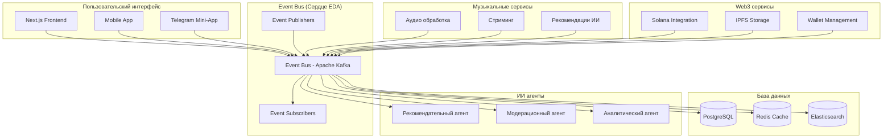
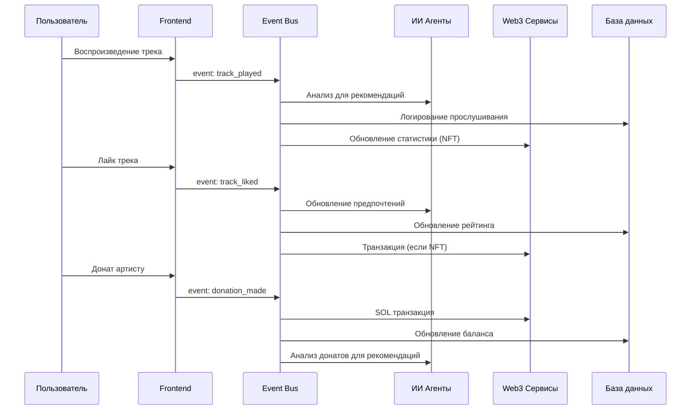
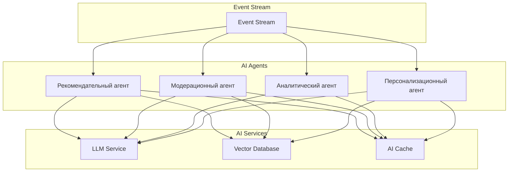

# 🎵 Event-Driven Architecture для Normal Dance

## 📊 Введение

Этот документ описывает интеграцию событийно-управляемой архитектуры (EDA) в проект Normal Dance. Основываясь на современных тенденциях ИИ и корпоративных системах, мы создадим масштабируемую, гибкую платформу для децентрализованной музыки.

---

## 🎯 Почему EDA критически важна для Normal Dance

### Проблемы, которые решает EDA

#### 1. Масштабирование музыкальной платформы

**Текущие ограничения:**

- Жестко связанные компоненты аудио-стриминга
- Проблемы с одновременным доступом множества пользователей
- Ограниченная обработка реальных событий (лайки, комментарии, донаты)

**Решение через EDA:**

- Асинхронная обработка музыкальных событий
- Горизонтальное масштабирование компонентов
- Реакция на действия пользователей в реальном времени

#### 2. Интеграция ИИ-агентов

**Необходимость:**

- Умные рекомендации музыки
- Автоматическая модерация контента
- Персонализированные плейлисты
- Анализ музыкальных трендов

**EDA как основа:**

- События прослушивания для рекомендаций
- События загрузки для модерации
- События взаимодействия для персонализации

#### 3. Web3 интеграции

**Сложности:**

- Блокчейн транзакции (медленные, дорогие)
- Множество внешних сервисов (Solana, IPFS, Telegram)
- Необходимость ре-time обновлений

**EDA решение:**

- Асинхронная обработка блокчейн событий
- Событийная интеграция с Web3 сервисами
- Кэширование и оптимизация Web3 операций

---

## 🏗️ Архитектура Normal Dance с EDA

### Высокоуровневая архитектура



### Поток событий в системе



---

## 🎵 Ключевые события Normal Dance

### 1. Музыкальные события

```typescript
// События, связанные с музыкой
interface MusicEvents {
  // Прослушивание
  "track.played": {
    trackId: string;
    userId: string;
    duration: number;
    timestamp: Date;
    deviceInfo: DeviceInfo;
  };

  "track.completed": {
    trackId: string;
    userId: string;
    completionRate: number;
  };

  "track.liked": {
    trackId: string;
    userId: string;
    action: "like" | "unlike";
  };

  "track.shared": {
    trackId: string;
    userId: string;
    platform: "telegram" | "twitter" | "other";
  };

  // Загрузка контента
  "track.uploaded": {
    trackId: string;
    artistId: string;
    metadata: TrackMetadata;
    ipfsHash: string;
  };

  "track.approved": {
    trackId: string;
    moderatorId: string;
    status: "approved" | "rejected";
  };
}
```

### 2. Пользовательские события

```typescript
// События, связанные с пользователями
interface UserEvents {
  "user.registered": {
    userId: string;
    email: string;
    walletAddress: string;
    registrationSource: "web" | "telegram" | "mobile";
  };

  "user.profile.updated": {
    userId: string;
    changes: ProfileChanges;
  };

  "user.subscription.created": {
    userId: string;
    plan: "free" | "premium" | "artist";
  };

  "user.session.started": {
    userId: string;
    sessionId: string;
    deviceInfo: DeviceInfo;
  };
}
```

### 3. Финансовые события

```typescript
// События, связанные с финансами
interface FinancialEvents {
  "donation.created": {
    donationId: string;
    fromUserId: string;
    toArtistId: string;
    amount: number; // в SOL
    trackId?: string;
    message?: string;
  };

  "nft.purchased": {
    nftId: string;
    userId: string;
    amount: number;
    trackId: string;
  };

  "reward.earned": {
    userId: string;
    rewardType: "listening" | "sharing" | "creation";
    amount: number;
    trackId?: string;
  };
}
```

### 4. Web3 события

```typescript
// События, связанные с Web3
interface Web3Events {
  "wallet.connected": {
    userId: string;
    walletType: "phantom" | "solflare" | "other";
    walletAddress: string;
  };

  "solana.transaction.completed": {
    userId: string;
    transactionId: string;
    type: "donation" | "nft_purchase" | "stake";
    status: "success" | "failed";
    amount?: number;
  };

  "ipfs.file.uploaded": {
    fileId: string;
    userId: string;
    ipfsHash: string;
    fileSize: number;
    mimeType: string;
  };
}
```

---

## 🤖 ИИ Агенты в архитектуре EDA

### Архитектура ИИ агентов



### Рекомендательный агент

```typescript
class RecommendationAgent {
  async processEvent(event: TrackPlayedEvent) {
    // 1. Получаем векторное представление трека
    const trackVector = await this.vectorDB.getTrackVector(event.trackId);

    // 2. Получаем вектор пользователя
    const userVector = await this.vectorDB.getUserVector(event.userId);

    // 3. Вычисляем схожесть
    const similarity = this.cosineSimilarity(trackVector, userVector);

    // 4. Генерируем рекомендации
    const recommendations = await this.generateRecommendations(
      event.userId,
      similarity,
      event.trackId
    );

    // 5. Публикуем событие рекомендаций
    this.eventBus.publish("recommendations.generated", {
      userId: event.userId,
      recommendations,
      timestamp: new Date(),
    });
  }

  private async generateRecommendations(
    userId: string,
    similarity: number,
    currentTrackId: string
  ) {
    // Логика генерации рекомендаций на основе векторов
    // Используем LLM для контекстуальных рекомендаций
  }
}
```

### Модерационный агент

```typescript
class ModerationAgent {
  async processEvent(event: TrackUploadedEvent) {
    // 1. Проверка контента
    const contentCheck = await this.checkContent(event.metadata);

    // 2. Анализ IPFS хеша
    const ipfsCheck = await this.checkIPFSContent(event.ipfsHash);

    // 3. Проверка прав
    const rightsCheck = await this.checkCopyright(
      event.artistId,
      event.metadata
    );

    // 4. Решение о модерации
    const moderationResult = this.makeModerationDecision(
      contentCheck,
      ipfsCheck,
      rightsCheck
    );

    // 5. Публикация события
    this.eventBus.publish("track.moderation_result", {
      trackId: event.trackId,
      result: moderationResult,
      moderatorId: "ai-agent",
      timestamp: new Date(),
    });
  }

  private async checkContent(metadata: TrackMetadata) {
    // Используем LLM для анализа текста и описания
    // Проверка на нецензурную лексику, спам и т.д.
  }
}
```

---

## 🏗️ Техническая реализация EDA

### Выбор технологии Event Bus

#### Apache Kafka (Рекомендуемый вариант)

**Преимущества:**

- Горизонтальное масштабирование
- Высокая пропускная способность
- Надежное хранение событий
- Поддержка потоковой обработки

**Альтернативы:**

- **Redis Streams**: Для небольших нагрузок
- **RabbitMQ**: Для сложных маршрутизации
- **NATS**: Для легковесных решений

### Конфигурация Kafka для Normal Dance

```yaml
# docker-compose.yml для Kafka
version: "3.8"
services:
  zookeeper:
    image: confluentinc/cp-zookeeper:7.3.0
    environment:
      ZOOKEEPER_CLIENT_PORT: 2181
      ZOOKEEPER_TICK_TIME: 2000

  kafka:
    image: confluentinc/cp-kafka:7.3.0
    depends_on:
      - zookeeper
    ports:
      - "9092:9092"
    environment:
      KAFKA_BROKER_ID: 1
      KAFKA_ZOOKEEPER_CONNECT: zookeeper:2181
      KAFKA_ADVERTISED_LISTENERS: PLAINTEXT://kafka:29092,PLAINTEXT_HOST://localhost:9092
      KAFKA_LISTENER_SECURITY_PROTOCOL_MAP: PLAINTEXT:PLAINTEXT,PLAINTEXT_HOST:PLAINTEXT
      KAFKA_INTER_BROKER_LISTENER_NAME: PLAINTEXT
      KAFKA_OFFSETS_TOPIC_REPLICATION_FACTOR: 1
      KAFKA_AUTO_CREATE_TOPICS_ENABLE: true

  kafdrop:
    image: obsidiandynamics/kafdrop:3.28.0
    depends_on:
      - kafka
    ports:
      - "9000:9000"
    environment:
      KAFKA_BROKERCONNECT: "kafka:29092"
```

### Топики Kafka для Normal Dance

```typescript
// Конфигурация топиков
const KAFKA_TOPICS = {
  // Музыкальные события
  "track.played": { partitions: 3, replicationFactor: 1 },
  "track.completed": { partitions: 3, replicationFactor: 1 },
  "track.liked": { partitions: 2, replicationFactor: 1 },
  "track.shared": { partitions: 2, replicationFactor: 1 },
  "track.uploaded": { partitions: 1, replicationFactor: 1 },
  "track.approved": { partitions: 1, replicationFactor: 1 },

  // Пользовательские события
  "user.registered": { partitions: 2, replicationFactor: 1 },
  "user.profile.updated": { partitions: 2, replicationFactor: 1 },
  "user.subscription.created": { partitions: 1, replicationFactor: 1 },

  // Финансовые события
  "donation.created": { partitions: 3, replicationFactor: 1 },
  "nft.purchased": { partitions: 2, replicationFactor: 1 },
  "reward.earned": { partitions: 2, replicationFactor: 1 },

  // Web3 события
  "wallet.connected": { partitions: 2, replicationFactor: 1 },
  "solana.transaction.completed": { partitions: 3, replicationFactor: 1 },
  "ipfs.file.uploaded": { partitions: 2, replicationFactor: 1 },

  // ИИ события
  "recommendations.generated": { partitions: 3, replicationFactor: 1 },
  "track.moderation_result": { partitions: 2, replicationFactor: 1 },
};
```

---

## 🔧 Интеграция с существующей архитектурой

### От текущей архитектуры к EDA

#### Текущая архитектура (MVP)

```
Frontend → Next.js API → Database
           ↓
        Solana RPC
           ↓
         IPFS
```

#### Архитектура с EDA

```
Frontend → Event Bus → [Множество сервисов]
    ↓           ↓
  Kafka    → AI Agents
    ↓           ↓
  Database ← Web3 Services
```

### Миграционная стратегия

#### Этап 1: Внедрение Event Bus (2-4 недели)

- Установка Kafka
- Создание базовых топиков
- Интеграция с существующим Next.js API
- Публикация ключевых событий

#### Этап 2: Создание AI агентов (4-8 недель)

- Разработка рекомендательного агента
- Разработка модерационного агента
- Интеграция с LLM сервисами
- Тестирование и оптимизация

#### Этап 3: Полная интеграция Web3 (8-12 недель)

- Асинхронная обработка блокчейн транзакций
- Оптимизация Web3 операций
- Кэширование и оффчейн вычисления
- Мониторинг и метрики

---

## 📊 Мониторинг и observability

### Метрики для EDA системы

#### Базовые метрики

```typescript
interface SystemMetrics {
  // Производительность
  eventProcessingLatency: number; // ms
  eventThroughput: number; // events/sec
  errorRate: number; // %

  // Масштабирование
  partitionUtilization: number; // %
  consumerLag: number; // events
  brokerLoad: number; // %

  // Бизнес метрики
  activeUsers: number;
  tracksPlayed: number;
  donationsProcessed: number;
}
```

#### AI метрики

```typescript
interface AIMetrics {
  // Качество рекомендаций
  recommendationAccuracy: number;
  userEngagement: number;
  clickThroughRate: number;

  // Модерация
  moderationAccuracy: number;
  falsePositiveRate: number;
  processingTime: number;

  // Ресурсы
  tokenUsage: number;
  modelLatency: number;
  errorRate: number;
}
```

### Dashboard для мониторинга

```typescript
// Пример дашборда в Grafana
const DASHBOARD_QUERIES = {
  // Event Bus метрики
  eventRate: "rate(kafka_events_total[5m])",
  errorRate: "rate(kafka_events_errors_total[5m])",
  processingLatency:
    "histogram_quantile(0.95, rate(kafka_processing_duration_seconds_bucket[5m]))",

  // AI метрики
  recommendationAccuracy: "avg(recommendation_accuracy)",
  moderationAccuracy: "avg(moderation_accuracy)",
  tokenUsage: "sum(rate(llm_tokens_total[5m]))",

  // Бизнес метрики
  activeUsers: "count(distinct(user_id))",
  tracksPlayed: "rate(tracks_played_total[5m])",
  donationsAmount: "rate(donations_amount_total[5m])",
};
```

---

## 🚀 Преимущества EDA для Normal Dance

### 1. Масштабируемость

- **Горизонтальное масштабирование**: Добавление новых потребителей без остановки системы
- **Обработка пиковых нагрузок**: Автоматическое распределение нагрузки
- **Гибкая архитектура**: Легкое добавление новых сервисов

### 2. Надежность

- **Отказоустойчивость**: Отказ одного компонента не останавливает систему
- **Восстановление после сбоев**: Автоматическое восстановление обработчиков
- **Дублирование событий**: Гарантия обработки важных событий

### 3. Гибкость

- **Асинхронная обработка**: Неблокирующая работа системы
- **Ре-time реакции**: Мгновенная реакция на действия пользователей
- **Легкое тестирование**: Изолированное тестирование компонентов

### 4. Инновационность

- **ИИ интеграция**: Естественная интеграция с ИИ агентами
- **Web3 оптимизация**: Эффективная работа с блокчейном
- **Персонализация**: Глубокая персонализация на основе событий

---

## 🎯 План внедрения EDA

### Краткосрочные цели (1-3 месяца)

- [ ] Установка и настройка Kafka
- [ ] Создание базовых топиков
- [ ] Интеграция с существующим Next.js API
- [ ] Разработка первого AI агента (рекомендации)

### Среднесрочные цели (3-6 месяцев)

- [ ] Полная интеграция Web3 сервисов
- [ ] Разработка всех AI агентов
- [ ] Оптимизация производительности
- [ ] Внедрение мониторинга

### Долгосрочные цели (6-12 месяцев)

- [ ] Масштабирование до Enterprise уровня
- [ ] Интеграция с внешними сервисами
- [ ] Продвинутая аналитика и ML
- [ ] Глобальная распределенная система

---

## 💡 Заключение

Внедрение событийно-управляемой архитектуры (EDA) в Normal Dance открывает возможности для создания真正 масштабируемой, инновационной и надежной музыкальной платформы. Эта архитектура позволит:

1. **Эффективно масштабировать** платформу по мере роста пользовательской базы
2. **Интегрировать ИИ агенты** для умных рекомендаций и автоматизации
3. **Оптимизировать Web3 операции** через асинхронную обработку
4. **Обеспечить надежность** и отказоустойчивость системы
5. **Создать уникальный пользовательский опыт** через персонализацию

EDA - это не просто техническое решение, это стратегическое преимущество, которое позволит Normal Dance стать лидером в децентрализованной музыкальной индустрии.

**Готовность к будущему: ✅ EDA архитектура определит успех Normal Dance!**
