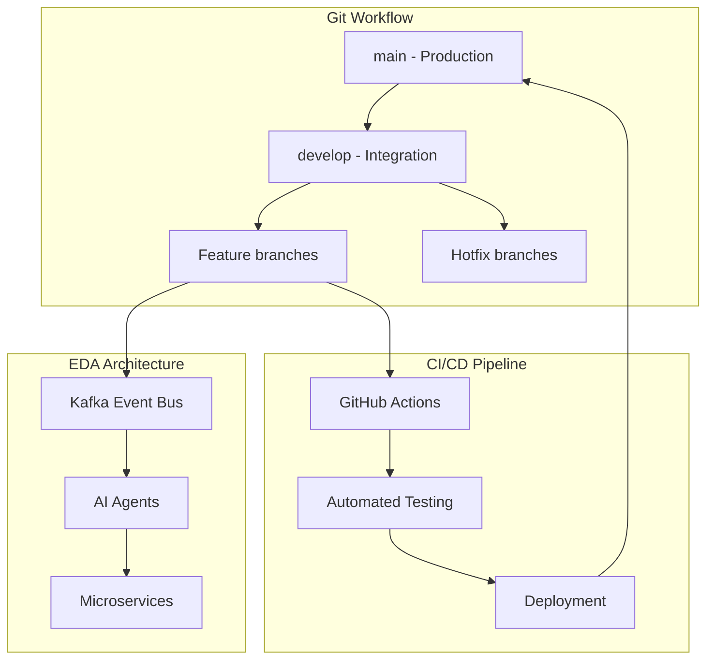
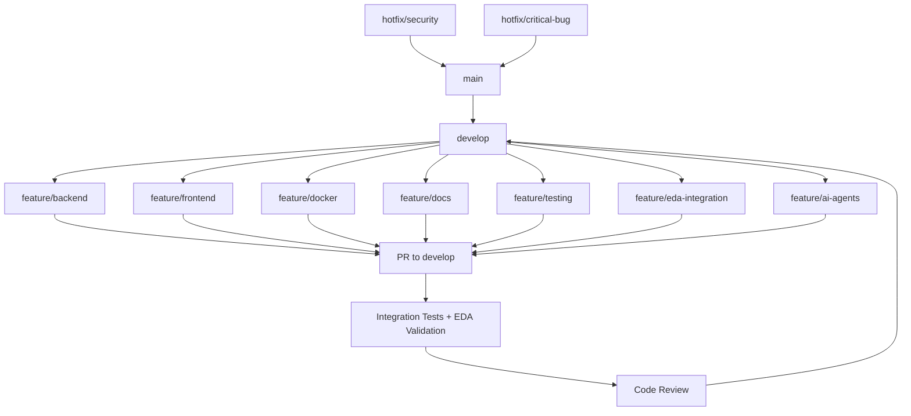

# 🌳 Git Workflow + EDA Стратегия для Normal Dance

## 📊 Введение

Этот документ описывает интегрированную стратегию управления версиями (Git workflow) и событийно-управляемой архитектуры (EDA) для проекта Normal Dance. Комбинация этих подходов обеспечит эффективную разработку, масштабируемость и надежность нашей музыкальной платформы.

---

## 🎯 Общая архитектура workflow

### Высокоуровневая схема



---

## 🌳 Структура веток Normal Dance

### Основная ветвление стратегия



### Детальная структура веток

```
📁 NORMALDANCE-Enterprise/
├── 🌿 main                    # Production-ready код
├── 🌿 develop                 # Интеграционная ветка
├── 🌿 feature/backend         # Backend разработка
├── 🌿 feature/frontend        # Frontend разработка
├── 🌿 feature/docker          # Docker и инфраструктура
├── 🌿 feature/docs            # Документация
├── 🌿 feature/testing         # Тесты и QA
├── 🌿 feature/eda-integration # EDA интеграция
├── 🌿 feature/ai-agents       # ИИ агенты
├── 🌿 feature/web3-integration# Web3 сервисы
├── 🌿 feature/mobile          # Мобильное приложение
├── 🌿 feature/telegram        # Telegram интеграция
├── 🌿 release/v1.0.0          # Релизная ветка
├── 🌿 hotfix/*                # Срочные исправления
└── 🌿 support/*               # Поддержка и обслуживание
```

---

## 🔄 Git Workflow с EDA интеграцией

### 1. Основные ветки

#### main (Production)

```bash
# Цель: Только production-ready код
# Правила:
# - Только слияния из develop после тестирования
# - Версионирование по семантической версии
# - Автоматический деплой в production

# Пример коммитов:
git commit -m "chore(release): v1.0.0 - Production release"
git commit -m "fix(eda): Critical event processing bug fix"
```

#### develop (Integration)

```bash
# Цель: Интеграция всех компонентов
# Правила:
- Регулярные слияния из feature веток
- Запуск всех тестов (EDA + Integration)
- Мониторинг производительности

# Пример коммитов:
git commit -m "feat(eda): Add Kafka event bus integration"
git commit -m "test(integration): EDA component integration tests"
```

### 2. Feature ветки

#### feature/backend

```bash
# Фокус: Backend логика и API
# Интеграция с EDA:
- Публикация событий из API
- Подписка на события для обработки
- Интеграция с AI агентами

# Пример коммитов:
git commit -m "feat(api): User authentication endpoints"
git commit -m "feat(eda): Track events publishing"
git commit -m "fix(database): Connection pooling optimization"
```

#### feature/frontend

```bash
# Фокус: UI/UX и клиентская логика
# Интеграция с EDA:
- Отправка событий в Event Bus
- Реакция на события от AI агентов
- Визуализация данных в реальном времени

# Пример коммитов:
git commit -m "feat(ui): Audio player component"
git commit -m "feat(eda): Event listeners implementation"
git commit -m "style(responsive): Mobile optimization"
```

#### feature/eda-integration

```bash
# Фокус: Event-driven архитектура
# Задачи:
- Настройка Kafka
- Создание схем событий
- Разработка обработчиков
- Мониторинг и метрики

# Пример коммитов:
git commit -m "feat(kafka): Event bus setup"
git commit -m "feat(schema): Track event schemas"
git commit -m "feat(consumer): Event processors"
```

#### feature/ai-agents

```bash
# Фокус: ИИ агенты и ML
# Интеграция с EDA:
- Потребление событий из Kafka
- Генерация рекомендаций
- Модерация контента
- Аналитика

# Пример коммитов:
git commit -m "feat(ai): Recommendation agent"
git commit -m "feat(ai): Content moderation agent"
git commit -m "feat(llm): OpenAI integration"
```

### 3. Hotfix ветки

```bash
# Цель: Срочные исправления в production
# Процесс:
1. Создание от main: git checkout -b hotfix/security-fix main
2. Исправление проблемы
3. Тестирование
4. Слияние в main и develop

# Пример коммитов:
git commit -m "fix(security): SQL injection vulnerability"
git commit -m "fix(eda): Event processing critical bug"
```

---

## 🚀 CI/CD Pipeline с EDA

### GitHub Actions Workflow

```yaml
# .github/workflows/ci.yml
name: CI/CD Pipeline with EDA

on:
  push:
    branches: [main, develop, feature/*]
  pull_request:
    branches: [develop]

jobs:
  # EDA Validation
  eda-validation:
    runs-on: ubuntu-latest
    steps:
      - uses: actions/checkout@v4

      - name: Setup Node.js
        uses: actions/setup-node@v4
        with:
          node-version: "18"

      - name: Install dependencies
        run: npm ci

      - name: EDA Schema Validation
        run: npm run eda:validate

      - name: Event Bus Health Check
        run: npm run eda:health-check

      - name: Kafka Connection Test
        run: npm run eda:kafka-test

  # Component Testing
  component-tests:
    needs: eda-validation
    runs-on: ubuntu-latest
    strategy:
      matrix:
        component: [backend, frontend, eda, ai-agents]

    steps:
      - uses: actions/checkout@v4

      - name: Setup ${{ matrix.component }}
        run: |
          if [ "${{ matrix.component }}" = "backend" ]; then
            npm run setup:backend
          elif [ "${{ matrix.component }}" = "frontend" ]; then
            npm run setup:frontend
          elif [ "${{ matrix.component }}" = "eda" ]; then
            npm run setup:eda
          elif [ "${{ matrix.component }}" = "ai-agents" ]; then
            npm run setup:ai-agents
          fi

      - name: Run ${{ matrix.component }} tests
        run: npm run test:${{ matrix.component }}

  # Integration Tests
  integration-tests:
    needs: [eda-validation, component-tests]
    runs-on: ubuntu-latest

    steps:
      - uses: actions/checkout@v4

      - name: Start EDA infrastructure
        run: docker-compose -f docker-compose.eda.yml up -d

      - name: Wait for services
        run: npm run wait:eda

      - name: Run integration tests
        run: npm run test:integration

      - name: Run EDA end-to-end tests
        run: npm run test:eda-e2e

  # Security Scan
  security-scan:
    needs: [eda-validation, component-tests]
    runs-on: ubuntu-latest

    steps:
      - uses: actions/checkout@v4

      - name: Run security audit
        run: npm audit

      - name: Run EDA security scan
        run: npm run eda:security-scan

      - name: Dependency vulnerability check
        run: npm run security:check

  # Deployment
  deploy:
    needs: [eda-validation, component-tests, integration-tests, security-scan]
    runs-on: ubuntu-latest
    if: github.ref == 'refs/heads/develop'

    steps:
      - uses: actions/checkout@v4

      - name: Deploy to staging
        run: |
          echo "Deploying to staging environment..."
          npm run deploy:staging

      - name: Run smoke tests
        run: npm run test:smoke

      - name: Notify deployment
        run: npm run notify:deployment
```

### EDA Specific Jobs

```yaml
# .github/workflows/eda-monitoring.yml
name: EDA Monitoring and Alerting

on:
  schedule:
    - cron: "*/5 * * * *" # Every 5 minutes
  workflow_dispatch:

jobs:
  monitor-event-bus:
    runs-on: ubuntu-latest

    steps:
      - name: Check Kafka health
        run: |
          curl -f http://localhost:8080/health || exit 1

      - name: Check event processing lag
        run: |
          lag=$(kafka-consumer-groups --bootstrap-server localhost:9092 --describe --group normaldance-edagroup | awk 'NR>2 {print $5}')
          if [ "$lag" -gt "1000" ]; then
            echo "Event processing lag too high: $lag"
            exit 1
          fi

      - name: Check AI agent health
        run: |
          health=$(curl -s http://localhost:3001/health | jq -r '.status')
          if [ "$health" != "healthy" ]; then
            echo "AI agent unhealthy: $health"
            exit 1
          fi

  alert-on-errors:
    runs-on: ubuntu-latest

    steps:
      - name: Check error rates
        run: |
          errors=$(curl -s http://localhost:8080/metrics | grep 'eda_events_failed_total' | awk '{print $2}')
          if [ "$errors" -gt "10" ]; then
            echo "High error rate detected: $errors"
            # Send alert to Slack/Teams
            curl -X POST -H 'Content-type: application/json' \
              --data '{"text":"EDA Error Alert: High error rate detected"}' \
              $SLACK_WEBHOOK
          fi
```

---

## 📊 EDA Event Schema Management

### Event Schema Versioning

```typescript
// schemas/events/track-played/v1.ts
export interface TrackPlayedV1 {
  version: "1.0.0";
  eventType: "track.played";
  timestamp: Date;
  payload: {
    trackId: string;
    userId: string;
    duration: number;
    deviceInfo: DeviceInfo;
    source: "web" | "mobile" | "telegram";
  };
}

// schemas/events/track-played/v2.ts
export interface TrackPlayedV2 {
  version: "2.0.0";
  eventType: "track.played";
  timestamp: Date;
  payload: {
    trackId: string;
    userId: string;
    duration: number;
    deviceInfo: DeviceInfo;
    source: "web" | "mobile" | "telegram";
    // New field in v2
    listeningContext: "discover" | "profile" | "playlist" | "radio";
  };
}
```

### Schema Validation in CI

```bash
# scripts/validate-schemas.sh
#!/bin/bash

echo "Validating EDA event schemas..."

# Check for duplicate event types
find schemas/events -name "*.ts" -exec grep -l "eventType:" {} \; | while read file; do
  event_type=$(grep "eventType:" "$file" | head -1 | cut -d'"' -f2)
  if [ $(grep -r "eventType: \"$event_type\"" schemas/events/ | wc -l) -gt 1 ]; then
    echo "ERROR: Duplicate event type found: $event_type"
    exit 1
  fi
done

# Check for version consistency
find schemas/events -name "v*.ts" | while read file; do
  version=$(grep "version:" "$file" | head -1 | cut -d'"' -f2)
  if ! [[ $version =~ ^[0-9]+\.[0-9]+\.[0-9]+$ ]]; then
    echo "ERROR: Invalid version format in $file: $version"
    exit 1
  fi
done

echo "All schemas validated successfully!"
```

---

## 🔧 Конфигурация для разных компонентов

### Backend Configuration

```typescript
// src/config/eda.config.ts
export const edaConfig = {
  kafka: {
    brokers: process.env.KAFKA_BROKERS || "localhost:9092",
    clientId: "normaldance-backend",
    groupId: "normaldance-backend-group",
    topics: {
      trackPlayed: "track.played",
      trackLiked: "track.liked",
      userRegistered: "user.registered",
      donationCreated: "donation.created",
    },
  },
  aiAgents: {
    recommendationService: "http://localhost:3001",
    moderationService: "http://localhost:3002",
    analyticsService: "http://localhost:3003",
  },
  monitoring: {
    metricsPort: 9090,
    healthCheckPath: "/health",
  },
};
```

### Frontend Configuration

```typescript
// src/config/eda.config.ts
export const edaConfig = {
  eventBus: {
    url: process.env.NEXT_PUBLIC_EVENT_BUS_URL || "ws://localhost:8080",
    reconnectInterval: 5000,
    maxReconnectAttempts: 10,
  },
  events: {
    trackPlayed: "track.played",
    trackLiked: "track.liked",
    userAction: "user.action",
  },
  aiFeatures: {
    recommendationsEnabled:
      process.env.NEXT_PUBLIC_ENABLE_RECOMMENDATIONS === "true",
    realTimeUpdates: process.env.NEXT_PUBLIC_REAL_TIME_UPDATES === "true",
  },
};
```

### AI Agents Configuration

```typescript
// agents/config/eda.config.ts
export const edaConfig = {
  kafka: {
    brokers: process.env.KAFKA_BROKERS || "localhost:9092",
    clientId: "normaldance-ai-agents",
    groupId: "normaldance-ai-group",
  },
  llm: {
    provider: process.env.LLM_PROVIDER || "openai",
    model: process.env.LLM_MODEL || "gpt-4",
    apiKey: process.env.LLM_API_KEY,
  },
  vectorDB: {
    provider: process.env.VECTOR_DB_PROVIDER || "pinecone",
    index: process.env.VECTOR_DB_INDEX || "normaldance-tracks",
  },
  monitoring: {
    metricsEnabled: process.env.ENABLE_METRICS === "true",
    tracingEnabled: process.env.ENABLE_TRACING === "true",
  },
};
```

---

## 📈 Мониторинг и observability

### EDA Metrics Collection

```typescript
// src/monitoring/eda-metrics.ts
import { Counter, Histogram, Gauge } from "prom-client";

export const edaMetrics = {
  // Event processing metrics
  eventsProcessed: new Counter({
    name: "eda_events_processed_total",
    help: "Total number of events processed",
    labelNames: ["event_type", "status"],
  }),

  eventProcessingDuration: new Histogram({
    name: "eda_event_processing_duration_seconds",
    help: "Time spent processing events",
    labelNames: ["event_type", "agent"],
    buckets: [0.1, 0.5, 1, 2, 5, 10],
  }),

  // AI agent metrics
  aiRequests: new Counter({
    name: "eda_ai_requests_total",
    help: "Total number of AI agent requests",
    labelNames: ["agent_type", "status"],
  }),

  aiLatency: new Histogram({
    name: "eda_ai_latency_seconds",
    help: "AI agent response time",
    labelNames: ["agent_type"],
    buckets: [0.5, 1, 2, 5, 10, 30],
  }),

  // System health metrics
  eventLag: new Gauge({
    name: "eda_event_lag_seconds",
    help: "Event processing lag",
    labelNames: ["consumer_group"],
  }),

  errorRate: new Gauge({
    name: "eda_error_rate_percent",
    help: "Error rate percentage",
    labelNames: ["component"],
  }),
};
```

### Grafana Dashboard for EDA

```json
{
  "dashboard": {
    "title": "Normal Dance EDA Monitoring",
    "panels": [
      {
        "title": "Event Processing Rate",
        "type": "graph",
        "targets": [
          {
            "expr": "rate(eda_events_processed_total[5m])",
            "legendFormat": "{{event_type}}"
          }
        ]
      },
      {
        "title": "AI Agent Latency",
        "type": "graph",
        "targets": [
          {
            "expr": "histogram_quantile(0.95, rate(eda_ai_latency_seconds_bucket[5m]))",
            "legendFormat": "{{agent_type}}"
          }
        ]
      },
      {
        "title": "Event Processing Lag",
        "type": "singlestat",
        "targets": [
          {
            "expr": "eda_event_lag_seconds{consumer_group=\"normaldance-edagroup\"}"
          }
        ]
      },
      {
        "title": "Error Rate by Component",
        "type": "graph",
        "targets": [
          {
            "expr": "eda_error_rate_percent",
            "legendFormat": "{{component}}"
          }
        ]
      }
    ]
  }
}
```

---

## 🎯 Best Practices для Normal Dance

### 1. Event Schema Management

- **Используйте семантическое версирование** для схем событий
- **Сохраняйте обратную совместимость** при изменении схем
- **Документируйте все события** в общем реестре
- **Автоматизируйте валидацию** схем в CI/CD

### 2. Branch Management

- **Используйте короткие описательные имена** для веток
- **Регулярно синхронизируйте** feature ветки с develop
- **Используйте pull requests** для код-ревью
- **Автоматизируйте проверки** в PR

### 3. EDA Development

- **Тестируйте обработчики событий** изолированно
- **Используйте моки** для внешних зависимостей
- **Мониторите производительность** обработчиков
- **Логируйте все события** для отладки

### 4. Integration Strategy

- **Постепенно внедряйте EDA** без остановки системы
- **Используйте feature flags** для новых событий
- **Тестируйте интеграцию** в staging среде
- **Мониторите переходный период**

---

## 🚀 Заключение

Интеграция Git workflow с EDA архитектурой обеспечит Normal Dance:

1. **Эффективную разработку** с четким разделением ответственности
2. **Масштабируемость** через горизонтальное расширение компонентов
3. **Надежность** через отказоустойчивую обработку событий
4. **Инновационность** через естественную интеграцию ИИ агентов
5. **Качество** через автоматизированное тестирование и мониторинг

Эта стратегия создаст прочную основу для роста Normal Dance как лидера децентрализованной музыкальной индустрии.

**Готовность к будущему: ✅ Git + EDA = Идеальная комбинация для Normal Dance!**
