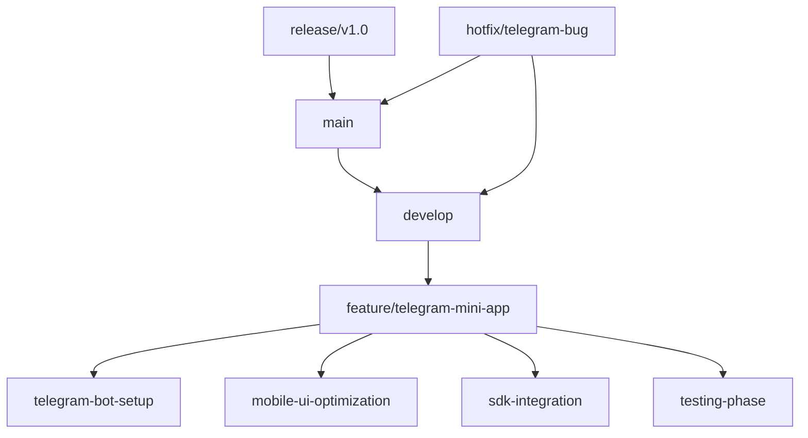

# 🔄 Git Workflow для Telegram Mini-App MVP Normal Dance

## 📊 Обзор Git стратегии

Оптимизированный Git workflow для solo разработчика, работающего над Telegram Mini-App MVP. Фокус на скорости разработки, качестве кода и надежности развертывания.

---

## 🏗️ Структура репозитория

### Основная ветвление стратегия



### Рекомендуемая структура веток

| Тип ветки      | Префикс           | Цель                | Время жизни |
| -------------- | ----------------- | ------------------- | ----------- |
| Основные       | `main`, `develop` | Стабильные версии   | Постоянные  |
| Функциональные | `feature/*`       | Новые функции       | До слияния  |
| Релизные       | `release/*`       | Подготовка релиза   | 1-2 недели  |
| Горячие фиксы  | `hotfix/*`        | Срочные исправления | До слияния  |

---

## 📋 Конфигурация Git

### .gitignore для Telegram Mini-App

```gitignore
# Environment variables
.env
.env.local
.env.development.local
.env.test.local
.env.production.local

# Telegram specific
telegram-bot-token.txt
telegram-webhook-secret.txt

# Build outputs
.next/
out/
dist/
build/

# Dependencies
node_modules/
npm-debug.log*
yarn-debug.log*
yarn-error.log*

# IDE
.vscode/
.idea/
*.swp
*.swo

# OS
.DS_Store
Thumbs.db

# Logs
logs/
*.log

# Testing
coverage/
.nyc_output/

# Telegram SDK cache
.telegram-sdk-cache/

# Temporary files
tmp/
temp/
*.tmp
```

### Commit Convention

```bash
# Формат: <тип>: <описание>
# Примеры:

feat: добавить Telegram аутентификацию
fix: исправить ошибку воспроизведения аудио
docs: обновить документацию по Telegram SDK
style: улучшить мобильный UI
refactor: оптимизировать производительность
test: добавить тесты для Mini-App
chore: обновить зависимости
```

### Commit Types для Telegram Mini-App

- `feat:telegram` - новые Telegram функции
- `fix:telegram` - исправления Telegram интеграции
- `feat:mobile` - мобильные функции
- `fix:mobile` - исправления мобильного UI
- `feat:audio` - аудио функции
- `fix:audio` - исправления аудио плеера

---

## 🚀 GitHub Actions CI/CD Pipeline

### Основной workflow файл

```yaml
# .github/workflows/telegram-mini-app.yml
name: Telegram Mini-App CI/CD

on:
  push:
    branches: [main, develop, feature/telegram-mini-app]
  pull_request:
    branches: [develop, feature/telegram-mini-app]

jobs:
  test:
    runs-on: ubuntu-latest

    steps:
      - uses: actions/checkout@v4

      - name: Setup Node.js
        uses: actions/setup-node@v4
        with:
          node-version: "18"
          cache: "npm"

      - name: Install dependencies
        run: npm ci

      - name: Type check
        run: npm run type-check

      - name: Lint
        run: npm run lint

      - name: Test
        run: npm run test:coverage

      - name: Build
        run: npm run build

      - name: Upload coverage to Codecov
        uses: codecov/codecov-action@v3
        with:
          file: ./coverage/lcov.info
          flags: unittests
          name: codecov-umbrella

  security:
    runs-on: ubuntu-latest

    steps:
      - uses: actions/checkout@v4

      - name: Run security audit
        run: npm audit --audit-level moderate

      - name: Run Trivy vulnerability scanner
        uses: aquasecurity/trivy-action@master
        with:
          scan-type: "fs"
          scan-ref: "."
          format: "sarif"
          output: "trivy-results.sarif"

      - name: Upload Trivy scan results to GitHub Security tab
        uses: github/codeql-action/upload-sarif@v2
        with:
          sarif_file: "trivy-results.sarif"

  deploy-staging:
    needs: [test, security]
    runs-on: ubuntu-latest
    if: github.ref == 'refs/heads/develop'

    steps:
      - uses: actions/checkout@v4

      - name: Setup Node.js
        uses: actions/setup-node@v4
        with:
          node-version: "18"
          cache: "npm"

      - name: Install dependencies
        run: npm ci

      - name: Build
        run: npm run build

      - name: Deploy to Vercel Staging
        uses: vercel/action@v1
        with:
          vercel-token: ${{ secrets.VERCEL_TOKEN }}
          vercel-org-id: ${{ secrets.VERCEL_ORG_ID }}
          vercel-project-id: ${{ secrets.VERCEL_PROJECT_ID }}
          working-directory: "./"
          alias: "staging-telegram-mini-app"

  deploy-production:
    needs: [test, security]
    runs-on: ubuntu-latest
    if: github.ref == 'refs/heads/main'

    steps:
      - uses: actions/checkout@v4

      - name: Setup Node.js
        uses: actions/setup-node@v4
        with:
          node-version: "18"
          cache: "npm"

      - name: Install dependencies
        run: npm ci

      - name: Build
        run: npm run build

      - name: Deploy to Vercel Production
        uses: vercel/action@v1
        with:
          vercel-token: ${{ secrets.VERCEL_TOKEN }}
          vercel-org-id: ${{ secrets.VERCEL_ORG_ID }}
          vercel-project-id: ${{ secrets.VERCEL_PROJECT_ID }}
          working-directory: "./"
          alias: "production-telegram-mini-app"
```

### Telegram-specific workflow

```yaml
# .github/workflows/telegram-deployment.yml
name: Telegram Mini-App Deployment

on:
  workflow_dispatch:
    inputs:
      environment:
        description: "Environment to deploy"
        required: true
        default: "staging"
        type: choice
        options:
          - staging
          - production

jobs:
  deploy-telegram-bot:
    runs-on: ubuntu-latest
    if: github.event.inputs.environment == 'production'

    steps:
      - uses: actions/checkout@v4

      - name: Setup Node.js
        uses: actions/setup-node@v4
        with:
          node-version: "18"
          cache: "npm"

      - name: Install dependencies
        run: npm ci

      - name: Build
        run: npm run build

      - name: Deploy Telegram Bot Webhook
        run: |
          curl -X POST "https://api.telegram.org/bot${{ secrets.TELEGRAM_BOT_TOKEN }}/setWebhook" \
            -H "Content-Type: application/json" \
            -d '{
              "url": "${{ secrets.TELEGRAM_WEBHOOK_URL }}",
              "secret_token": "${{ secrets.TELEGRAM_WEBHOOK_SECRET }}"
            }'
```

---

## 📁 Структура файлов для Telegram Mini-App

### Рекомендуемая организация

```
src/
├── telegram/                    # Telegram-specific functionality
│   ├── bot-config.ts           # Bot configuration
│   ├── webhook.ts              # Webhook handler
│   ├── sdk.ts                  # Telegram SDK integration
│   └── types.ts                # Telegram-specific types
├── components/
│   ├── telegram/               # Telegram-specific components
│   │   ├── telegram-mini-app.tsx
│   │   ├── telegram-auth.tsx
│   │   ├── mobile-audio-player.tsx
│   │   └── telegram-share.tsx
│   └── common/                 # Shared components
├── api/
│   ├── telegram/               # Telegram API routes
│   │   ├── webhook.ts
│   │   ├── auth.ts
│   │   └── tracks.ts
│   └── common/                 # Shared API routes
├── lib/
│   ├── telegram-service.ts     # Telegram service
│   ├── analytics.ts           # Analytics service
│   └── utils.ts               # Utility functions
└── types/
    ├── telegram.ts             # Telegram types
    └── common.ts              # Common types

tests/
├── telegram/                   # Telegram-specific tests
│   ├── telegram-auth.test.ts
│   ├── mobile-player.test.ts
│   └── webhook.test.ts
├── components/                 # Component tests
└── integration/                # Integration tests
```

---

## 🔧 Development Workflow

### 1. Создание новой ветки

```bash
# Создание ветки для Telegram функции
git checkout -b feature/telegram-auth develop

# Или для мобильной оптимизации
git checkout -b feature/mobile-ui-optimization develop
```

### 2. Разработка с использованием Git

```bash
# Ежедневная работа
git add .
git commit -m "feat:telegram добавить аутентификацию через Telegram"

# Частые коммиты для небольших изменений
git add src/components/telegram/
git commit -m "fix:telegram исправить отображение аватара пользователя"

# Перед отправкой в PR
git pull origin develop
git push origin feature/telegram-auth
```

### 3. Создание Pull Request

```markdown
## Title: feat:telegram добавить аутентификацию через Telegram

### Changes

- Добавлен компонент TelegramAuth
- Интеграция с Telegram SDK
- Обработка ошибок аутентификации
- Адаптация под мобильные устройства

### Testing

- ✅ Локальное тестирование
- ✅ Тестирование на реальных устройствах
- ✅ Интеграционное тестирование

### Checklist

- [ ] Код соответствует стилю проекта
- [ ] Добавлены тесты
- [ ] Документация обновлена
- [ ] Нет критических ошибок
```

### 4. Code Review checklist

```markdown
## Code Review Checklist for Telegram Mini-App

### Functionality

- [ ] Функция работает как ожидается
- [ ] Обработка ошибок корректна
- [ ] Edge cases обработаны
- [ ] Telegram интеграция работает

### Performance

- [ ] Нет утечек памяти
- [ ] Оптимизирована производительность
- [ ] Правильное использование кэширования

### Security

- [ ] Нет уязвимостей
- [ ] Telegram токены безопасны
- [ ] Валидация входных данных

### Mobile

- [ ] Адаптировано под мобильные устройства
- [ ] Touch-friendly интерфейс
- [ ] Оптимизирована загрузка

### Code Quality

- [ ] Следует конвенциям проекта
- [ ] Легко читаемый код
- [ ] Добавлены комментарии где необходимо
```

---

## 📊 Мониторинг и метрики

### GitHub Issues для отслеживания

```markdown
## Telegram Mini-App Issues Template

### Issue Description

Краткое описание проблемы

### Steps to Reproduce

1. Шаг 1
2. Шаг 2
3. Шаг 3

### Expected Behavior

Что должно происходить

### Actual Behavior

Что происходит на самом деле

### Environment

- OS: [например, iOS 16.0]
- Telegram App: [версия]
- Browser: [версия]

### Additional Context

Скриншоты, логи, другая информация
```

### Project Board organization

```
📋 Product Backlog
├── 🚀 Must Have
│   ├── Telegram Bot Setup
│   ├── Web App Integration
│   ├── Mobile Audio Player
│   └── Track Upload via IPFS
├── 🔄 Should Have
│   ├── Simple Recommendations
│   ├── Basic Analytics
│   └── Share Functionality
└── ⏸️ Nice to Have
    ├── Advanced AI Features
    ├── Social Integration
    └── NFT Support

🔄 Sprint Backlog (2 недели)
├── ✅ Telegram Bot Setup
├── ✅ Web App URL Configuration
├── 🔄 SDK Integration
├── 🔄 Mobile UI Optimization
└── 🔄 Basic Authentication

🐛 Bug Backlog
├── 🔄 Audio player buffering issue
├── 🔄 Telegram theme integration
└── 🔄 Mobile responsiveness
```

---

## 🔐 Security Best Practices

### Secrets management

```bash
# Использование GitHub Secrets
TELEGRAM_BOT_TOKEN
TELEGRAM_WEBHOOK_SECRET
VERCEL_TOKEN
DATABASE_URL
```

### Code security checks

```yaml
# .github/workflows/security.yml
name: Security

on:
  push:
    branches: [main, develop]
  pull_request:
    branches: [develop]

jobs:
  security-scan:
    runs-on: ubuntu-latest

    steps:
      - uses: actions/checkout@v4

      - name: Run npm audit
        run: npm audit --audit-level moderate

      - name: Check for secrets
        uses: gitleaks/gitleaks-action@v1
        with:
          config-path: .gitleaks.toml
          only-untracked: false

      - name: Run CodeQL analysis
        uses: github/codeql-action/init@v2
        with:
          languages: ${{ matrix.language }}
```

---

## 🚀 Deployment Strategy

### Environments

```bash
# Development environment
git checkout develop
npm run dev
# http://localhost:3000/telegram

# Staging environment
git checkout release/v1.0-staging
npm run build
# Deployed to Vercel staging

# Production environment
git checkout main
npm run build
# Deployed to Vercel production
```

### Rollback strategy

```bash
# Если что-то пошло не так в production
git checkout main
git revert <commit-hash>
git push origin main

# Или hotfix
git checkout -b hotfix/telegram-bug main
# Исправление ошибки
git commit -m "fix:telegram исправить критическую ошибку"
git push origin hotfix/telegram-bug
```

---

## 📈 Monitoring and Analytics

### GitHub Insights

```yaml
# .github/workflows/analytics.yml
name: Analytics

on:
  schedule:
    - cron: "0 0 * * *" # Ежедневно в полночь

jobs:
  collect-analytics:
    runs-on: ubuntu-latest

    steps:
      - uses: actions/checkout@v4

      - name: Generate analytics report
        run: |
          echo "## Telegram Mini-App Analytics" > analytics.md
          echo "- Commits this week: $(git log --since='1 week ago' --oneline | wc -l)" >> analytics.md
          echo "- PRs merged: $(gh pr list --state merged --since '1 week ago' | wc -l)" >> analytics.md
          echo "- Issues closed: $(gh issue list --state closed --since '1 week ago' | wc -l)" >> analytics.md

      - name: Create issue with analytics
        uses: actions/github-script@v6
        with:
          script: |
            const fs = require('fs');
            const analytics = fs.readFileSync('analytics.md', 'utf8');
            github.rest.issues.create({
              owner: context.repo.owner,
              repo: context.repo.repo,
              title: 'Weekly Analytics Report',
              body: analytics,
              labels: ['analytics', 'telegram-mini-app']
            });
```

---

Этот Git workflow обеспечит эффективную разработку Telegram Mini-App MVP с поддержкой качества, безопасности и надежного развертывания.
