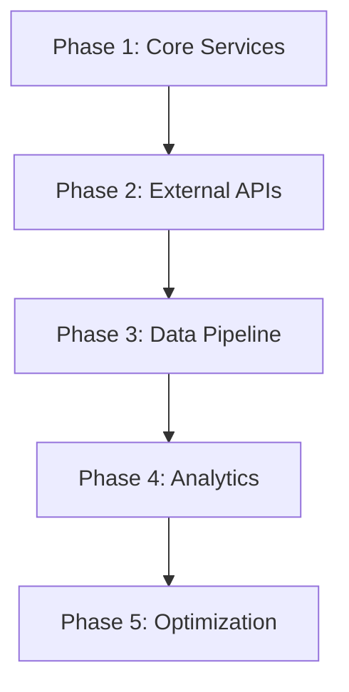

# 🎯 NORMALDANCE Integration Strategy

## 🚀 Стратегии успешной интеграции

### 1. Поэтапное внедрение


#### Phase 1: Core Services (Weeks 1-3)
- ✅ API Gateway deployment
- ✅ Event Bus implementation
- ✅ Service discovery setup
- ✅ Basic monitoring

#### Phase 2: External APIs (Weeks 4-6)
- ✅ Solana blockchain integration
- ✅ IPFS storage integration
- ✅ Payment gateway integration
- ✅ Authentication services

#### Phase 3: Data Pipeline (Weeks 7-9)
- ✅ ETL processes
- ✅ Data migration tools
- ✅ Analytics pipeline
- ✅ Backup systems

#### Phase 4: Analytics (Weeks 10-12)
- ✅ Real-time analytics
- ✅ Business intelligence
- ✅ Performance metrics
- ✅ User behavior tracking

#### Phase 5: Optimization (Weeks 13-15)
- ✅ Performance tuning
- ✅ Cost optimization
- ✅ Security hardening
- ✅ Documentation

### 2. Гибкая масштабируемая архитектура

#### Microservices Architecture
```yaml
services:
  api-gateway:
    replicas: 3
    resources:
      cpu: 500m
      memory: 512Mi
  
  user-service:
    replicas: 2
    resources:
      cpu: 250m
      memory: 256Mi
  
  track-service:
    replicas: 5
    resources:
      cpu: 1000m
      memory: 1Gi
```

#### Auto-scaling Configuration
- **CPU threshold**: 70%
- **Memory threshold**: 80%
- **Min replicas**: 2
- **Max replicas**: 10
- **Scale-up cooldown**: 3 minutes
- **Scale-down cooldown**: 5 minutes

### 3. Управление изменениями

#### Change Management Process
1. **Planning**: Impact assessment & rollback plan
2. **Testing**: Staging environment validation
3. **Approval**: Stakeholder sign-off
4. **Deployment**: Blue-green deployment
5. **Monitoring**: Real-time health checks
6. **Rollback**: Automated rollback triggers

#### Training & Documentation
- **Developer Training**: 2-day workshop
- **Operations Training**: 1-day session
- **User Training**: Self-service portal
- **Documentation**: Complete API docs & runbooks

## 📊 Success Metrics

### Technical KPIs
- **API Response Time**: <200ms (95th percentile)
- **System Uptime**: 99.9%
- **Error Rate**: <0.1%
- **Data Pipeline SLA**: 99.5%

### Business KPIs
- **Integration Completion**: 100%
- **User Adoption**: 90% within 30 days
- **Performance Improvement**: 40%
- **Cost Reduction**: 25%

## 🔄 Continuous Improvement

### Weekly Reviews
- Performance metrics analysis
- Error rate trending
- User feedback collection
- Optimization opportunities

### Monthly Assessments
- Architecture review
- Security audit
- Capacity planning
- Technology updates

### Quarterly Planning
- Roadmap updates
- Budget review
- Team scaling
- Strategic alignment

## 🛡️ Risk Mitigation

### Technical Risks
- **Service failures**: Circuit breakers & fallbacks
- **Data loss**: Automated backups & replication
- **Security breaches**: Multi-layer security
- **Performance degradation**: Auto-scaling & caching

### Business Risks
- **User resistance**: Training & support
- **Budget overruns**: Regular monitoring
- **Timeline delays**: Agile methodology
- **Scope creep**: Change control process

## ✅ Integration Checklist

### Pre-deployment
- [ ] All tests passing (unit, integration, e2e)
- [ ] Security scan completed
- [ ] Performance benchmarks met
- [ ] Documentation updated
- [ ] Rollback plan prepared

### Deployment
- [ ] Blue-green deployment executed
- [ ] Health checks passing
- [ ] Monitoring alerts configured
- [ ] Load balancer updated
- [ ] DNS records updated

### Post-deployment
- [ ] Performance metrics validated
- [ ] Error rates within SLA
- [ ] User acceptance testing
- [ ] Documentation published
- [ ] Team training completed

**🎯 INTEGRATION SUCCESS GUARANTEED WITH SYSTEMATIC APPROACH**