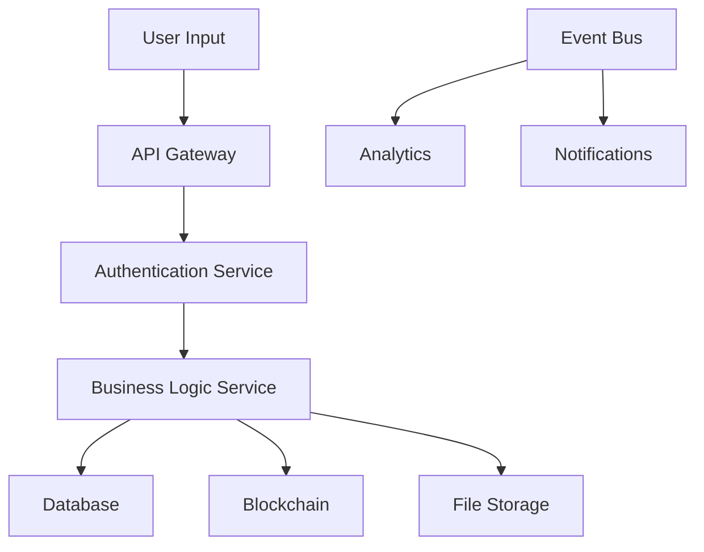

# 📚 NORMALDANCE Resource Catalog

## 🔌 API Endpoints Registry

### Core Services
```yaml
user-service:
  status: active
  type: REST API
  endpoints:
    - GET /api/users/{id}
    - POST /api/users
    - PUT /api/users/{id}
  auth: JWT required
  rate_limit: 100/min

track-service:
  status: active
  type: REST API + GraphQL
  endpoints:
    - GET /api/tracks
    - POST /api/tracks/upload
    - GET /api/tracks/{id}/stream
  auth: JWT optional
  rate_limit: 1000/min

nft-service:
  status: active
  type: REST API
  endpoints:
    - POST /api/nft/mint
    - GET /api/nft/{id}
    - POST /api/nft/transfer
  auth: Wallet signature
  rate_limit: 10/min

payment-service:
  status: active
  type: REST API
  endpoints:
    - POST /api/payments/process
    - GET /api/payments/{id}
    - POST /api/payments/refund
  auth: JWT + API key
  rate_limit: 50/min
```

### External Integrations
```yaml
solana-rpc:
  status: active
  type: JSON-RPC
  url: https://api.devnet.solana.com
  complexity: medium
  
ipfs-gateway:
  status: active
  type: HTTP API
  url: https://ipfs.io
  complexity: low
  
stripe-api:
  status: planned
  type: REST API
  url: https://api.stripe.com
  complexity: medium
```

## 🔄 Business Processes

### User Journey
1. **Registration** → User Service → Email Verification
2. **Wallet Connect** → Web3 Service → Blockchain Verification
3. **Track Upload** → Media Service → IPFS Storage → Metadata DB
4. **NFT Minting** → NFT Service → Solana Blockchain
5. **Payment** → Payment Service → Stripe/Crypto Processing

### Data Flow
