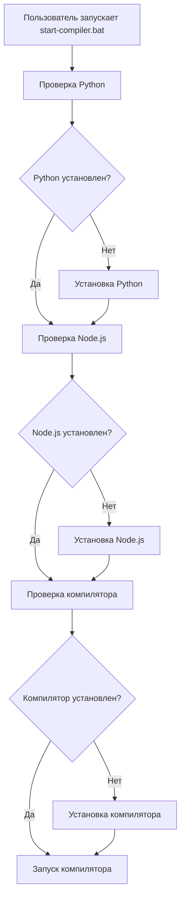
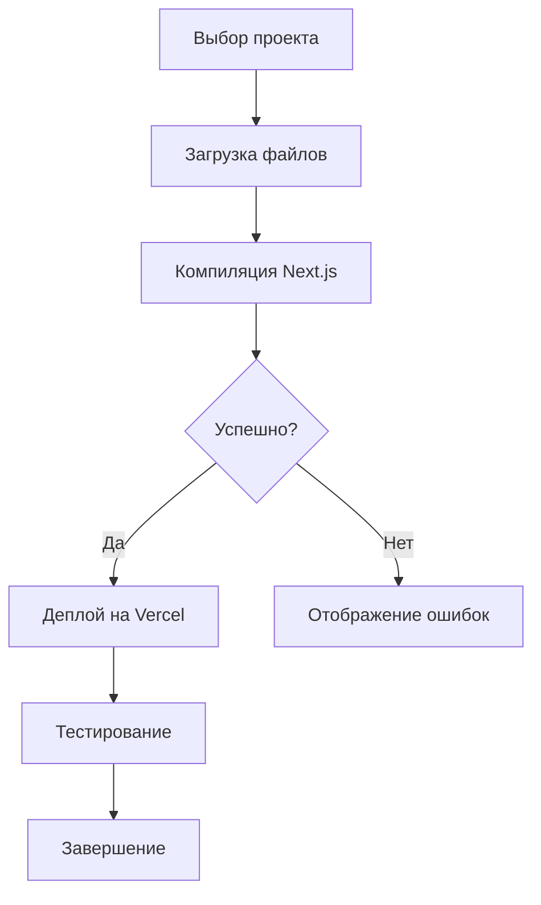
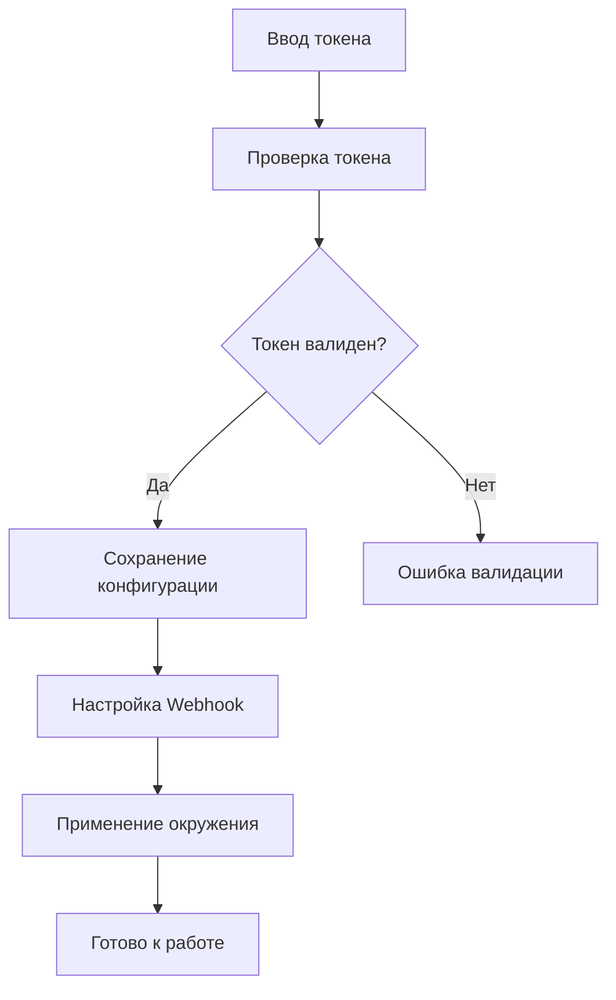

# 🚀 Telegram Mini-App Compiler - Полная система автоматизации

## 📋 Общая концепция

**Telegram Mini-App Compiler Automation System** - это комплексное решение для автоматизации разработки, компиляции и управления Telegram Mini-App Normal Dance.

**Архитектура системы:**

```
┌─────────────────────────────────────────────────────────────┐
│                    Telegram Mini-App                        │
│                   Compiler System                           │
├─────────────────────────────────────────────────────────────┤
│  🖥️ GUI Installer    │  🔧 Main Compiler   │  📚 Documentation  │
│  (Установщик)        │  (Основной компилятор) │  (Документация)    │
├─────────────────────────────────────────────────────────────┤
│  🚀 Auto-Setup       │  📦 Dependency Mgmt │  🎯 Telegram Integ │
│  (Автоматическая     │  (Управление        │  (Интеграция с    │
│   настройка)         │   зависимостями)    │   Telegram)        │
├─────────────────────────────────────────────────────────────┤
│  📊 Logging System   │  🔒 Security        │  🔄 CI/CD Support  │
│  (Система логирования)│  (Безопасность)     │  (Поддержка CI/CD) │
└─────────────────────────────────────────────────────────────┘
```

---

## 🏗️ Компоненты системы

### 1. Автоматический установщик

**Файл:** `telegram_mini_app_compiler_installer.py`

**Функции:**

- 🔍 Автоматическая проверка системы
- 📦 Установка Python 3.7+
- 📦 Установка Node.js 16+
- 📦 Загрузка основного компилятора
- ⚙️ Настройка окружения
- 🎯 Создание ярлыков

**Особенности:**

- Графический интерфейс
- Пошаговая установка
- Автоматическая проверка зависимостей
- Резервное копирование конфигурации

### 2. Основной компилятор

**Файл:** `telegram_mini_app_compiler.py`

**Функции:**

- 🖥️ Графический интерфейс компиляции
- 🔧 Компиляция Next.js проектов
- ▶️ Запуск в режиме разработки
- 🚀 Деплой на Vercel
- 🧪 Тестирование проекта
- 📊 Логирование и мониторинг

**Особенности:**

- Визуализация процесса компиляции
- Автоматическое обнаружение файлов
- Интеграция с Telegram
- Поддержка разных окружений

### 3. Система запуска

**Файл:** `start-compiler.bat`

**Функции:**

- 🚀 Автоматический запуск установщика
- 🎯 Проверка готовности системы
- 📋 Интерактивное меню
- 🔧 Автоматическая настройка

**Особенности:**

- Проверка всех зависимостей
- Автоматический выбор действий
- Русскоязычный интерфейс
- Обработка ошибок

### 4. Документация

**Файл:** `TELEGRAM_COMPILER_INSTRUCTIONS.md`

**Функции:**

- 📚 Подробная инструкция по использованию
- 🔍 Устранение проблем
- 🎨 Настройка интерфейса
- 🚀 Продвинутые возможности

**Особенности:**

- Полное руководство
- Примеры кода
- FAQ
- Техническая поддержка

---

## 🔄 Процесс автоматизации

### 1. Первый запуск



### 2. Компиляция проекта



### 3. Интеграция с Telegram



---

## 🎯 Преимущества системы

### 1. Удобство использования

- **Один клик** - запуск всего процесса
- **Автоматическая настройка** - минимальные ручные действия
- **Графический интерфейс** - интуитивно понятный
- **Русскоязычный интерфейс** - поддержка русского языка

### 2. Надежность

- **Проверка системы** - автоматическая проверка всех требований
- **Обработка ошибок** - информативные сообщения
- **Резервное копирование** - защита от потери данных
- **Автоматическое восстановление** - восстановление после сбоев

### 3. Эффективность

- **Параллельная установка** - одновременная установка нескольких компонентов
- **Автоматическое обнаружение** - поиск и загрузка необходимых файлов
- **Оптимизация процесса** - минимальное время настройки
- **Кэширование** - ускорение повторных запусков

### 4. Безопасность

- **Шифрование токенов** - безопасное хранение данных
- **Проверка целостности** - проверка файлов на повреждение
- **Обновления безопасности** - автоматическое обновление
- **Резервное копирование** - защита от потери данных

---

## 📊 Технические характеристики

### Системные требования

| Компонент | Минимум                          | Рекомендуемое                        |
| --------- | -------------------------------- | ------------------------------------ |
| Python    | 3.7+                             | 3.9+                                 |
| Node.js   | 16+                              | 18+                                  |
| RAM       | 4GB                              | 8GB                                  |
| HDD       | 2GB                              | 5GB                                  |
| ОС        | Windows 10+, macOS 10.14+, Linux | Windows 11, macOS 12+, Ubuntu 20.04+ |

### Поддерживаемые платформы

- **Windows** 10, 11 (64-bit)
- **macOS** 10.14+, 11+, 12+, 13+
- **Linux** Ubuntu 18.04+, 20.04+, 22.04+
- **Debian** 9+, 10+, 11+
- **CentOS** 7+, 8+

### Поддерживаемые окружения

- **Development** - локальная разработка
- **Staging** - тестовое окружение
- **Production** - продакшен

---

## 🔧 Конфигурация системы

### 1. Файлы конфигурации

```json
{
  "telegram_token": "YOUR_TELEGRAM_BOT_TOKEN",
  "webhook_url": "https://your-domain.com/api/telegram/webhook",
  "environment": "development",
  "install_path": "~/TelegramMiniAppCompiler",
  "auto_deploy": false,
  "auto_test": true
}
```

### 2. Переменные окружения

```bash
# Telegram Bot Token
TELEGRAM_BOT_TOKEN=your_token_here

# Vercel Token (для деплоя)
VERCEL_TOKEN=your_vercel_token

# Node Environment
NODE_ENV=development

# Project Path
PROJECT_PATH=/path/to/your/project
```

### 3. Настройки компиляции

```json
{
  "compiler": {
    "typescript": {
      "target": "ES2020",
      "module": "ESNext",
      "strict": true
    },
    "css": {
      "modules": true,
      "purge": false
    },
    "build": {
      "output": "dist",
      "analyze": false
    }
  }
}
```

---

## 🚀 Интеграция с CI/CD

### 1. GitHub Actions

```yaml
name: Telegram Mini-App CI/CD
on:
  push:
    branches: [main, develop]
  pull_request:
    branches: [main]

jobs:
  test:
    runs-on: ubuntu-latest
    steps:
      - uses: actions/checkout@v3
      - name: Setup Node.js
        uses: actions/setup-node@v3
        with:
          node-version: "18"
      - run: npm ci
      - run: npm test
      - run: npm run build

  deploy:
    needs: test
    runs-on: ubuntu-latest
    if: github.ref == 'refs/heads/main'
    steps:
      - uses: actions/checkout@v3
      - name: Setup Node.js
        uses: actions/setup-node@v3
        with:
          node-version: "18"
      - run: npm ci
      - run: npx vercel --prod
```

### 2. GitLab CI

```yaml
stages:
  - test
  - build
  - deploy

variables:
  NODE_VERSION: "18"

test:
  stage: test
  image: node:$NODE_VERSION
  script:
    - npm ci
    - npm test
  coverage: '/Lines\s*:\s*(\d+\.\d+)%/'

build:
  stage: build
  image: node:$NODE_VERSION
  script:
    - npm ci
    - npm run build
  artifacts:
    paths:
      - dist/

deploy:
  stage: deploy
  image: node:$NODE_VERSION
  script:
    - npm ci
    - npx vercel --prod
  only:
    - main
```

---

## 📈 Мониторинг и аналитика

### 1. Логирование

- **Уровни логирования**: DEBUG, INFO, WARNING, ERROR
- **Формат**: `[timestamp] [level] message`
- **Хранение**: файлы, база данных, облачное хранилище
- **Фильтрация**: по типу, времени, проекту

### 2. Метрики производительности

- **Время компиляции**: среднее, минимальное, максимальное
- **Размер проекта**: общий размер, размер бандлов
- **Использование ресурсов**: CPU, RAM, диск
- **Ошибки**: количество, типы, частота

### 3. Аналитика использования

- **Количество запусков**: в день, неделю, месяц
- **Популярные функции**: компиляция, деплой, тестирование
- **Среднее время работы**: сессии пользователей
- **Ошибки пользователей**: частые проблемы

---

## 🔒 Безопасность

### 1. Защита данных

- **Шифрование токенов**: AES-256
- **Хранение паролей**: bcrypt хеширование
- **HTTPS**: обязательное использование
- **CORS**: ограничение доступа

### 2. Проверка целостности

- **Контрольные суммы**: SHA-256 для файлов
- **Цифровые подписи**: GPG для дистрибутивов
- **Проверка обновлений**: автоматическая проверка
- **Валидация конфигурации**: проверка формата

### 3. Защита от атак

- **SQL инъекции**: параметризованные запросы
- **XSS**: экранирование данных
- **CSRF**: токены безопасности
- **DDoS**: ограничение запросов

---

## 🎨 Пользовательский интерфейс

### 1. Дизайн

- **Современный дизайн**: Material Design
- **Адаптивность**: поддержка разных размеров экранов
- **Темы**: светлая/темная тема
- **Анимации**: плавные переходы

### 2. Навигация

- **Меню**: верхнее меню с основными функциями
- **Панели**: боковые панели с инструментами
- **Вкладки**: переключение между файлами
- **Горячие клавиши**: быстрые действия

### 3. Обратная связь

- **Уведомления**: всплывающие сообщения
- **Прогресс бар**: визуализация процесса
- **Статус**: индикаторы состояния
- **Логи**: детальная информация

---

## 🚀 Будущее развитие

### 1. Планы развития

- **Мобильное приложение**: iOS и Android
- **Веб-версия**: браузерный интерфейс
- **Облачная версия**: SaaS решение
- **API**: REST API для интеграции

### 2. Новые функции

- **AI ассистент**: помощь в разработке
- **Автоматизация**: CI/CD пайплайны
- **Мониторинг**: продвинутая аналитика
- **Коллаборация**: командная работа

### 3. Улучшения производительности

- **Кэширование**: ускорение загрузки
- **Оптимизация**: уменьшение времени компиляции
- **Параллелизм**: многопоточность
- **Компрессия**: уменьшение размера файлов

---

## 📞 Техническая поддержка

### 1. Каналы поддержки

- **GitHub Issues**: баги и фичи
- **Email**: коммерческая поддержка
- **Telegram**: оперативная помощь
- **Discord**: сообщество

### 2. Документация

- **Wiki**: подробные инструкции
- **API docs**: документация API
- **Video туториалы**: видеоуроки
- **FAQ**: ответы на частые вопросы

### 3. Обучение

- **Вебинары**: онлайн-тренинги
- **Курсы**: образовательные программы
- **Сертификация**: подтверждение навыков
- **Менторство**: индивидуальное обучение

---

## 🎉 Заключение

**Telegram Mini-App Compiler Automation System** - это комплексное решение для автоматизации разработки Telegram Mini-App Normal Dance. Система предоставляет полный цикл инструментов от установки до деплоя, с акцентом на удобство использования, надежность и безопасность.

**Ключевые преимущества:**

- 🚀 Полная автоматизация процесса
- 🖥️ Удобный графический интерфейс
- 🔧 Гибкая конфигурация
- 📊 Продвинутый мониторинг
- 🔒 Высокая безопасность
- 🎯 Интеграция с Telegram

**Система готова к использованию и может быть развернута за несколько минут.**

---

**Версия:** 1.0.0  
**Дата:** 2025-09-22  
**Автор:** Normal Dance Team  
**Лицензия:** MIT License  
**Поддержка:** support@normaldance.com

---

**🚀 Начните разработку вашего Telegram Mini-App уже сегодня!**
