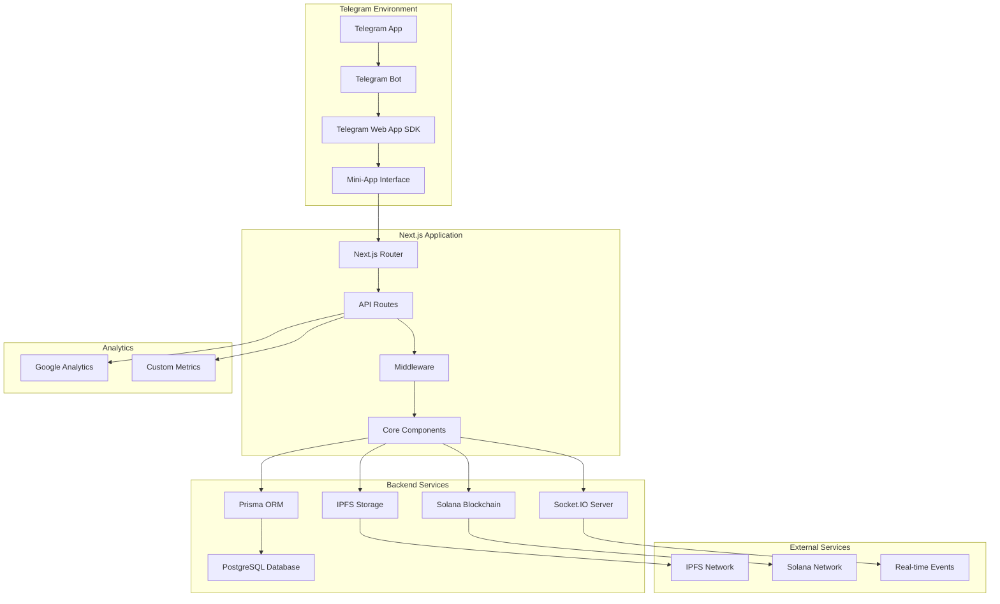
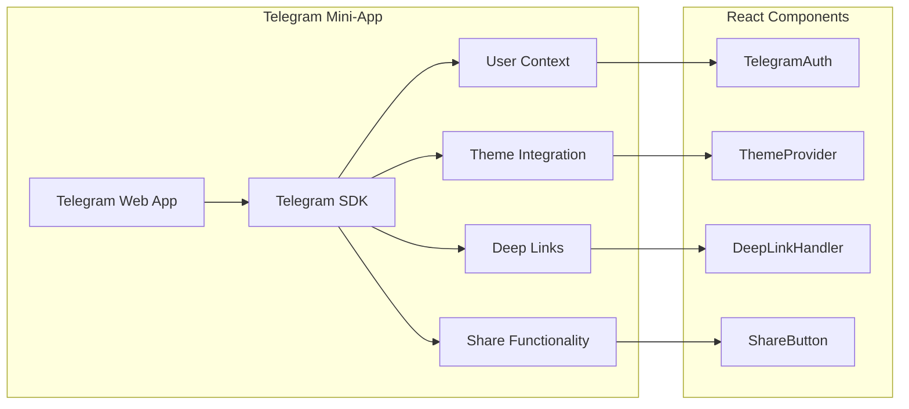
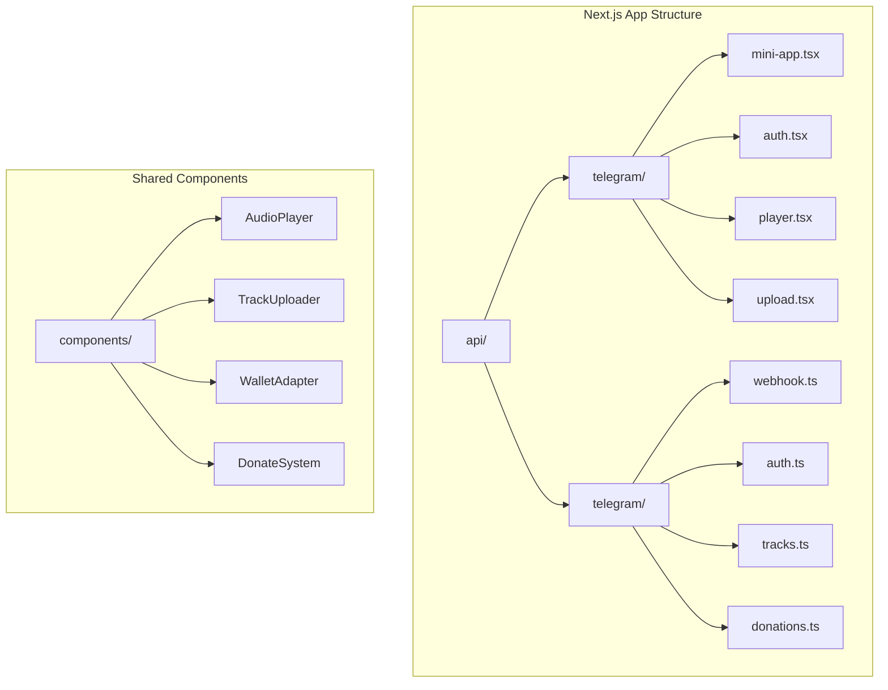

# 🏗️ Архитектура Telegram Mini-App MVP Normal Dance

## 📊 Обзор архитектуры

Архитектура Telegram Mini-App Normal Dance построена на основе существующей Next.js инфраструктуры с дополнительными слоями для интеграции с Telegram ecosystem. Основная цель - создать легковесное, быстрое и удобное приложение для загрузки и прослушивания музыки.

---

## 🔄 Схема архитектуры



---

## 📱 Детальная архитектура компонентов

### 1. Telegram Layer (Клиентский уровень)



### 2. Next.js Application Layer



---

## 🔧 Техническая реализация

### 1. Telegram Bot Setup

#### Bot Configuration

```typescript
// telegram/bot-config.ts
export const BOT_CONFIG = {
  token: process.env.TELEGRAM_BOT_TOKEN,
  webAppUrl: process.env.NEXT_PUBLIC_TELEGRAM_WEB_APP_URL,
  menuCommands: [
    { command: "start", description: "Начать использование" },
    { command: "upload", description: "Загрузить трек" },
    { command: "discover", description: "Открыть треки" },
    { command: "profile", description: "Мой профиль" },
  ],
};
```

#### Webhook Setup

```typescript
// telegram/webhook.ts
export async function setupWebhook() {
  const url = `${process.env.NEXT_PUBLIC_APP_URL}/api/telegram/webhook`;

  await fetch(`https://api.telegram.org/bot${BOT_CONFIG.token}/setWebhook`, {
    method: "POST",
    headers: { "Content-Type": "application/json" },
    body: JSON.stringify({
      url,
      secret_token: process.env.TELEGRAM_WEBHOOK_SECRET,
    }),
  });
}
```

### 2. Mini-App Integration

#### Telegram SDK Integration

```typescript
// lib/telegram-sdk.ts
import { TelegramWebApp } from "@telegram-apps/sdk";

export class TelegramService {
  private webApp: TelegramWebApp;

  constructor() {
    this.webApp = TelegramWebApp;
  }

  getUser() {
    return this.webApp.initDataUnsafe?.user;
  }

  getTheme() {
    return this.webApp.themeParams;
  }

  sendData(data: any) {
    this.webApp.sendData(JSON.stringify(data));
  }

  close() {
    this.webApp.close();
  }
}

export const telegramService = new TelegramService();
```

#### Mini-App Wrapper

```typescript
// components/telegram-mini-app.tsx
'use client';

import { useEffect, useState } from 'react';
import { TelegramService } from '@/lib/telegram-sdk';

interface TelegramMiniAppProps {
  children: React.ReactNode;
}

export function TelegramMiniApp({ children }: TelegramMiniAppProps) {
  const [isReady, setIsReady] = useState(false);
  const [user, setUser] = useState<any>(null);

  useEffect(() => {
    const telegram = new TelegramService();

    // Инициализация Telegram Web App
    TelegramWebApp.ready();

    const userData = telegram.getUser();
    if (userData) {
      setUser(userData);
    }

    setIsReady(true);

    // Обработка сообщений от Telegram
    TelegramWebApp.onEvent('themeChanged', () => {
      // Обновление темы
    });

    return () => {
      TelegramWebApp.offEvent('themeChanged');
    };
  }, []);

  if (!isReady) {
    return <div>Загрузка...</div>;
  }

  return (
    <div className="telegram-mini-app" data-theme={TelegramWebApp.themeParams}>
      {children}
    </div>
  );
}
```

### 3. Authentication Flow

#### Telegram Authentication

```typescript
// components/telegram-auth.tsx
'use client';

import { useEffect, useState } from 'react';
import { telegramService } from '@/lib/telegram-sdk';
import { useWallet } from '@/lib/wallet-adapter';

export function TelegramAuth() {
  const [user, setUser] = useState<any>(null);
  const { connected, connect } = useWallet();

  useEffect(() => {
    const telegramUser = telegramService.getUser();
    if (telegramUser) {
      setUser(telegramUser);
    }
  }, []);

  const handleConnectWallet = async () => {
    if (!user) return;

    try {
      await connect();
      // Сохранение пользователя в базу данных
      await saveUserToDatabase(user);
    } catch (error) {
      console.error('Wallet connection failed:', error);
    }
  };

  if (!user) {
    return <div>Загрузка...</div>;
  }

  return (
    <div className="telegram-auth">
      <div className="user-info">
        
        <h2>{user.first_name} {user.last_name}</h2>
        <p>@{user.username}</p>
      </div>

      {!connected && (
        <button onClick={handleConnectWallet}>
          Подключить кошелек
        </button>
      )}
    </div>
  );
}
```

### 4. Mini-App Routes

#### Route Structure

```typescript
// pages/telegram/index.tsx
import { TelegramMiniApp } from '@/components/telegram-mini-app';
import { TelegramAuth } from '@/components/telegram-auth';
import { TrackPlayer } from '@/components/track-player';
import { TrackUploader } from '@/components/track-uploader';

export default function TelegramMiniAppPage() {
  return (
    <TelegramMiniApp>
      <TelegramAuth />
      <TrackPlayer />
      <TrackUploader />
    </TelegramMiniApp>
  );
}
```

#### API Routes for Telegram

```typescript
// api/telegram/webhook.ts
import { NextRequest, NextResponse } from "next/server";
import { BOT_CONFIG } from "@/telegram/bot-config";

export async function POST(request: NextRequest) {
  try {
    const body = await request.json();

    // Обработка различных типов обновлений от Telegram
    switch (body.message?.text) {
      case "/start":
        await handleStartCommand(body.message);
        break;
      case "/upload":
        await handleUploadCommand(body.message);
        break;
      case "/discover":
        await handleDiscoverCommand(body.message);
        break;
      default:
        await handleUnknownCommand(body.message);
    }

    return NextResponse.json({ ok: true });
  } catch (error) {
    console.error("Webhook error:", error);
    return NextResponse.json({ error: "Webhook failed" }, { status: 500 });
  }
}

async function handleStartCommand(message: any) {
  const chatId = message.chat.id;

  await fetch(`https://api.telegram.org/bot${BOT_CONFIG.token}/sendMessage`, {
    method: "POST",
    headers: { "Content-Type": "application/json" },
    body: JSON.stringify({
      chat_id: chatId,
      text: "Добро пожаловать в Normal Dance! 🎵\n\nИспользуйте меню для навигации.",
      reply_markup: {
        inline_keyboard: [
          [
            {
              text: "🎵 Открыть треки",
              web_app: { url: BOT_CONFIG.webAppUrl },
            },
          ],
          [
            {
              text: "📤 Загрузить трек",
              web_app: { url: `${BOT_CONFIG.webAppUrl}/upload` },
            },
          ],
        ],
      },
    }),
  });
}
```

### 5. Mobile-Optimized Components

#### Responsive Audio Player

```typescript
// components/mobile-audio-player.tsx
'use client';

import { useState, useRef, useEffect } from 'react';
import { Play, Pause, Volume2, SkipBack, SkipForward } from 'lucide-react';

interface MobileAudioPlayerProps {
  src: string;
  title: string;
  artist: string;
}

export function MobileAudioPlayer({ src, title, artist }: MobileAudioPlayerProps) {
  const [isPlaying, setIsPlaying] = useState(false);
  const [currentTime, setCurrentTime] = useState(0);
  const [duration, setDuration] = useState(0);
  const [volume, setVolume] = useState(1);
  const audioRef = useRef<HTMLAudioElement>(null);

  useEffect(() => {
    const audio = audioRef.current;
    if (!audio) return;

    const handleTimeUpdate = () => setCurrentTime(audio.currentTime);
    const handleLoadedMetadata = () => setDuration(audio.duration);
    const handleEnded = () => setIsPlaying(false);

    audio.addEventListener('timeupdate', handleTimeUpdate);
    audio.addEventListener('loadedmetadata', handleLoadedMetadata);
    audio.addEventListener('ended', handleEnded);

    return () => {
      audio.removeEventListener('timeupdate', handleTimeUpdate);
      audio.removeEventListener('loadedmetadata', handleLoadedMetadata);
      audio.removeEventListener('ended', handleEnded);
    };
  }, []);

  const togglePlay = () => {
    const audio = audioRef.current;
    if (!audio) return;

    if (isPlaying) {
      audio.pause();
    } else {
      audio.play();
    }
    setIsPlaying(!isPlaying);
  };

  const formatTime = (time: number) => {
    const minutes = Math.floor(time / 60);
    const seconds = Math.floor(time % 60);
    return `${minutes}:${seconds.toString().padStart(2, '0')}`;
  };

  return (
    <div className="mobile-audio-player">
      <audio ref={audioRef} src={src} />

      <div className="track-info">
        <h3>{title}</h3>
        <p>{artist}</p>
      </div>

      <div className="progress-bar">
        <input
          type="range"
          min="0"
          max={duration || 100}
          value={currentTime}
          onChange={(e) => {
            const audio = audioRef.current;
            if (audio) {
              audio.currentTime = parseFloat(e.target.value);
            }
          }}
        />
        <span className="time">{formatTime(currentTime)}</span>
        <span className="time">{formatTime(duration)}</span>
      </div>

      <div className="controls">
        <button className="control-btn">
          <SkipBack size={24} />
        </button>
        <button className="play-btn" onClick={togglePlay}>
          {isPlaying ? <Pause size={32} /> : <Play size={32} />}
        </button>
        <button className="control-btn">
          <SkipForward size={24} />
        </button>
        <button className="volume-btn">
          <Volume2 size={24} />
        </button>
      </div>
    </div>
  );
}
```

### 6. Analytics Integration

#### Mini-App Analytics

```typescript
// lib/analytics.ts
import { telegramService } from "./telegram-sdk";

export class MiniAppAnalytics {
  private userId: string;

  constructor() {
    const user = telegramService.getUser();
    this.userId = user?.id || "anonymous";
  }

  track(event: string, data: any = {}) {
    // Отправка в Google Analytics
    if (typeof window !== "undefined" && window.gtag) {
      window.gtag("event", event, {
        ...data,
        user_id: this.userId,
        platform: "telegram",
      });
    }

    // Отправка в Telegram Analytics
    telegramService.sendData({
      event,
      data: {
        ...data,
        user_id: this.userId,
        timestamp: Date.now(),
      },
    });
  }

  trackPageView(page: string) {
    this.track("page_view", { page });
  }

  trackTrackUpload(trackData: any) {
    this.track("track_upload", {
      title: trackData.title,
      artist: trackData.artist,
      duration: trackData.duration,
    });
  }

  trackTrackPlay(trackId: string, duration: number) {
    this.track("track_play", {
      track_id: trackId,
      duration,
      platform: "telegram",
    });
  }

  trackDonate(amount: number, currency: string = "SOL") {
    this.track("donate", {
      amount,
      currency,
      platform: "telegram",
    });
  }
}

export const analytics = new MiniAppAnalytics();
```

---

## 🚀 Deployment Strategy

### 1. Environment Setup

```bash
# .env.telegram
TELEGRAM_BOT_TOKEN=your_bot_token_here
TELEGRAM_WEB_APP_URL=https://your-domain.com/telegram
TELEGRAM_WEBHOOK_SECRET=your_webhook_secret
```

### 2. Vercel Configuration

```json
// vercel.json
{
  "functions": {
    "api/telegram/webhook.ts": {
      "runtime": "nodejs18.x",
      "memory": 128,
      "maxDuration": 30
    }
  },
  "routes": [
    {
      "src": "/telegram/(.*)",
      "dest": "/telegram/$1"
    }
  ]
}
```

### 3. Testing Strategy

```typescript
// tests/telegram-mini-app.test.ts
describe("Telegram Mini-App Integration", () => {
  test("should initialize Telegram Web App", () => {
    // Тест инициализации SDK
  });

  test("should handle user authentication", () => {
    // Тест аутентификации через Telegram
  });

  test("should track user interactions", () => {
    // Тест аналитики
  });

  test("should handle audio playback", () => {
    // Тест аудио плеера
  });
});
```

---

## 📋 Implementation Checklist

### Phase 1: Setup (Week 1)

- [ ] Create Telegram Bot
- [ ] Configure Web App URL
- [ ] Install Telegram SDK dependencies
- [ ] Set up environment variables

### Phase 2: Integration (Week 2)

- [ ] Implement Telegram authentication
- [ ] Create Mini-App wrapper
- [ ] Set up webhook handler
- [ ] Implement mobile-optimized UI

### Phase 3: Testing (Week 3)

- [ ] Test on real devices
- [ ] Test with different Telegram versions
- [ ] Performance testing
- [ ] User acceptance testing

### Phase 4: Launch (Week 4)

- [ ] Public release
- [ ] Monitor analytics
- [ ] Collect feedback
- [ ] Iterate based on data

---

Эта архитектура обеспечивает быструю и надежную интеграцию с Telegram Mini-App при сохранении всех существующих функций Normal Dance.
