# 🏗️ Архитектурная схема Telegram Mini-App MVP Normal Dance

## 📊 Общая архитектура

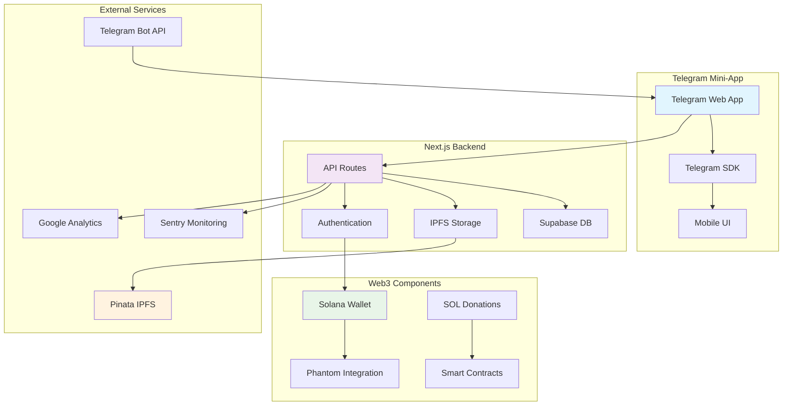

## 🔄 Поток данных

### 1. Пользовательский сценарий

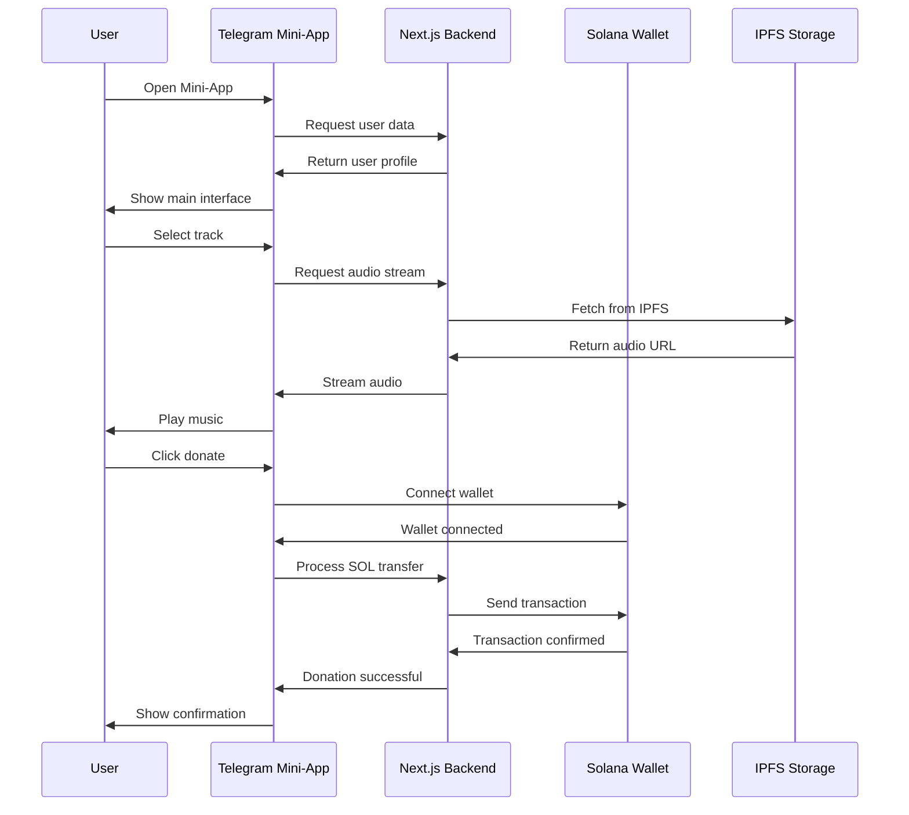

### 2. Загрузка трека артистом

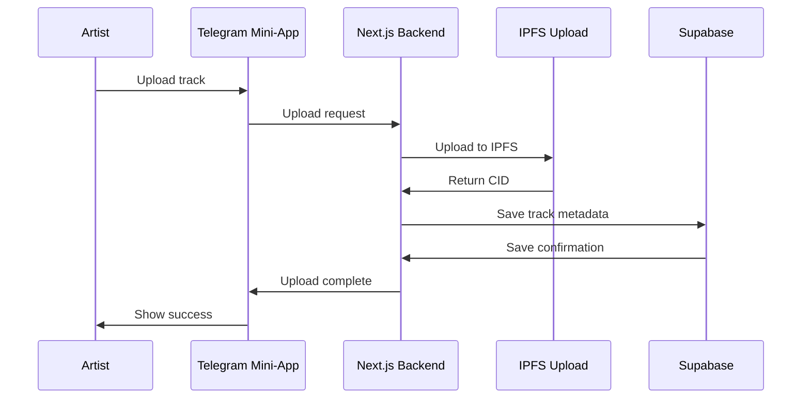

## 🎯 Компонентная архитектура

### Frontend компоненты

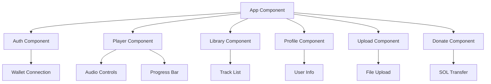

### Backend API endpoints

```mermaid
graph LR
    A[API Gateway] --> B[/api/auth]
    A --> C[/api/tracks]
    A --> D[/api/stream]
    A --> E[/api/upload]
    A --> F[/api/donate]
    A --> G[/api/users]

    B --> H[Authentication]
    C --> I[Track Management]
    D --> J[Audio Streaming]
    E --> K[File Upload]
    F --> L[Payment Processing]
    G --> M[User Management]
```

## 📱 Mobile-first дизайн

### Адаптация для Telegram Mini-App

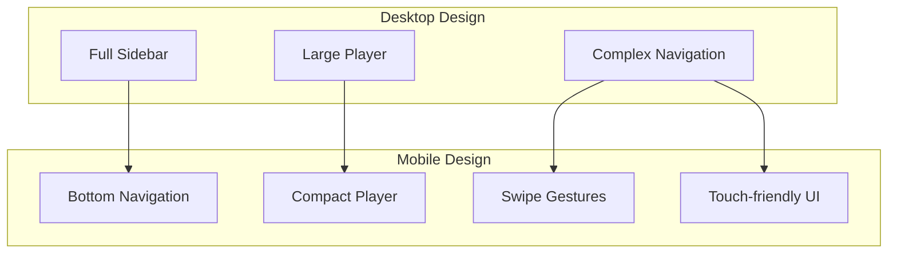

## 🔐 Безопасность и мониторинг

### Security Flow

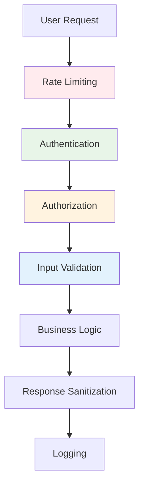

### Monitoring Architecture

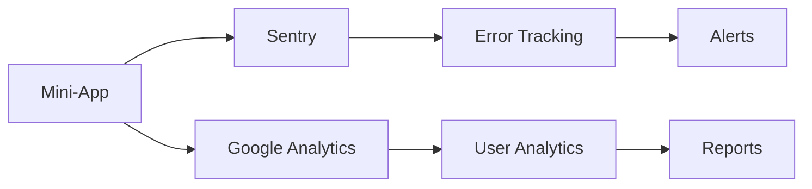

## 🚀 Deployment Pipeline

### CI/CD Flow

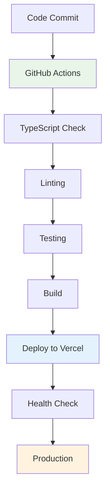

## 📊 Data Flow Architecture

### Database Schema

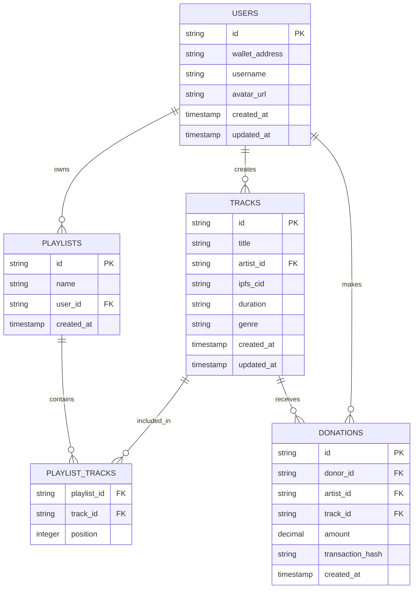

## 🎯 Performance Optimization

### Caching Strategy

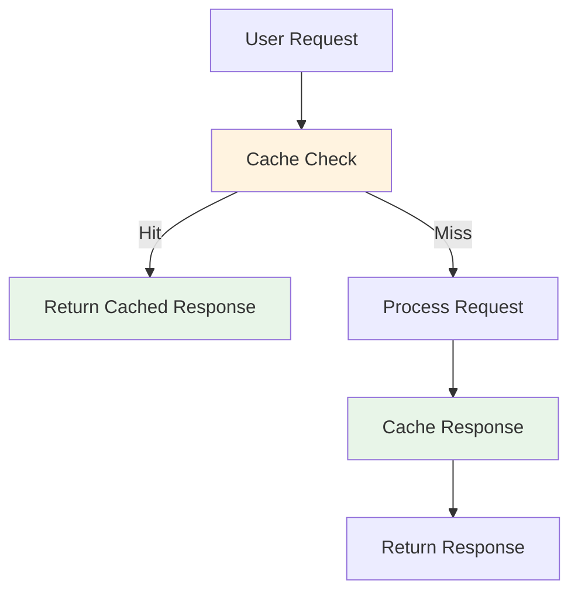

### Load Balancing

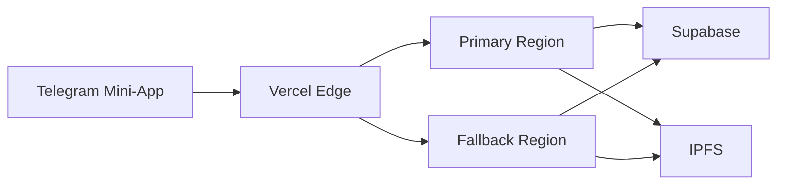

Эта архитектурная схема обеспечивает основу для создания масштабируемого, безопасного и производительного Telegram Mini-App MVP для Normal Dance.
