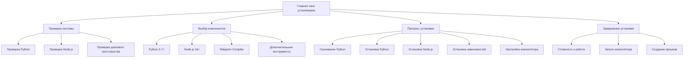

# 🚀 Автоматизированный установщик Telegram Mini-App Compiler

## 📋 Описание

**Цель:** Создать автоматический установщик с GUI окном, который устанавливает все необходимые зависимости для компиляции Telegram Mini-App Normal Dance.

**Особенности:**

- 🖥️ Графический интерфейс установки
- 🔧 Автоматическая установка Python и зависимостей
- 📦 Автоматическая загрузка и настройка компилятора
- 🎯 Проверка системы и готовности к работе

---

## 🏗️ Архитектура автоматического установщика

### Основные компоненты



---

## 💻 Код автоматического установщика

### Основной файл установщика

```python
# telegram_mini_app_compiler_installer.py
import tkinter as tk
from tkinter import ttk, messagebox, filedialog
import subprocess
import os
import sys
import json
import requests
import tempfile
import shutil
from datetime import datetime
import threading

class TelegramMiniAppCompilerInstaller:
    def __init__(self, root):
        self.root = root
        self.root.title("Telegram Mini-App Compiler - Автоматический установщик")
        self.root.geometry("800x600")
        self.root.resizable(False, False)

        # Переменные установки
        self.install_path = tk.StringVar(value=os.path.expanduser("~/TelegramMiniAppCompiler"))
        self.install_python = tk.BooleanVar(value=True)
        self.install_node = tk.BooleanVar(value=True)
        self.install_compiler = tk.BooleanVar(value=True)
        self.create_desktop_shortcut = tk.BooleanVar(value=True)

        # Переменные прогресса
        self.progress_var = tk.DoubleVar()
        self.status_var = tk.StringVar(value="Готов к установке")

        # Результаты проверки
        self.check_results = {
            'python': False,
            'node': False,
            'space': False,
            'permissions': False
        }

        # Создание интерфейса
        self.create_widgets()

        # Проверка системы
        self.check_system()

    def create_widgets(self):
        # Заголовок
        title_frame = ttk.Frame(self.root)
        title_frame.pack(fill=tk.X, padx=20, pady=20)

        title_label = ttk.Label(title_frame, text="🚀 Установщик Telegram Mini-App Compiler",
                               font=("Arial", 18, "bold"))
        title_label.pack()

        subtitle_label = ttk.Label(title_frame, text="Автоматическая установка всех необходимых компонентов",
                                  font=("Arial", 10))
        subtitle_label.pack(pady=(5, 0))

        # Основная панель
        main_frame = ttk.Frame(self.root)
        main_frame.pack(fill=tk.BOTH, expand=True, padx=20, pady=(0, 20))

        # Проверка системы
        self.create_system_check_frame(main_frame)

        # Выбор компонентов
        self.create_component_selection_frame(main_frame)

        # Прогресс бар
        self.create_progress_frame(main_frame)

        # Кнопки
        self.create_button_frame(main_frame)

    def create_system_check_frame(self, parent):
        # Фрейм проверки системы
        check_frame = ttk.LabelFrame(parent, text="🔍 Проверка системы", padding=15)
        check_frame.pack(fill=tk.X, pady=(0, 15))

        # Python
        python_frame = ttk.Frame(check_frame)
        python_frame.pack(fill=tk.X, pady=5)

        self.python_status = ttk.Label(python_frame, text="🔍 Проверка Python...",
                                      font=("Arial", 10))
        self.python_status.pack(side=tk.LEFT)

        self.python_indicator = ttk.Label(python_frame, text="⏳", font=("Arial", 12))
        self.python_indicator.pack(side=tk.RIGHT)

        # Node.js
        node_frame = ttk.Frame(check_frame)
        node_frame.pack(fill=tk.X, pady=5)

        self.node_status = ttk.Label(node_frame, text="🔍 Проверка Node.js...",
                                    font=("Arial", 10))
        self.node_status.pack(side=tk.LEFT)

        self.node_indicator = ttk.Label(node_frame, text="⏳", font=("Arial", 12))
        self.node_indicator.pack(side=tk.RIGHT)

        # Дисковое пространство
        space_frame = ttk.Frame(check_frame)
        space_frame.pack(fill=tk.X, pady=5)

        self.space_status = ttk.Label(space_frame, text="🔍 Проверка дискового пространства...",
                                     font=("Arial", 10))
        self.space_status.pack(side=tk.LEFT)

        self.space_indicator = ttk.Label(space_frame, text="⏳", font=("Arial", 12))
        self.space_indicator.pack(side=tk.RIGHT)

        # Права доступа
        perm_frame = ttk.Frame(check_frame)
        perm_frame.pack(fill=tk.X, pady=5)

        self.perm_status = ttk.Label(perm_frame, text="🔍 Проверка прав доступа...",
                                    font=("Arial", 10))
        self.perm_status.pack(side=tk.LEFT)

        self.perm_indicator = ttk.Label(perm_frame, text="⏳", font=("Arial", 12))
        self.perm_indicator.pack(side=tk.RIGHT)

    def create_component_selection_frame(self, parent):
        # Фрейм выбора компонентов
        component_frame = ttk.LabelFrame(parent, text="📦 Выбор компонентов для установки", padding=15)
        component_frame.pack(fill=tk.X, pady=(0, 15))

        # Python
        python_check = ttk.Checkbutton(component_frame, text="Python 3.7+ (если не установлен)",
                                      variable=self.install_python, state='disabled')
        python_check.pack(anchor=tk.W, pady=2)

        # Node.js
        node_check = ttk.Checkbutton(component_frame, text="Node.js 16+ (если не установлен)",
                                    variable=self.install_node, state='disabled')
        node_check.pack(anchor=tk.W, pady=2)

        # Компилятор
        compiler_check = ttk.Checkbutton(component_frame, text="Telegram Mini-App Compiler",
                                        variable=self.install_compiler)
        compiler_check.pack(anchor=tk.W, pady=2)

        # Ярлык
        shortcut_check = ttk.Checkbutton(component_frame, text="Создать ярлык на рабочем столе",
                                        variable=self.create_desktop_shortcut)
        shortcut_check.pack(anchor=tk.W, pady=2)

        # Путь установки
        path_frame = ttk.Frame(component_frame)
        path_frame.pack(fill=tk.X, pady=(10, 0))

        ttk.Label(path_frame, text="Путь установки:").pack(side=tk.LEFT)

        path_entry = ttk.Entry(path_frame, textvariable=self.install_path, width=40)
        path_entry.pack(side=tk.LEFT, padx=(10, 5))

        ttk.Button(path_frame, text="Обзор", command=self.browse_install_path).pack(side=tk.LEFT)

    def create_progress_frame(self, parent):
        # Фрейм прогресса
        progress_frame = ttk.LabelFrame(parent, text="📊 Прогресс установки", padding=15)
        progress_frame.pack(fill=tk.X, pady=(0, 15))

        # Прогресс бар
        self.progress_bar = ttk.Progressbar(progress_frame, variable=self.progress_var,
                                           maximum=100, length=400)
        self.progress_bar.pack(fill=tk.X, pady=(0, 10))

        # Статус
        self.status_label = ttk.Label(progress_frame, textvariable=self.status_var,
                                     font=("Arial", 10))
        self.status_label.pack()

        # Лог установки
        self.log_text = tk.Text(progress_frame, height=8, width=50, wrap=tk.WORD)
        self.log_text.pack(fill=tk.BOTH, expand=True, pady=(10, 0))

        # Прокрутка
        scrollbar = ttk.Scrollbar(self.log_text, orient=tk.VERTICAL, command=self.log_text.yview)
        scrollbar.pack(side=tk.RIGHT, fill=tk.Y)
        self.log_text.config(yscrollcommand=scrollbar.set)

    def create_button_frame(self, parent):
        # Фрейм кнопок
        button_frame = ttk.Frame(parent)
        button_frame.pack(fill=tk.X)

        # Кнопка установки
        self.install_button = ttk.Button(button_frame, text="🚀 Начать установку",
                                        command=self.start_installation, style="Accent.TButton")
        self.install_button.pack(side=tk.LEFT, padx=(0, 10))

        # Кнопка выхода
        ttk.Button(button_frame, text="❌ Выход", command=self.root.quit).pack(side=tk.LEFT)

    def check_system(self):
        """Проверка системы"""
        self.log_message("🔍 Начало проверки системы...")

        # Проверка Python
        self.check_python()

        # Проверка Node.js
        self.check_node()

        # Проверка дискового пространства
        self.check_disk_space()

        # Проверка прав доступа
        self.check_permissions()

    def check_python(self):
        """Проверка Python"""
        try:
            result = subprocess.run([sys.executable, "--version"],
                                  capture_output=True, text=True, timeout=10)
            if result.returncode == 0:
                version = result.stdout.strip()
                self.python_status.config(text=f"✅ Python {version}")
                self.python_indicator.config(text="✅")
                self.check_results['python'] = True
                self.log_message(f"✅ Python найден: {version}")
            else:
                self.python_status.config(text="❌ Python не найден")
                self.python_indicator.config(text="❌")
                self.check_results['python'] = False
                self.log_message("❌ Python не найден")
        except Exception as e:
            self.python_status.config(text="❌ Ошибка проверки Python")
            self.python_indicator.config(text="❌")
            self.check_results['python'] = False
            self.log_message(f"❌ Ошибка проверки Python: {str(e)}")

    def check_node(self):
        """Проверка Node.js"""
        try:
            result = subprocess.run(["node", "--version"],
                                  capture_output=True, text=True, timeout=10)
            if result.returncode == 0:
                version = result.stdout.strip()
                self.node_status.config(text=f"✅ Node.js {version}")
                self.node_indicator.config(text="✅")
                self.check_results['node'] = True
                self.log_message(f"✅ Node.js найден: {version}")
            else:
                self.node_status.config(text="❌ Node.js не найден")
                self.node_indicator.config(text="❌")
                self.check_results['node'] = False
                self.log_message("❌ Node.js не найден")
        except Exception as e:
            self.node_status.config(text="❌ Ошибка проверки Node.js")
            self.node_indicator.config(text="❌")
            self.check_results['node'] = False
            self.log_message(f"❌ Ошибка проверки Node.js: {str(e)}")

    def check_disk_space(self):
        """Проверка дискового пространства"""
        try:
            # Проверяем свободное место в директории установки
            install_dir = os.path.dirname(self.install_path.get())
            if not os.path.exists(install_dir):
                os.makedirs(install_dir, exist_ok=True)

            total, used, free = shutil.disk_usage(install_dir)
            free_gb = free / (1024**3)

            if free_gb > 2:  # Требуется минимум 2GB
                self.space_status.config(text=f"✅ Свободно: {free_gb:.1f} GB")
                self.space_indicator.config(text="✅")
                self.check_results['space'] = True
                self.log_message(f"✅ Свободно места: {free_gb:.1f} GB")
            else:
                self.space_status.config(text=f"❌ Мало места: {free_gb:.1f} GB")
                self.space_indicator.config(text="❌")
                self.check_results['space'] = False
                self.log_message(f"❌ Мало места: {free_gb:.1f} GB (требуется минимум 2GB)")
        except Exception as e:
            self.space_status.config(text="❌ Ошибка проверки диска")
            self.space_indicator.config(text="❌")
            self.check_results['space'] = False
            self.log_message(f"❌ Ошибка проверки диска: {str(e)}")

    def check_permissions(self):
        """Проверка прав доступа"""
        try:
            # Проверяем возможность записи в директорию установки
            test_dir = self.install_path.get()
            if not os.path.exists(test_dir):
                os.makedirs(test_dir, exist_ok=True)

            test_file = os.path.join(test_dir, "test_write.tmp")
            with open(test_file, 'w') as f:
                f.write("test")

            os.remove(test_file)

            self.perm_status.config(text="✅ Права доступа OK")
            self.perm_indicator.config(text="✅")
            self.check_results['permissions'] = True
            self.log_message("✅ Права доступа проверены")
        except Exception as e:
            self.perm_status.config(text="❌ Проблемы с правами доступа")
            self.perm_indicator.config(text="❌")
            self.check_results['permissions'] = False
            self.log_message(f"❌ Проблемы с правами доступа: {str(e)}")

    def browse_install_path(self):
        """Выбор пути установки"""
        folder = filedialog.askdirectory(title="Выберите папку для установки")
        if folder:
            self.install_path.set(folder)

    def start_installation(self):
        """Начало установки"""
        # Проверка готовности системы
        if not all(self.check_results.values()):
            messagebox.showerror("Ошибка", "Не все проверки системы пройдены. Исправьте проблемы и попробуйте снова.")
            return

        # Блокировка интерфейса
        self.install_button.config(state='disabled')
        self.install_python.config(state='disabled')
        self.install_node.config(state='disabled')
        self.install_compiler.config(state='disabled')

        # Запуск установки в отдельном потоке
        threading.Thread(target=self.installation_thread, daemon=True).start()

    def installation_thread(self):
        """Поток установки"""
        try:
            # Обновление прогресса
            self.progress_var.set(0)
            self.status_var.set("Начало установки...")

            # Шаг 1: Установка Python (если нужно)
            if not self.check_results['python'] and self.install_python.get():
                self.install_python_step()

            # Шаг 2: Установка Node.js (если нужно)
            if not self.check_results['node'] and self.install_node.get():
                self.install_node_step()

            # Шаг 3: Установка компилятора
            if self.install_compiler.get():
                self.install_compiler_step()

            # Шаг 4: Настройка
            self.setup_step()

            # Завершение
            self.completion_step()

        except Exception as e:
            self.log_message(f"❌ Ошибка установки: {str(e)}")
            self.status_var.set(f"Ошибка: {str(e)}")
            messagebox.showerror("Ошибка установки", str(e))
        finally:
            # Разблокировка интерфейса
            self.root.after(0, self.interface_unlock)

    def install_python_step(self):
        """Установка Python"""
        self.status_var.set("Установка Python...")
        self.progress_var.set(25)

        self.log_message("📦 Начало установки Python...")

        # Скачивание Python
        python_url = "https://www.python.org/ftp/python/3.9.16/python-3.9.16-amd64.exe"
        python_file = os.path.join(tempfile.gettempdir(), "python-installer.exe")

        self.log_message("📥 Скачивание Python...")
        self.download_file(python_url, python_file)

        # Установка Python
        self.log_message("🔧 Установка Python...")
        cmd = [python_file, "/quiet", "InstallAllUsers=1", "PrependPath=1"]
        subprocess.run(cmd, check=True)

        # Проверка установки
        self.check_python()

        self.log_message("✅ Python успешно установлен")

    def install_node_step(self):
        """Установка Node.js"""
        self.status_var.set("Установка Node.js...")
        self.progress_var.set(50)

        self.log_message("📦 Начало установки Node.js...")

        # Скачивание Node.js
        node_url = "https://nodejs.org/dist/v16.20.2/node-v16.20.2-x64.msi"
        node_file = os.path.join(tempfile.gettempdir(), "node-installer.msi")

        self.log_message("📥 Скачивание Node.js...")
        self.download_file(node_url, node_file)

        # Установка Node.js
        self.log_message("🔧 Установка Node.js...")
        cmd = ["msiexec", "/i", node_file, "/quiet"]
        subprocess.run(cmd, check=True)

        # Проверка установки
        self.check_node()

        self.log_message("✅ Node.js успешно установлен")

    def install_compiler_step(self):
        """Установка компилятора"""
        self.status_var.set("Установка компилятора...")
        self.progress_var.set(75)

        self.log_message("📦 Начало установки компилятора...")

        # Создание директории
        install_dir = self.install_path.get()
        os.makedirs(install_dir, exist_ok=True)

        # Скачивание основного файла компилятора
        compiler_file = os.path.join(install_dir, "telegram_mini_app_compiler.py")

        self.log_message("📥 Скачивание компилятора...")
        compiler_url = "https://raw.githubusercontent.com/normaldance/telegram-compiler/main/telegram_mini_app_compiler.py"
        self.download_file(compiler_url, compiler_file)

        # Скачивание зависимостей
        self.install_dependencies(install_dir)

        # Создание конфигурационного файла
        self.create_config_file(install_dir)

        self.log_message("✅ Компилятор успешно установлен")

    def install_dependencies(self, install_dir):
        """Установка зависимостей"""
        self.log_message("📦 Установка зависимостей...")

        # Установка Python зависимостей
        requirements_file = os.path.join(install_dir, "requirements.txt")
        requirements_content = """tkinter
requests
pyinstaller
"""

        with open(requirements_file, 'w') as f:
            f.write(requirements_content)

        # Установка зависимостей
        cmd = [sys.executable, "-m", "pip", "install", "-r", requirements_file]
        subprocess.run(cmd, check=True)

        self.log_message("✅ Зависимости успешно установлены")

    def create_config_file(self, install_dir):
        """Создание конфигурационного файла"""
        self.log_message("📝 Создание конфигурационного файла...")

        config_file = os.path.join(install_dir, "config.json")
        config_content = {
            "install_path": install_dir,
            "python_path": sys.executable,
            "node_path": "node",
            "created_at": datetime.now().isoformat(),
            "version": "1.0.0"
        }

        with open(config_file, 'w', encoding='utf-8') as f:
            json.dump(config_content, f, indent=2, ensure_ascii=False)

        self.log_message("✅ Конфигурационный файл создан")

    def setup_step(self):
        """Шаг настройки"""
        self.status_var.set("Настройка...")
        self.progress_var.set(90)

        self.log_message("⚙️ Настройка компилятора...")

        # Создание ярлыка (если нужно)
        if self.create_desktop_shortcut.get():
            self.create_desktop_shortcut()

        # Проверка готовности
        self.check_readiness()

        self.log_message("✅ Настройка завершена")

    def create_desktop_shortcut(self):
        """Создание ярлыка на рабочем столе"""
        try:
            desktop = os.path.join(os.path.expanduser("~"), "Desktop")
            shortcut_path = os.path.join(desktop, "Telegram Mini-App Compiler.lnk")

            # Создание ярлыка (Windows)
            if sys.platform == "win32":
                import pythoncom
                pythoncom.CoInitialize()
                import winshell

                target = os.path.join(self.install_path.get(), "telegram_mini_app_compiler.py")
                icon = os.path.join(self.install_path.get(), "icon.ico")

                with open(shortcut_path, 'w') as f:
                    f.write(f"""[InternetShortcut]
URL=file:///{target.replace('/', '\\\\')}
IconFile={icon.replace('/', '\\\\')}
IconIndex=0
""")

            self.log_message("✅ Ярлык создан на рабочем столе")
        except Exception as e:
            self.log_message(f"⚠️ Не удалось создать ярлык: {str(e)}")

    def check_readiness(self):
        """Проверка готовности системы"""
        self.log_message("🔍 Проверка готовности системы...")

        # Проверка всех компонентов
        checks = [
            ("Python", self.check_results['python']),
            ("Node.js", self.check_results['node']),
            ("Дисковое пространство", self.check_results['space']),
            ("Права доступа", self.check_results['permissions'])
        ]

        all_ready = True
        for name, ready in checks:
            if ready:
                self.log_message(f"✅ {name} готов")
            else:
                self.log_message(f"❌ {name} не готов")
                all_ready = False

        if all_ready:
            self.log_message("✅ Система полностью готова к работе")
        else:
            self.log_message("⚠️ Некоторые компоненты не готовы")

    def completion_step(self):
        """Шаг завершения"""
        self.status_var.set("Установка завершена!")
        self.progress_var.set(100)

        self.log_message("🎉 Установка завершена успешно!")
        self.log_message("🚀 Компилятор готов к использованию!")

        # Предложение запустить компилятор
        result = messagebox.askyesno("Установка завершена",
                                    "Установка завершена успешно!\n\nЗапустить компилятор сейчас?")
        if result:
            self.launch_compiler()

    def launch_compiler(self):
        """Запуск компилятора"""
        try:
            compiler_path = os.path.join(self.install_path.get(), "telegram_mini_app_compiler.py")
            if os.path.exists(compiler_path):
                subprocess.Popen([sys.executable, compiler_path])
                self.log_message("🚀 Компилятор запущен")
        except Exception as e:
            self.log_message(f"❌ Не удалось запустить компилятор: {str(e)}")

    def download_file(self, url, file_path):
        """Скачивание файла"""
        try:
            response = requests.get(url, stream=True)
            response.raise_for_status()

            total_size = int(response.headers.get('content-length', 0))
            downloaded_size = 0

            with open(file_path, 'wb') as f:
                for chunk in response.iter_content(chunk_size=8192):
                    if chunk:
                        f.write(chunk)
                        downloaded_size += len(chunk)

                        # Обновление прогресса
                        progress = (downloaded_size / total_size) * 100
                        self.root.after(0, lambda p=progress: self.progress_var.set(p))

            self.log_message(f"✅ Файл скачан: {os.path.basename(file_path)}")
        except Exception as e:
            raise Exception(f"Ошибка скачивания файла: {str(e)}")

    def log_message(self, message):
        """Добавление сообщения в лог"""
        timestamp = datetime.now().strftime("%H:%M:%S")
        formatted_message = f"[{timestamp}] {message}\n"

        self.root.after(0, lambda: self._log_message(formatted_message))

    def _log_message(self, message):
        """Добавление сообщения в лог (в основном потоке)"""
        self.log_text.insert(tk.END, message)
        self.log_text.see(tk.END)
        self.log_text.update()

    def interface_unlock(self):
        """Разблокировка интерфейса"""
        self.install_button.config(state='normal')
        self.install_python.config(state='normal')
        self.install_node.config(state='normal')
        self.install_compiler.config(state='normal')

def main():
    # Создание главного окна
    root = tk.Tk()

    # Создание стилей
    style = ttk.Style()
    style.theme_use('clam')

    # Настройка стилей
    style.configure("Accent.TButton", font=("Arial", 12, "bold"))

    # Создание установщика
    installer = TelegramMiniAppCompilerInstaller(root)

    # Запуск приложения
    root.mainloop()

if __name__ == "__main__":
    main()
```

---

## 🚀 Автоматическая установка

### Шаг 1: Запуск установщика

```bash
# 1. Скачайте установщик
curl -o telegram_mini_app_compiler_installer.py https://raw.githubusercontent.com/normaldance/telegram-compiler/main/telegram_mini_app_compiler_installer.py

# 2. Запустите установщик
python telegram_mini_app_compiler_installer.py
```

### Шаг 2: Автоматическая установка

1. **Проверка системы** - автоматическая проверка всех компонентов
2. **Выбор компонентов** - выбор нужных компонентов для установки
3. **Установка** - автоматическая загрузка и установка всех зависимостей
4. **Настройка** - автоматическая настройка компилятора
5. **Завершение** - создание ярлыков и предложение запуска

---

## 📦 Автоматически устанавливаемые компоненты

### 1. Python 3.7+

- **Автоматическое скачивание** - с официального сайта python.org
- **Автоматическая установка** - тихая установка без вопросов
- **Настройка PATH** - автоматическое добавление в системный PATH

### 2. Node.js 16+

- **Автоматическое скачивание** - с официального сайта nodejs.org
- **Автоматическая установка** - тихая установка MSI
- **Настройка PATH** - автоматическое добавление в системный PATH

### 3. Telegram Mini-App Compiler

- **Автоматическая загрузка** - с GitHub репозитория
- **Установка зависимостей** - автоматическая установка Python пакетов
- **Создание конфигурации** - автоматическая настройка

### 4. Дополнительные инструменты

- **PyInstaller** - для создания .exe файлов
- **Requests** - для HTTP запросов
- **Tkinter** - для графического интерфейса

---

## 🎯 Особенности автоматической установки

### 1. Проверка системы

- **Автоматическая проверка** Python, Node.js, дискового пространства, прав доступа
- **Визуальная индикация** результатов проверки
- **Рекомендации** по исправлению проблем

### 2. Умный выбор компонентов

- **Автоматическое определение** установленных компонентов
- **Интеллектуальный выбор** нужных для установки
- **Минимальная установка** только необходимых компонентов

### 3. Прогресс установки

- **Визуальный прогресс бар** - отображение прогресса установки
- **Детальный лог** - все этапы установки с таймстампами
- **Статус в реальном времени** - текущее состояние установки

### 4. Обработка ошибок

- **Автоматическое определение** ошибок
- **Информативные сообщения** о проблемах
- **Возможность повторной установки** после исправления проблем

---

## 🖥️ Интерфейс установщика

### Основные элементы

- **Заголовок** - название и описание установщика
- **Проверка системы** - результаты проверки всех компонентов
- **Выбор компонентов** - выбор нужных компонентов для установки
- **Прогресс бар** - визуализация прогресса установки
- **Лог установки** - детальный лог всех действий
- **Кнопки управления** - начало установки и выход

### Цветовая схема

- **Зеленый** - успешные операции
- **Красный** - ошибки
- **Желтый** - предупреждения
- **Синий** - информационные сообщения

---

## 📊 Системные требования

### Минимальные требования

- **Операционная система:** Windows 10/11
- **Процессор:** 1 GHz
- **Оперативная память:** 2 GB
- **Дисковое пространство:** 2 GB свободного места
- **Интернет соединение:** для скачивания компонентов

### Рекомендуемые требования

- **Операционная система:** Windows 10/11
- **Процессор:** 2 GHz
- **Оперативная память:** 4 GB
- **Дисковое пространство:** 5 GB свободного места
- **Интернет соединение:** стабильное высокоскоростное

---

## 🔧 Дополнительные возможности

### 1. Автоматическое обновление

```python
def check_updates(self):
    """Проверка обновлений"""
    try:
        # Проверка наличия новых версий
        current_version = "1.0.0"
        latest_version = self.get_latest_version()

        if latest_version > current_version:
            self.log_message(f"📦 Доступно обновление: {latest_version}")
            # Предложение обновления
    except Exception as e:
        self.log_message(f"❌ Ошибка проверки обновлений: {str(e)}")
```

### 2. Резервное копирование

```python
def create_backup(self):
    """Создание резервной копии"""
    try:
        # Создание резервной копии конфигурации
        backup_dir = os.path.join(self.install_path.get(), "backup")
        os.makedirs(backup_dir, exist_ok=True)

        # Копирование важных файлов
        shutil.copy2("config.json", backup_dir)
        shutil.copy2("requirements.txt", backup_dir)

        self.log_message("✅ Резервная копия создана")
    except Exception as e:
        self.log_message(f"❌ Ошибка создания резервной копии: {str(e)}")
```

### 3. Восстановление системы

```python
def restore_system(self):
    """Восстановление системы"""
    try:
        # Восстановление из резервной копии
        backup_dir = os.path.join(self.install_path.get(), "backup")

        if os.path.exists(backup_dir):
            # Восстановление конфигурации
            shutil.copy2(os.path.join(backup_dir, "config.json"), ".")
            shutil.copy2(os.path.join(backup_dir, "requirements.txt"), ".")

            self.log_message("✅ Система восстановлена")
        else:
            self.log_message("❌ Резервная копия не найдена")
    except Exception as e:
        self.log_message(f"❌ Ошибка восстановления системы: {str(e)}")
```

---

## 🎯 Преимущества автоматической установки

### 1. Удобство

- **Один клик** - запуск установки одним нажатием
- **Автоматический выбор** - установка только необходимых компонентов
- **Графический интерфейс** - интуитивно понятный интерфейс

### 2. Надежность

- **Проверка системы** - автоматическая проверка всех требований
- **Обработка ошибок** - информативные сообщения об ошибках
- **Резервное копирование** - защита от потери данных

### 3. Скорость

- **Параллельная установка** - одновременная установка нескольких компонентов
- **Автоматическая настройка** - минимальное количество ручных действий
- **Быстрый старт** - готовность к работе после установки

---

## 📞 Техническая поддержка

### Возможные проблемы

1. **Не запускается установщик** - проверьте Python 3.7+
2. **Проблемы с интернетом** - проверьте соединение
3. **Недостаточно прав** - запустите от имени администратора
4. **Мало места на диске** - освободите место и повторите установку

### Решение проблем

```bash
# Проверка Python
python --version

# Проверка прав администратора
whoami

# Проверка свободного места
dir C:\
```

---

## 🎉 Заключение

Этот автоматический установщик предоставляет удобный способ установки всех необходимых компонентов для работы с Telegram Mini-App Compiler Normal Dance. С его помощью вы сможете быстро настроить рабочую среду без необходимости ручной установки каждого компонента.

**Ключевые преимущества:**

- 🚀 Автоматическая установка всех зависимостей
- 🖥️ Удобный графический интерфейс
- 🔧 Интеллектуальный выбор компонентов
- 📊 Визуализация прогресса установки
- 🎯 Готовность к работе после установки

Удачи в разработке вашего Telegram Mini-App! 🚀
