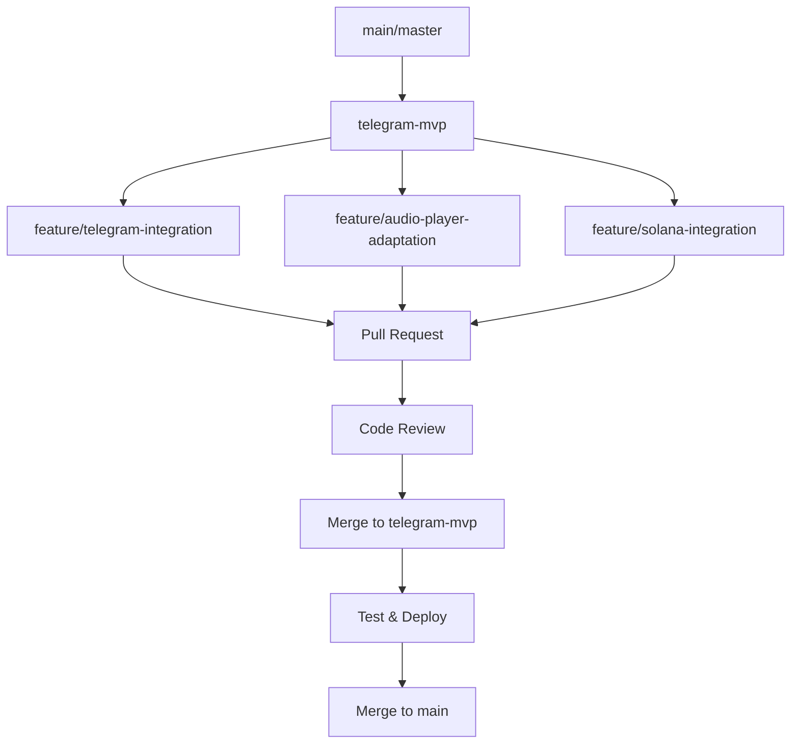

# 🔄 Стратегия безопасного слияния Telegram Mini-App с существующей кодовой базой

## 📋 Проблема слияния

**Основные риски:**

- Конфликты в существующих компонентах
- Нарушение текущей функциональности
- Проблемы с Git историей
- Технический долг

**Решение:** Постепенная интеграция с изоляцией рисков

---

## 🏗️ Стратегия ветвления

### 1. Clean Branch Strategy

```bash
# Текущая основная ветка (рабочая версия)
main/master

# Ветка для Telegram Mini-App разработки
telegram-mvp

# Ветки для фичей (feature branches)
feature/telegram-integration
feature/audio-player-adaptation
feature/solana-integration
```

### 2. Git Workflow



---

## 🎯 Пошаговый план слияния

### Этап 1: Подготовка (Дни 1-2)

#### Шаг 1: Создание изолированной среды

```bash
# 1. Создать backup текущей рабочей версии
git checkout main
git branch backup-$(date +%Y%m%d-%H%M%S)

# 2. Создать чистую ветку для Telegram Mini-App
git checkout -b telegram-mvp
git push origin telegram-mvp

# 3. Настроить CI/CD для этой ветки
# Создать отдельный Vercel preview environment
```

#### Шаг 2: Анализ существующего кода

```typescript
// Проверить существующие компоненты
-src / components / audio -
  player.tsx -
  src / components / wallet -
  adapter.tsx -
  src / components / track -
  uploader.tsx -
  src / components / donate -
  system.tsx -
  src / app / page.tsx;

// Определить, что можно переиспользовать
// Что нужно адаптировать
// Что нужно создать с нуля
```

### Этап 2: Интеграция компонентов (Дни 3-7)

#### Шаг 3: Адаптация существующих компонентов

```typescript
// 1. Audio Player адаптация
// Создать wrapper компонента для Telegram
// src/components/telegram-audio-player.tsx

import { AudioPlayer } from './audio-player';

export const TelegramAudioPlayer = ({ track, onPlay, onPause }) => {
  return (
    <div className="telegram-player">
      <AudioPlayer
        track={track}
        onPlay={onPlay}
        onPause={onPause}
        // Telegram-specific adaptations
        showControls={true}
        autoPlay={false}
        preload="metadata"
      />
    </div>
  );
};
```

#### Шаг 4: Wallet Adapter интеграция

```typescript
// 2. Solana Wallet адаптация
// Создать Telegram-specific wallet adapter
// src/components/telegram-wallet-adapter.tsx

import { WalletAdapter } from './wallet-adapter';

export const TelegramWalletAdapter = () => {
  return (
    <div className="telegram-wallet">
      <WalletAdapter
        // Telegram-specific constraints
        mobileOnly={true}
        showQRCode={false}
        simpleConnect={true}
      />
    </div>
  );
};
```

#### Шаг 5: Track Uploader адаптация

```typescript
// 3. Track Uploader для Telegram
// Адаптировать под Telegram Mini-App ограничения
// src/components/telegram-track-uploader.tsx

import { TrackUploader } from './track-uploader';

export const TelegramTrackUploader = () => {
  return (
    <div className="telegram-uploader">
      <TrackUploader
        // Telegram-specific adaptations
        maxSize={10 * 1024 * 1024} // 10MB
        allowedTypes={['audio/mp3', 'audio/wav']}
        simpleInterface={true}
      />
    </div>
  );
};
```

### Этап 3: Создание Telegram-specific компонентов (Дни 8-12)

#### Шаг 6: Telegram Mini-App Wrapper

```typescript
// src/components/telegram-mini-app.tsx

'use client';

import { useEffect, useState } from 'react';
import { TelegramWebApp } from '@telegram-apps/sdk';

export const TelegramMiniApp = ({ children }) => {
  const [isTelegram, setIsTelegram] = useState(false);
  const [webApp, setWebApp] = useState(null);

  useEffect(() => {
    if (typeof window !== 'undefined') {
      const telegram = window.Telegram?.WebApp;
      if (telegram) {
        setIsTelegram(true);
        setWebApp(telegram);
        telegram.ready();
      }
    }
  }, []);

  if (!isTelegram) {
    return <div className="desktop-fallback">{children}</div>;
  }

  return (
    <div
      className="telegram-mini-app"
      data-telegram-web-app
      style={{
        minHeight: '100vh',
        backgroundColor: '#ffffff',
        color: '#000000',
      }}
    >
      {children}
    </div>
  );
};
```

#### Шаг 7: Telegram Navigation

```typescript
// src/components/telegram-navigation.tsx

export const TelegramNavigation = () => {
  return (
    <div className="telegram-navigation">
      <button className="nav-btn" data-action="home">
        🏠 Главная
      </button>
      <button className="nav-btn" data-action="library">
        🎵 Библиотека
      </button>
      <button className="nav-btn" data-action="profile">
        👤 Профиль
      </button>
      <button className="nav-btn" data-action="upload">
        📤 Загрузить
      </button>
    </div>
  );
};
```

### Этап 4: Интеграция с существующим API (Дни 13-14)

#### Шаг 8: API Routes адаптация

```typescript
// src/app/api/telegram/route.ts

import { NextRequest, NextResponse } from "next/server";
import { supabase } from "@/lib/supabase";

export async function GET(request: NextRequest) {
  const { searchParams } = new URL(request.url);
  const userId = searchParams.get("user_id");

  if (!userId) {
    return NextResponse.json({ error: "User ID required" }, { status: 400 });
  }

  // Использовать существующие API endpoints
  const { data, error } = await supabase
    .from("tracks")
    .select("*")
    .eq("user_id", userId);

  if (error) {
    return NextResponse.json({ error: error.message }, { status: 500 });
  }

  return NextResponse.json({ data });
}
```

#### Шаг 9: Main Page адаптация

```typescript
// src/app/page.tsx

import { TelegramMiniApp } from '@/components/telegram-mini-app';
import { TelegramNavigation } from '@/components/telegram-navigation';
import { TelegramAudioPlayer } from '@/components/telegram-audio-player';
import { TelegramWalletAdapter } from '@/components/telegram-wallet-adapter';
import { TelegramTrackUploader } from '@/components/telegram-track-uploader';

export default function HomePage() {
  return (
    <TelegramMiniApp>
      <div className="app-container">
        <TelegramNavigation />

        {/* Использовать существующие компоненты с Telegram адаптацией */}
        <TelegramWalletAdapter />
        <TelegramTrackUploader />
        <TelegramAudioPlayer />

        {/* Остальной контент */}
      </div>
    </TelegramMiniApp>
  );
}
```

---

## 🛡️ Стратегия тестирования

### 1. Изолированное тестирование

```bash
# Тестировать каждую компоненту отдельно
npm test -- --testPathPattern="telegram-.*"

# Тестировать интеграцию
npm test -- --testPathPattern="integration.*"

# Тестировать производительность
npm run test:performance
```

### 2. Кросс-браузерное тестирование

```typescript
// Тесты для разных окружений
describe("Telegram Mini-App", () => {
  it("should work in Telegram Web App", () => {
    // Тест для Telegram окружения
  });

  it("should work as standalone web app", () => {
    // Тест для обычного браузера
  });

  it("should work on mobile devices", () => {
    // Тест для мобильных устройств
  });
});
```

---

## 🚨 Митигация рисков слияния

### 1. Бэкап и откаты

```bash
# Создать бэкап перед слиянием
git add .
git commit -m "Backup before Telegram integration"

# Создать тег
git tag backup-before-telegram-$(date +%Y%m%d)

# Если что-то пошло не так, можно откатиться
git reset --hard backup-before-telegram-20250922
```

### 2. Feature Flags

```typescript
// src/lib/telegram-feature-flag.ts

export const isTelegramEnabled = () => {
  if (typeof window === 'undefined') return false;

  // Проверяем, запущено ли в Telegram
  return window.Telegram?.WebApp !== undefined;
};

// Использование в компонентах
import { isTelegramEnabled } from '@/lib/telegram-feature-flag';

export const MyComponent = () => {
  const telegramMode = isTelegramEnabled();

  return telegramMode ? <TelegramVersion /> : <DesktopVersion />;
};
```

### 3. Gradual Rollout

```typescript
// Постепенное включение функционала
const TELEGRAM_ROLLOUT_PERCENTAGE = 10; // 10% пользователей

export const shouldUseTelegram = () => {
  if (typeof window === "undefined") return false;

  // Для разработки всегда включено
  if (process.env.NODE_ENV === "development") return true;

  // Для продакшена - только часть пользователей
  const userId = getUserId();
  return userId % 100 < TELEGRAM_ROLLOUT_PERCENTAGE;
};
```

---

## 📊 Мониторинг после слияния

### 1. Технические метрики

```typescript
// Отслеживать производительность
const metrics = {
  loadTime: performance.now(),
  errorRate: errorCount / totalRequests,
  uptime: checkUptime(),
  memoryUsage: performance.memory?.usedJSHeapSize,
};

// Отправка в мониторинг
sendToSentry(metrics);
```

### 2. Пользовательские метрики

```typescript
// Отслеживать использование Telegram версии
const userMetrics = {
  telegramUsage: countTelegramUsers(),
  desktopUsage: countDesktopUsers(),
  featureAdoption: trackFeatureUsage(),
};
```

---

## 🔄 Процесс отката

### Если что-то пошло не так:

```bash
# 1. Откатить изменения
git reset --hard HEAD~1

# 2. Восстановить из бэкапа
git checkout backup-before-telegram-20250922

# 3. Проанализировать проблему
git log --oneline -10

# 4. Исправить и попробовать снова
git checkout telegram-mvp
# Исправить проблемы
git commit --amend
```

---

## 🎯 Успешные критерии слияния

### Технические критерии

- ✅ Все существующие функции работают без изменений
- ✅ Telegram Mini-App функционал работает изолированно
- ✅ Нет критических ошибок в Sentry
- ✅ Производительность не ухудшилась

### Бизнес критерии

- ✅ Пользователи могут использовать обе версии
- ✅ Нет потери данных при переключении
- ✅ Функционал Telegram Mini-App доступен

### Пользовательские критерии

- ✅ Плавный переход между версиями
- ✅ Интуитивный интерфейс в Telegram
- ✅ Нет путаницы для существующих пользователей

---

## 📝 Финальные шаги

### 1. Полное тестирование

```bash
# Запустить все тесты
npm test
npm run test:e2e
npm run test:performance

# Ручное тестирование
# Проверить все сценарии использования
```

### 2. Деплой на staging

```bash
# Деплой на staging environment
git checkout telegram-mvp
git push origin telegram-mvp

# Проверить на staging
# Собрать обратную связь
```

### 3. Production deployment

```bash
# После успешного тестирования
git checkout main
git merge telegram-mvp --no-ff
git push origin main

# Мониторить производительность
# Собирать метрики
```

Эта стратегия обеспечит безопасное слияние нового Telegram Mini-App функционала с существующей кодовой базой, минимизируя риски и сохраняя текущую функциональность.
