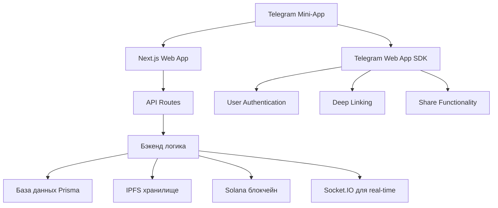

# 🚀 Стратегия запуска MVP Normal Dance в Telegram Mini-App

## 📋 Исполнительное резюме

**Цель:** Запустить работающий MVP Normal Dance в Telegram Mini-App для тестирования основного сценария (загрузка/прослушивание музыки) с привлечением первых 10-20 пользователей в течение 4 недель.

**Ключевые метрики успеха:**

- ✅ Функционирующий Telegram Mini-App
- ✅ Возможность загрузки аудио файлов через IPFS
- ✅ Воспроизведение музыки в плеере
- ✅ Интеграция с Solana кошельком для донатов
- ✅ Первые 10 активных пользователей
- ✅ Сбор обратной связи по основному сценарию

---

## 🎯 Стратегия MVP в Telegram Mini-App

### 1. Архитектура Telegram Mini-App



### 2. Ключевые компоненты MVP

#### 2.1 Telegram Bot Setup

- **Bot Token:** Получение токена через @BotFather
- **Web App URL:** Настройка URL вашего Next.js приложения
- **Menu Buttons:** Настройка главного меню с основными действиями
- **Deep Links:** Настройка ссылок для прямого доступа к функциям

#### 2.2 Mini-App Integration

- **Web App SDK:** Интеграция с `@telegram-apps/sdk`
- **User Context:** Получение информации о пользователе из Telegram
- **Theme Integration:** Адаптация под тему Telegram
- **Back Button:** Настройка кнопки возврата

#### 2.3 Упрощенный UI для Mini-App

- **Главный экран:** Поиск и популярные треки
- **Экран загрузки:** Простая форма для загрузки музыки
- **Плеер:** Минималистичный аудио плеер
- **Профиль:** Базовая информация о пользователе

---

## 🛠️ Техническая реализация (4-недельный план)

### Неделя 1: Настройка Telegram инфраструктуры

#### Задачи:

1. **Создание Telegram Bot**

   ```bash
   # Шаги для создания бота
   1. Написать @BotFather
   2. Создать нового бота
   3. Получить токен
   4. Настроить описание и аватар
   ```

2. **Настройка Web App URL**
   - Добавить URL вашего Next.js приложения в настройки бота
   - Настроить домен в настройках бота
   - Протестировать доступность Web App

3. **Интеграция Telegram Web App SDK**

   ```typescript
   // Установка зависимостей
   npm install @telegram-apps/sdk
   npm install @telegram-apps/telegram-ui
   ```

4. **Создание Mini-App оболочки**

   ```typescript
   // components/telegram-mini-app.tsx
   import { TelegramMiniApp } from '@telegram-apps/sdk';

   export function TelegramMiniAppWrapper({ children }) {
     return (
       <TelegramMiniApp>
         {children}
       </TelegramMiniApp>
     );
   }
   ```

### Неделя 2: Адаптация существующего функционала

#### Задачи:

1. **Мобильная оптимизация**
   - Адаптация существующих компонентов под мобильный размер
   - Оптимизация аудио плеера для сенсорного управления
   - Упрощение навигации

2. **Telegram-специфичные компоненты**

   ```typescript
   // components/telegram-auth.tsx
   export function TelegramAuth() {
     const user = useTelegramUser();

     if (!user) {
       return <div>Загрузка...</div>;
     }

     return (
       <div>
         <h1>Добро пожаловать, {user.first_name}!</h1>
         {/* Основной контент */}
       </div>
     );
   }
   ```

3. **Deep Link интеграция**
   ```typescript
   // utils/telegram-deeplink.ts
   export function handleDeepLink() {
     const initData = TelegramWebApp.initData;
     // Обработка данных из Telegram
   }
   ```

### Неделя 3: Тестирование и отладка

#### Задачи:

1. **Локальное тестирование**
   - Использование Telegram Web App в режиме разработки
   - Тестирование на реальных устройствах
   - Проверка производительности

2. **Интеграционное тестирование**
   - Тестирование полного сценария: загрузка → воспроизведение → донат
   - Проверка работы с разными браузерами
   - Тестирование ошибок и edge cases

3. **Сбор обратной связи**
   - Приглашение 5-10 тестовых пользователей
   - Создание чата для сбора фидбека
   - Анализ использования и проблем

### Неделя 4: Публичный запуск и привлечение пользователей

#### Задачи:

1. **Публичный запуск**
   - Обновление бота для публичного доступа
   - Настройка аналитики
   - Создание публичной ссылки

2. **Привлечение первых пользователей**
   - Размещение в музыкальных Telegram чатах
   - Партнерство с небольшими артистами
   - Реклама в релевантных сообществах

3. **Мониторинг и улучшение**
   - Настройка Google Analytics для Mini-App
   - Мониторинг ошибок и производительности
   - Итеративные улучшения на основе фидбека

---

## 📊 Метрики и аналитика для MVP

### Ключевые метрики для отслеживания:

#### 1. Технические метрики

- **Время загрузки Mini-App** (< 3 секунд)
- **Количество ошибок** (0 критических ошибок)
- **Производительность плеера** (буферизация < 2 сек)

#### 2. Пользовательские метрики

- **DAU (Daily Active Users)** (цель: 5-10)
- **Retention Rate** (цель: 40% на следующий день)
- **Средняя сессия** (цель: 5+ минут)

#### 3. Бизнес-метрики

- **Количество загрузок треков** (цель: 20-50)
- **Количество донатов** (цель: 5-10)
- **Конверсия в донаты** (цель: 10-15%)

#### 4. Инструменты аналитики

```typescript
// utils/analytics.ts
export class MiniAppAnalytics {
  track(event: string, data: any) {
    // Отправка в Google Analytics
    gtag("event", event, data);

    // Отправка в Telegram Analytics
    TelegramWebApp.sendData({
      event,
      data,
      timestamp: Date.now(),
    });
  }

  trackPageView(page: string) {
    this.track("page_view", { page });
  }

  trackUpload() {
    this.track("track_upload", {});
  }

  trackPlay(trackId: string) {
    this.track("track_play", { trackId });
  }

  trackDonate(amount: number) {
    this.track("donate", { amount });
  }
}
```

---

## 🎨 Дизайн и UX для Mini-App

### 1. Принципы дизайна

- **Минимализм:** Только необходимые функции
- **Интуитивность:** Простые и понятные действия
- **Скорость:** Быстрая загрузка и отклик
- **Адаптивность:** Работа на всех устройствах

### 2. Цветовая схема

```css
/* Основные цвета для Mini-App */
:root {
  --primary: #6366f1; /* Индigo */
  --secondary: #8b5cf6; /* Purple */
  --accent: #ec4899; /* Pink */
  --background: #ffffff;
  --surface: #f8fafc;
  --text: #1e293b;
  --text-secondary: #64748b;
}
```

### 3. Компоненты UI

```typescript
// components/mini-app-layout.tsx
export function MiniAppLayout({ children, title }) {
  return (
    <div className="mini-app-layout">
      <header className="mini-app-header">
        <button className="back-button">←</button>
        <h1>{title}</h1>
      </header>
      <main className="mini-app-content">
        {children}
      </main>
    </div>
  );
}
```

---

## 🔐 Безопасность и оптимизация

### 1. Безопасность для Mini-App

- **Валидация данных от Telegram**
- **Защита от CSRF атак**
- **Безопасная обработка файлов**
- **Шифрование данных пользователя**

### 2. Оптимизация производительности

- **Code splitting для Mini-App**
- **Кэширование ресурсов**
- **Оптимизация изображений**
- **Lazy loading компонентов**

---

## 📈 Стратегия привлечения пользователей

### 1. Источники трафика

- **Музыкальные Telegram чаты** (10-15 чатов)
- **Партнерство с артистами** (3-5 артистов)
- **Реклама в релевантных сообществах**
- **Органический рост через шаринг**

### 2. Механики вовлечения

- **Бонус за первого друга**
- **Рекомендации треков**
- **Система достижений**
- **Персональные плейлисты**

---

## 🚨 Риски и митигация

### 1. Технические риски

| Риск                    | Вероятность | Воздействие | Митигация                   |
| ----------------------- | ----------- | ----------- | --------------------------- |
| Проблемы с Telegram API | 30%         | Высокое     | Тестирование на всех этапах |
| Медленная загрузка      | 25%         | Среднее     | Оптимизация ассетов         |
| Ошибки интеграции       | 20%         | Высокое     | Четкая документация         |

### 2. Пользовательские риски

| Риск                 | Вероятность | Воздействие | Митигация             |
| -------------------- | ----------- | ----------- | --------------------- |
| Низкая конверсия     | 40%         | Среднее     | Упрощение процесса    |
| Технические проблемы | 30%         | Высокое     | Быстрая поддержка     |
| Низкая вовлеченность | 35%         | Среднее     | Регулярные обновления |

---

## 🎯 Критические успехи для MVP

### Фаза 1: Техническая готовность (Неделя 1-2)

- [ ] Telegram Bot работает корректно
- [ ] Mini-App загружается без ошибок
- [ ] Все функции доступны через Telegram
- [ ] Адаптированный UI для мобильных устройств

### Фаза 2: Пользовательский опыт (Неделя 3)

- [ ] Полный сценарий работает без сбоев
- [ ] Первые 5 пользователей успешно протестировали
- [ ] Собраны основные отзывы и проблемы
- [ ] Произведены исправления на основе фидбека

### Фаза 3: Публичный запуск (Неделя 4)

- [ ] Mini-App доступен публично
- [ ] Привлечено 10+ активных пользователей
- [ ] Собраны первые метрики использования
- [ ] Запущена система аналитики

---

## 📋 Чек-лист запуска MVP

### До запуска

- [ ] Telegram Bot настроен и протестирован
- [ ] Mini-App работает на всех устройствах
- [ ] Все функции протестированы
- [ ] Настроена аналитика
- [ ] Подготовлена документация для пользователей

### Во время запуска

- [ ] Мониторинг ошибок в реальном времени
- [ ] Быстрая реакция на проблемы пользователей
- [ ] Сбор обратной связи
- [ ] Регулярные обновления на основе фидбека

### После запуска

- [ ] Анализ метрик использования
- [ ] Идентификация узких мест
- [ ] Планирование следующих итераций
- [ ] Подготовка к масштабированию

---

## 🎉 Следующие шаги после MVP

### 1. Анализ результатов

- Оценка выполнения метрик
- Анализ пользовательского поведения
- Идентификация успешных и провальных функций

### 2. Планирование развития

- Улучшение существующего функционала
- Добавление новых на основе запросов
- Подготовка к масштабированию

### 3. Поиск инвестиций

- Подготовка данных о первых пользователях
- Демонстрация working MVP
- Поиск грантов и финансирования

---

**Важно:** Этот фокус на MVP позволит быстро проверить гипотезы, получить реальную обратную связь и построить основу для дальнейшего развития Normal Dance.
