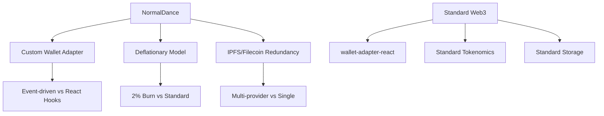

# 2. Анализ архитектурных паттернов

## Введение

В этом разделе представлен детальный анализ кастомных архитектурных паттернов, используемых в проекте NormalDance. Эти паттерны определяют уникальность архитектуры и являются ключевыми конкурентными преимуществами платформы.

## Ключевые архитектурные паттерны

### 2.1 Custom Server Setup

#### Описание паттерна
Проект использует кастомный `server.ts` с Socket.IO вместо стандартного Next.js сервера. Это отклонение от стандартной практики Next.js и предоставляет дополнительные возможности для real-time функционала.

#### Реализация:
```typescript
// server.ts
import { createServer } from 'http';
import { Server } from 'socket.io';
import next from 'next';

const dev = process.env.NODE_ENV !== 'production';
const hostname = 'localhost';
const port = 3000;

const app = next({ dev, hostname, port });
const handler = app.getRequestHandler();

const server = createServer(async (req, res) => {
  await handler(req, res);
});

const io = new Server(server, {
  path: '/api/socketio', // Кастомный путь
  cors: {
    origin: '*',
    methods: ['GET', 'POST']
  }
});

io.on('connection', (socket) => {
  console.log('Client connected:', socket.id);
  
  socket.on('disconnect', () => {
    console.log('Client disconnected:', socket.id);
  });
});

server.listen(port, () => {
  console.log(`> Ready on http://${hostname}:${port}`);
});
```

#### Преимущества:
- **Гибкость**: Полный контроль над серверной логикой
- **Real-time функционал**: Нативная интеграция Socket.IO
- **Производительность**: Оптимизированная обработка соединений
- **Масштабируемость**: Возможность горизонтального масштабирования

#### Недостатки:
- **Сложность**: Требует дополнительной поддержки
- **Отклонение от стандартов**: Усложняет миграцию и поддержку
- **Обучение**: Новым разработчикам требуется время на изучение

### 2.2 Wallet Integration Pattern

#### Описание паттерна
Кастомная система интеграции с Phantom кошельком на основе event emitter вместо стандартных wallet-adapter-react паттернов.

#### Реализация:
```typescript
// src/components/wallet/wallet-adapter.tsx
import { EventEmitter } from 'events';

export class WalletAdapter extends EventEmitter {
  private wallet: any;
  private connected: boolean = false;
  
  constructor() {
    super();
    this.setupWallet();
  }
  
  private setupWallet() {
    if (typeof window !== 'undefined' && window.solana) {
      this.wallet = window.solana;
      this.wallet.on('connect', () => {
        this.connected = true;
        this.emit('connected');
      });
      
      this.wallet.on('disconnect', () => {
        this.connected = false;
        this.emit('disconnected');
      });
    }
  }
  
  async connect(): Promise<boolean> {
    try {
      if (!this.wallet) return false;
      
      const response = await this.wallet.connect();
      this.connected = true;
      this.emit('connected', response);
      return true;
    } catch (error) {
      // Silent failure - возвращаем 0 вместо ошибки
      return false;
    }
  }
  
  async disconnect(): Promise<void> {
    try {
      if (this.wallet) {
        await this.wallet.disconnect();
      }
      this.connected = false;
      this.emit('disconnected');
    } catch (error) {
      // Silent failure
    }
  }
  
  async signTransaction(transaction: any): Promise<any> {
    try {
      if (!this.wallet || !this.connected) return 0;
      
      const signed = await this.wallet.signTransaction(transaction);
      return signed;
    } catch (error) {
      // Silent failure
      return 0;
    }
  }
  
  async signAllTransactions(transactions: any[]): Promise<any[]> {
    try {
      if (!this.wallet || !this.connected) return [];
      
      const signed = await this.wallet.signAllTransactions(transactions);
      return signed;
    } catch (error) {
      // Silent failure
      return [];
    }
  }
}
```

#### Преимущества:
- **Гибкость**: Полный контроль над логикой кошелька
- **Event-driven**: Удобная обработка событий
- **Кастомизация**: Возможность добавить специфичную логику
- **Отказоустойчивость**: Silent failures предотвращают падение приложения

#### Недостатки:
- **Безопасность**: Silent failures могут скрывать реальные проблемы
- **Отладка**: Сложность диагностики ошибок
- **Соответствие**: Отклонение от стандартных практик

### 2.3 Deflationary Model Pattern

#### Описание паттерна
Реализация дефляционной модели токенов с 2% burn на всех транзакциях. Это уникальный экономический паттерн для Web3 платформ.

#### Реализация:
```typescript
// src/lib/deflationary-model.ts
export class DeflationaryModel {
  private static readonly BURN_RATE = 0.02; // 2%
  
  /**
   * Рассчитать сумму для burning
   */
  static calculateBurn(amount: number): number {
    return amount * this.BURN_RATE;
  }
  
  /**
   * Рассчитать чистую сумму после burning
   */
  static calculateNetAmount(amount: number): number {
    const burn = this.calculateBurn(amount);
    return amount - burn;
  }
  
  /**
   * Рассчитать новый total supply после транзакции
   */
  static calculateTotalSupply(
    currentSupply: number, 
    transactionAmount: number
  ): number {
    const netAmount = this.calculateNetAmount(transactionAmount);
    return currentSupply + netAmount;
  }
  
  /**
   * Применить дефляционную модель к транзакции
   */
  static applyDeflation(
    amount: number,
    currentSupply: number
  ): {
    grossAmount: number;
    burnAmount: number;
    netAmount: number;
    newSupply: number;
  } {
    const burnAmount = this.calculateBurn(amount);
    const netAmount = this.calculateNetAmount(amount);
    const newSupply = this.calculateTotalSupply(currentSupply, amount);
    
    return {
      grossAmount: amount,
      burnAmount,
      netAmount,
      newSupply
    };
  }
}
```

#### Преимущества:
- **Экономическая модель**: Создает дефляционное давление на токен
- **Уникальность**: Отличает платформу от конкурентов
- **Инвестиционная привлекательность**: Увеличивает ценность токена со временем
- **Автоматизация**: Полностью автоматический процесс

#### Недостатки:
- **Сложность**: Требует дополнительного объяснения пользователям
- **Налоговые последствия**: Может создавать сложности с налогообложением
- **Регуляторные риски**: Требует внимания к регулированию

### 2.4 Global Database Instance Pattern

#### Описание паттерна
Использование глобального экземпляра Prisma в `src/lib/db.ts` вместо создания новых экземпляров в каждом модуле.

#### Реализация:
```typescript
// src/lib/db.ts
import { PrismaClient } from '@prisma/client';

declare global {
  // eslint-disable-next-line no-var
  var prisma: PrismaClient | undefined;
}

export const db = globalThis.prisma || new PrismaClient();

if (process.env.NODE_ENV !== 'production') {
  globalThis.prisma = db;
}

// Использование в других модулях
import { db } from './db';

export async function getUserById(id: string) {
  return db.user.findUnique({
    where: { id },
    include: {
      tracks: true,
      playlists: true,
      nfts: true
    }
  });
}
```

#### Преимущества:
- **Производительность**: Избегает накладных расходов на создание экземпляров
- **Память**: Эффективное использование памяти
- **Соединения**: Оптимизация управления соединениями с базой данных
- **Кэширование**: Лучшая работа кэширования запросов

#### Недостатки:
- **Глобальное состояние**: Сложность тестирования
- **Жизненный цикл**: Проблемы с жизненным циклом в некоторых средах
- **Изоляция**: Риски утечек памяти в долгоживущих процессах

### 2.5 IPFS/Filecoin Redundancy Pattern

#### Описание паттерна
Кастомная система загрузки файлов с избыточностью между IPFS и Filecoin для обеспечения надежности и долговечности хранения.

#### Реализация:
```typescript
// src/lib/ipfs-enhanced.ts
import { create } from 'ipfs-http-client';
import { upload } from '@zondax/filecoin-signing-tools';

export class IPFSEnhancedService {
  private ipfsClient: any;
  private filecoinClient: any;
  
  constructor() {
    this.ipfsClient = create({ url: process.env.IPFS_API_URL });
    this.filecoinClient = new FilecoinClient(process.env.FILECOIN_API_URL);
  }
  
  /**
   * Загрузить файл с избыточностью
   */
  async uploadWithRedundancy(
    file: Buffer,
    metadata: any
  ): Promise<{
    ipfsHash: string;
    filecoinCid: string;
    timestamp: Date;
  }> {
    try {
      // Загрузка в IPFS
      const ipfsResult = await this.ipfsClient.add({
        content: file,
        metadata
      });
      
      // Загрузка в Filecoin
      const filecoinResult = await upload(
        process.env.FILECOIN_API_URL!,
        file,
        metadata
      );
      
      return {
        ipfsHash: ipfsResult.path,
        filecoinCid: filecoinResult.cid,
        timestamp: new Date()
      };
    } catch (error) {
      console.error('Redundancy upload failed:', error);
      throw new Error('Failed to upload file with redundancy');
    }
  }
  
  /**
   * Проверить доступность файла
   */
  async checkFileAvailability(
    ipfsHash: string,
    filecoinCid: string
  ): Promise<{
    ipfsAvailable: boolean;
    filecoinAvailable: boolean;
  }> {
    const [ipfsAvailable, filecoinAvailable] = await Promise.all([
      this.checkIPFSAvailability(ipfsHash),
      this.checkFilecoinAvailability(filecoinCid)
    ]);
    
    return {
      ipfsAvailable,
      filecoinAvailable
    };
  }
  
  private async checkIPFSAvailability(hash: string): Promise<boolean> {
    try {
      await this.ipfsClient.cat(hash);
      return true;
    } catch {
      return false;
    }
  }
  
  private async checkFilecoinAvailability(cid: string): Promise<boolean> {
    try {
      await this.filecoinClient.storage.check(cid);
      return true;
    } catch {
      return false;
    }
  }
}
```

#### Преимущества:
- **Надежность**: Двойное резервирование файлов
- **Долговечность**: Filecoin обеспечивает долгосрочное хранение
- **Доступность**: Высокая доступность файлов
- **Децентрализация**: Избегает зависимости от单一 провайдера

#### Недостатки:
- **Сложность**: Усложняет архитектуру
- **Стоимость**: Двойная стоимость хранения
- **Производительность**: Дополнительные задержки при загрузке

### 2.6 Silent Error Handling Pattern

#### Описание паттерна
Вместо бросания ошибок, wallet операции возвращают 0 или пустые значения. Это предотвращает падение приложения, но скрывает реальные проблемы.

#### Реализация:
```typescript
// Примеры в коде
async function connectWallet(): Promise<boolean> {
  try {
    const result = await wallet.connect();
    return result;
  } catch (error) {
    // Silent failure - возвращаем false вместо ошибки
    return false;
  }
}

async function signTransaction(transaction: any): Promise<any> {
  try {
    const signed = await wallet.signTransaction(transaction);
    return signed;
  } catch (error) {
    // Silent failure - возвращаем 0
    return 0;
  }
}
```

#### Преимущества:
- **Отказоустойчивость**: Приложение не падает при ошибках
- **Пользовательский опыт**: Пользователи не видят технических ошибок
- **Стабильность**: Система продолжает работать даже при частичных сбоях

#### Недостатки:
- **Отладка**: Сложность диагностики проблем
- **Безопасность**: Скрывает потенциальные уязвимости
- **Надежность**: Создает иллюзию работы системы

## Анализ паттернов

### 2.7 Сравнение с отраслевыми стандартами

#### Web3 платформы:


#### Общие практики:
- **Wallet integration**: Большинство платформ используют `wallet-adapter-react`
- **Error handling**: Стандартные практики включают proper error handling
- **Storage**: Чаще используется单一的 IPFS или централизованное хранилище

### 2.8 Оценка эффективности паттернов

#### Эффективность по шкале от 1 до 5:

| Паттерн | Инновационность | Сложность | Риски | Общая оценка |
|---------|----------------|-----------|-------|-------------|
| Custom Server | 4 | 3 | 2 | 3.0 |
| Wallet Integration | 3 | 4 | 3 | 3.3 |
| Deflationary Model | 5 | 2 | 3 | 3.3 |
| Global DB Instance | 2 | 3 | 2 | 2.3 |
| IPFS/Filecoin | 4 | 5 | 2 | 3.7 |
| Silent Error Handling | 1 | 2 | 5 | 2.7 |

### 2.9 Рекомендации по паттернам

#### Сохранить:
1. **Custom Server Setup** - Предоставляет гибкость и real-time возможности
2. **Deflationary Model** - Уникальное конкурентное преимущество
3. **IPFS/Filecoin Redundancy** - Обеспечивает надежность хранения

#### Улучшить:
1. **Wallet Integration** - Добавить proper error handling без silent failures
2. **Global DB Instance** - Рассмотреть connection pooling для лучшей масштабируемости
3. **Silent Error Handling** - Заменить на structured error handling

#### Переосмыслить:
1. **Silent Error Handling** - Внедрить proper error handling с логированием

---

*Следующий раздел: [Технологический стек](./03-tech-stack.md)*