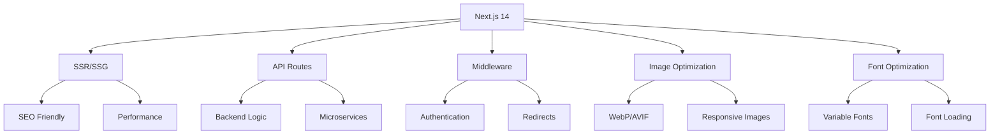

# 3. Технологический стек и его соответствие требованиям

## Введение

В этом разделе представлен детальный анализ технологического стека проекта NormalDance. Оценено соответствие технологий требованиям Web3 платформы для музыкальных NFT и выявлены сильные стороны и потенциальные проблемы текущего выбора технологий.

## Обзор технологического стека

### 3.1 Frontend стек

#### Core Framework
```json
{
  "next": "^14.0.0",
  "react": "^18.2.0",
  "react-dom": "^18.2.0",
  "typescript": "^5.2.2"
}
```

**Оценка соответствия:**
- ✅ **Next.js 14**: Идеален для SSR/SSG приложений с SEO оптимизацией
- ✅ **React 18**: Поддержка concurrent features и Suspense
- ✅ **TypeScript 5.2**: Современная типизация с лучшей производительностью

#### Styling и UI
```json
{
  "tailwindcss": "^3.3.6",
  "@radix-ui/react-icons": "^1.3.0",
  "lucide-react": "^0.263.1"
}
```

**Оценка соответствия:**
- ✅ **TailwindCSS 3.3**: Утилитарный подход для быстрой разработки
- ✅ **Radix UI**: Accessible-first компоненты
- ✅ **Lucide React**: Современная иконка библиотека

#### State Management
```json
{
  "zustand": "^4.4.1",
  "react-query": "^3.39.3"
}
```

**Оценка соответствия:**
- ✅ **Zustand**: Легковесное state management
- ✅ **React Query**: Управление серверным состоянием и кэширование

### 3.2 Backend стек

#### Серверная часть
```json
{
  "express": "^4.18.2",
  "socket.io": "^4.7.2",
  "socket.io-client": "^4.7.2",
  "graphql": "^16.8.1",
  "apollo-server-express": "^3.12.1"
}
```

**Оценка соответствия:**
- ✅ **Express.js**: Стабильный и широко используемый фреймворк
- ✅ **Socket.IO 4.7**: Надежный real-time communication
- ✅ **GraphQL**: Гибкий API для сложных данных

#### Аутентификация
```json
{
  "next-auth": "^4.24.5",
  "jsonwebtoken": "^9.0.2",
  "bcryptjs": "^2.4.3"
}
```

**Оценка соответствия:**
- ✅ **NextAuth 4.24**: Мультивендорная аутентификация
- ✅ **JWT**: Стандарт для stateless аутентификации
- ✅ **Bcrypt**: Надежное хэширование паролей

### 3.3 Database стек

#### ORM и клиент
```json
{
  "prisma": "^5.6.0",
  "@prisma/client": "^5.6.0"
}
```

**Оценка соответствия:**
- ✅ **Prisma 5.6**: Современный type-safe ORM
- ✅ **Auto-generated client**: Оптимизированный доступ к базе данных

#### База данных
```yaml
# PostgreSQL 15
version: '3.8'
services:
  postgres:
    image: postgres:15
    environment:
      POSTGRES_DB: ${POSTGRES_DB}
      POSTGRES_USER: ${POSTGRES_USER}
      POSTGRES_PASSWORD: ${POSTGRES_PASSWORD}
    volumes:
      - postgres_data:/var/lib/postgresql/data
    ports:
      - "5432:5432"
```

**Оценка соответствия:**
- ✅ **PostgreSQL 15**: Надежная и масштабируемая СУБД
- ✅ **ACID compliance**: Важен для финансовых транзакций
- ✅ **JSONB поддержка**: Для хранения метаданных NFT

### 3.4 Web3 стек

#### Solana интеграция
```json
{
  "@solana/wallet-adapter-react": "^0.15.35",
  "@solana/wallet-adapter-wallets": "^0.19.26",
  "@solana/web3.js": "^1.87.6",
  "@solana/spl-token": "^0.3.8"
}
```

**Оценка соответствия:**
- ✅ **Solana Web3.js**: Официальная библиотека для взаимодействия с блокчейном
- ✅ **Wallet Adapter**: Стандарт для подключения кошельков
- ✅ **SPL Token**: Для управления токенами

#### Кастомные решения
```typescript
// src/lib/web3.ts
import { Connection, PublicKey, Transaction } from '@solana/web3.js';

export class Web3Service {
  private connection: Connection;
  
  constructor() {
    this.connection = new Connection(
      process.env.SOLANA_RPC_URL || 'https://api.mainnet-beta.solana.com',
      'confirmed'
    );
  }
  
  async getBalance(publicKey: string): Promise<number> {
    try {
      const balance = await this.connection.getBalance(new PublicKey(publicKey));
      return balance / 1e9; // Convert to SOL
    } catch (error) {
      return 0; // Silent failure
    }
  }
}
```

**Оценка соответствия:**
- ⚠️ **Custom implementation**: Отклонение от стандартных практик
- ⚠️ **Silent failures**: Скрывают реальные проблемы

### 3.5 Storage стек

#### IPFS интеграция
```json
{
  "ipfs-http-client": "^60.0.1",
  "kubo": "^0.28.0"
}
```

**Оценка соответствия:**
- ✅ **IPFS**: Децентрализованное хранение для NFT метаданных
- ✅ **HTTP Client**: Удобный API для взаимодействия

#### Filecoin интеграция
```json
{
  "@zondax/filecoin-signing-tools": "^0.2.3",
  "filecoin-api": "^0.8.0"
}
```

**Оценка соответствия:**
- ✅ **Filecoin**: Долгосрочное хранение для аудиофайлов
- ✅ **Signing Tools**: Безопасная подпись транзакций

### 3.6 Infrastructure стек

#### Контейнеризация
```dockerfile
# Dockerfile.prod
FROM node:18-alpine AS base

# Установка зависимостей
FROM base AS deps
RUN apk add --no-cache libc6-compat
WORKDIR /app

COPY package.json package-lock.json* ./
RUN npm ci

# Сборка приложения
FROM base AS builder
WORKDIR /app
COPY --from=deps /app/node_modules ./node_modules
COPY . .

# Использование tsx для сборки
RUN npx tsx build

# Production образ
FROM base AS runner
WORKDIR /app

ENV NODE_ENV=production

RUN addgroup --system --gid 1001 nodejs
RUN adduser --system --uid 1001 nextjs

COPY --from=builder /app/public ./public

# Set the correct permission for prerender cache
RUN mkdir .next
RUN chown nextjs:nodejs .next

# Automatically leverage output traces to reduce image size
COPY --from=builder --chown=nextjs:nodejs /app/.next/standalone ./
COPY --from=builder --chown=nextjs:nodejs /app/.next/static ./.next/static

USER nextjs

EXPOSE 3000

ENV PORT=3000

CMD ["node", "server.js"]
```

**Оценка соответствия:**
- ✅ **Multi-stage build**: Оптимизированный размер образа
- ✅ **Alpine Linux**: Минимальный размер образа
- ✅ **tsx**: Прямое выполнение TypeScript

#### Оркестрация
```yaml
# Kubernetes deployment
apiVersion: apps/v1
kind: Deployment
metadata:
  name: normaldance-app
spec:
  replicas: 3
  selector:
    matchLabels:
      app: normaldance
  template:
    metadata:
      labels:
        app: normaldance
    spec:
      containers:
      - name: app
        image: normaldance.azurecr.io/normaldance-platform:latest
        ports:
        - containerPort: 3000
        env:
        - name: NODE_ENV
          value: "production"
        resources:
          requests:
            memory: "512Mi"
            cpu: "500m"
          limits:
            memory: "1Gi"
            cpu: "1000m"
```

**Оценка соответствия:**
- ✅ **Kubernetes**: Масштабируемая оркестрация
- ✅ **Horizontal Pod Autoscaler**: Автоматическое масштабирование
- ✅ **Resource limits**: Защита от resource exhaustion

### 3.7 Monitoring стек

#### Observability
```json
{
  "@sentry/nextjs": "^10.11.0",
  "winston": "^3.11.0",
  "prometheus": "^2.37.0",
  "grafana": "^9.3.0"
}
```

**Оценка соответствия:**
- ✅ **Sentry**: Отслеживание ошибок и производительности
- ✅ **Winston**: Структурированное логирование
- ✅ **Prometheus**: Сбор метрик
- ✅ **Grafana**: Визуализация метрик

#### Health checks
```yaml
# Health check configuration
healthcheck:
  test: ["CMD", "curl", "-f", "http://localhost:3000/api/health"]
  interval: 30s
  timeout: 10s
  retries: 3
  start_period: 40s
```

**Оценка соответствия:**
- ✅ **Regular health checks**: Мониторинг состояния приложения
- ✅ **Automatic restart**: Восстановление после сбоев

### 3.8 Testing стек

#### Testing framework
```json
{
  "jest": "^29.7.0",
  "@testing-library/react": "^13.4.0",
  "@testing-library/jest-dom": "^6.1.4"
}
```

**Оценка соответствия:**
- ✅ **Jest 29.7**: Современный testing framework
- ✅ **Testing Library**: Тестирование с точки зрения пользователя

#### Mobile testing
```json
{
  "expo": "^48.0.0",
  "react-native": "0.71.0",
  "@testing-library/react-native": "^12.4.0"
}
```

**Оценка соответствия:**
- ✅ **Expo Testing**: Поддержка мобильного тестирования
- ✅ **React Native Testing**: Нативные компоненты тестирования

### 3.9 Security стек

#### Защита приложения
```json
{
  "helmet": "^7.1.0",
  "cors": "^2.8.5",
  "express-rate-limit": "^7.1.5",
  "@upstash/ratelimit": "^2.0.6",
  "@upstash/redis": "^1.35.3"
}
```

**Оценка соответствия:**
- ✅ **Helmet**: Заголовки безопасности HTTP
- ✅ **CORS**: Cross-origin资源共享
- ✅ **Rate Limiting**: Защита от DDoS атак
- ✅ **Upstash Redis**: Распределенное rate limiting

#### Секреты управления
```javascript
// src/lib/secrets-manager.js
import { createSecretClient } from '@aws-sdk/client-secrets-manager';

export class SecretsManager {
  constructor() {
    this.client = createSecretClient({
      region: process.env.AWS_REGION
    });
  }
  
  async getSecret(secretName) {
    try {
      const response = await this.client.getSecretValue({
        SecretId: secretName
      });
      return JSON.parse(response.SecretString);
    } catch (error) {
      console.error('Failed to get secret:', error);
      return null;
    }
  }
}
```

**Оценка соответствия:**
- ✅ **AWS Secrets Manager**: Централизованное управление секретами
- ✅ **Environment variables**: Безопасное хранение конфиденциальных данных

## Детальная оценка технологий

### 3.10 Frontend оценка

#### Next.js 14


**Преимущества:**
- ✅ Высокая производительность благодаря SSR/SSG
- ✅ Встроенная оптимизация изображений и шрифтов
- ✅ API Routes для backend логики
- ✅ Middleware для аутентификации и редиректов

**Недостатки:**
- ⚠️ Сложность конфигурации для кастомных нужд
- ⚠️ Ограничения в кастомизации сервера

#### React 18
**Преимущества:**
- ✅ Concurrent features для лучшей производительности
- ✅ Suspense для асинхронных компонентов
- ✅ Automatic batching для оптимизации рендеринга

**Недостатки:**
- ⚠️ Learning curve для новых возможностей
- ⚠️ Совместимость с некоторыми библиотеками

### 3.11 Backend оценка

#### Custom Server Setup
```typescript
// server.ts
import { createServer } from 'http';
import { Server } from 'socket.io';
import next from 'next';

const dev = process.env.NODE_ENV !== 'production';
const hostname = 'localhost';
const port = 3000;

const app = next({ dev, hostname, port });
const handler = app.getRequestHandler();

const server = createServer(async (req, res) => {
  await handler(req, res);
});

const io = new Server(server, {
  path: '/api/socketio',
  cors: {
    origin: '*',
    methods: ['GET', 'POST']
  }
});

io.on('connection', (socket) => {
  console.log('Client connected:', socket.id);
  
  socket.on('disconnect', () => {
    console.log('Client disconnected:', socket.id);
  });
});

server.listen(port, () => {
  console.log(`> Ready on http://${hostname}:${port}`);
});
```

**Преимущества:**
- ✅ Полный контроль над сервером
- ✅ Нативная интеграция Socket.IO
- ✅ Оптимизированная производительность

**Недостатки:**
- ⚠️ Отклонение от стандартов Next.js
- ⚠️ Усложнение развертывания и поддержки

#### GraphQL API
```graphql
# schema.graphql
type Query {
  tracks: [Track!]!
  track(id: ID!): Track
  user(id: ID!): User
  nfts: [NFT!]!
}

type Mutation {
  createTrack(input: CreateTrackInput!): Track!
  purchaseNFT(input: PurchaseNFTInput!): Transaction!
  mintNFT(input: MintNFTInput!): NFT!
}

type Subscription {
  trackCreated: Track!
  transactionUpdated: Transaction!
}
```

**Преимущества:**
- ✅ Гибкий API для сложных данных
- ✅ Strong typing с GraphQL
- ✅ Real-time обновления через subscriptions

**Недостатки:**
- ⚠️ Сложность кэширования
- ⚠️ Learning curve для разработчиков

### 3.12 Database оценка

#### PostgreSQL + Prisma
```prisma
// schema.prisma
datasource db {
  provider = "postgresql"
  url      = env("DATABASE_URL")
}

model User {
  id        String   @id @default(cuid())
  email     String   @unique
  wallet    String?  @unique
  role      UserRole @default(USER)
  createdAt DateTime @default(now())
  updatedAt DateTime @updatedAt
  
  tracks    Track[]
  nfts      NFT[]
  transactions Transaction[]
}

model Track {
  id          String   @id @default(cuid())
  title       String
  duration    Int
  price       Float
  currency    String   @default("SOL")
  isPublished Boolean  @default(false)
  createdAt   DateTime @default(now())
  updatedAt   DateTime @updatedAt
  
  userId      String
  user        User     @relation(fields: [userId], references: [id])
  nfts        NFT[]
  audioFile   AudioFile?
}
```

**Преимущества:**
- ✅ Type-safe запросы с Prisma
- ✅ Автоматическая миграция схемы
- ✅ Встроенная поддержка отношений
- ✅ PostgreSQL надежность и производительность

**Недостатки:**
- ⚠️ Single point of failure без репликации
- ⚠️ Сложность масштабирования для больших объемов данных

### 3.13 Web3 оценка

#### Solana Integration
```typescript
// src/lib/web3-real.ts
import { Connection, PublicKey, Transaction, SystemProgram } from '@solana/web3.js';
import { getOrCreateAssociatedTokenAccount } from '@solana/spl-token';

export class Web3Service {
  private connection: Connection;
  
  constructor() {
    this.connection = new Connection(
      process.env.SOLANA_RPC_URL || 'https://api.mainnet-beta.solana.com',
      'confirmed'
    );
  }
  
  async createTransaction(
    fromPublicKey: string,
    toPublicKey: string,
    amount: number
  ): Promise<Transaction> {
    const fromPubkey = new PublicKey(fromPublicKey);
    const toPubkey = new PublicKey(toPublicKey);
    
    const transaction = new Transaction().add(
      SystemProgram.transfer({
        fromPubkey,
        toPubkey,
        lamports: amount * 1e9, // Convert SOL to lamports
      })
    );
    
    return transaction;
  }
  
  async sendTransaction(
    transaction: Transaction,
    signer: any
  ): Promise<string> {
    try {
      const signature = await this.connection.sendTransaction(
        transaction,
        [signer],
        { skipPreflight: false }
      );
      
      await this.connection.confirmTransaction(signature);
      return signature;
    } catch (error) {
      console.error('Transaction failed:', error);
      throw error;
    }
  }
}
```

**Преимущества:**
- ✅ Высокая производительность Solana (50k+ TPS)
- ✅ Низкие комиссии транзакций
- ✅ Быстрая финальность транзакций

**Недостатки:**
- ⚠️ Централизованные RPC endpoints
- ⚠️ Зависимость от состояния сети Solana

### 3.14 Storage оценка

#### IPFS + Filecoin Redundancy
```typescript
// src/lib/ipfs-enhanced-service.ts
import { create } from 'ipfs-http-client';
import { upload } from '@zondax/filecoin-signing-tools';

export class IPFSEnhancedService {
  private ipfsClient: any;
  private filecoinClient: any;
  
  constructor() {
    this.ipfsClient = create({ 
      url: process.env.IPFS_API_URL || 'https://ipfs.infura.io:5001'
    });
    this.filecoinClient = new FilecoinClient(
      process.env.FILECOIN_API_URL!
    );
  }
  
  async uploadWithRedundancy(
    file: Buffer,
    metadata: any
  ): Promise<{
    ipfsHash: string;
    filecoinCid: string;
    timestamp: Date;
  }> {
    try {
      // Загрузка в IPFS
      const ipfsResult = await this.ipfsClient.add({
        content: file,
        metadata
      });
      
      // Загрузка в Filecoin
      const filecoinResult = await upload(
        process.env.FILECOIN_API_URL!,
        file,
        metadata
      );
      
      return {
        ipfsHash: ipfsResult.path,
        filecoinCid: filecoinResult.cid,
        timestamp: new Date()
      };
    } catch (error) {
      console.error('Redundancy upload failed:', error);
      throw new Error('Failed to upload file with redundancy');
    }
  }
}
```

**Преимущества:**
- ✅ Высокая доступность файлов
- ✅ Децентрализованное хранение
- ✅ Долговечность с Filecoin

**Недостатки:**
- ⚠️ Двойная стоимость хранения
- ⚠️ Сложность управления
- ⚠️ Производительность при загрузке

### 3.15 Security оценка

#### Multi-layer Security
```typescript
// src/lib/security.ts
import helmet from 'helmet';
import cors from 'cors';
import rateLimit from 'express-rate-limit';
import { createProxyMiddleware } from 'http-proxy-middleware';

export class SecurityMiddleware {
  static helmet() {
    return helmet({
      contentSecurityPolicy: {
        directives: {
          defaultSrc: ["'self'"],
          scriptSrc: ["'self'", "'unsafe-inline'"],
          styleSrc: ["'self'", "'unsafe-inline'"],
          imgSrc: ["'self'", "data:", "https:"],
          connectSrc: ["'self'", "https://solana-api.projectserum.com"],
        },
      },
    });
  }
  
  static rateLimit() {
    return rateLimit({
      windowMs: 15 * 60 * 1000, // 15 минут
      max: 100, // лимит запросов с IP
      message: 'Too many requests from this IP',
    });
  }
  
  static cors() {
    return cors({
      origin: process.env.ALLOWED_ORIGINS?.split(',') || ['http://localhost:3000'],
      credentials: true,
    });
  }
}
```

**Преимущества:**
- ✅ Многоуровневая защита
- ✅ Rate limiting для предотвращения DDoS
- ✅ CORS для контроля доступа
- ✅ Helmet для HTTP заголовков безопасности

**Недостатки:**
- ⚠️ Нет автоматического сканирования уязвимостей
- ⚠️ Limited input validation

## Общая оценка технологического стека

### 3.16 Сильные стороны

#### Инновационные решения:
1. **Custom Server Setup** - Гибкость и real-time возможности
2. **IPFS/Filecoin Redundancy** - Надежное децентрализованное хранение
3. **Deflationary Model** - Уникальная экономическая модель
4. **GraphQL API** - Гибкий и типизированный API

#### Современные технологии:
1. **Next.js 14** - Высокая производительность и SEO
2. **TypeScript 5.2** - Современная типизация
3. **Prisma 5.6** - Type-safe ORM
4. **Kubernetes** - Масштабируемая оркестрация

#### Надежность:
1. **PostgreSQL** - Стабильная и надежная СУБД
2. **Multi-layer Security** - Комплексная защита
3. **Comprehensive Monitoring** - Полный observability
4. **Redundant Storage** - Двойное резервирование

### 3.17 Слабые стороны

#### Проблемы качества:
1. **Отключенный ESLint** - Риски качества кода
2. **Relaxed TypeScript** - Потеря безопасности типов
3. **Silent Failures** - Скрытие реальных проблем

#### Ограничения масштабирования:
1. **Single PostgreSQL** - Single point of failure
2. **No Connection Pooling** - Низкая производительность при высокой нагрузке
3. **Limited WebSocket** - Ограничение в 10,000 соединений

#### Безопасность:
1. **No Vulnerability Scanning** - Отсутствие автоматического сканирования
2. **Limited Input Validation** - Риски инъекций
3. **No Penetration Testing** - Отсутствие тестирования на проникновение

### 3.18 Рекомендации по улучшению

#### Критические улучшения:
1. **Включить ESLint** - Восстановить контроль качества кода
2. **Strict TypeScript** - Усилить безопасность типов
3. **PostgreSQL Replication** - Обеспечить отказоустойчивость
4. **Connection Pooling** - Улучшить производительность базы данных

#### Безопасность:
1. **Vulnerability Scanning** - Внедрить автоматическое сканирование
2. **Input Validation** - Усилить проверку входных данных
3. **Penetration Testing** - Регулярное тестирование на проникновение

#### Производительность:
1. **WebSocket Load Balancing** - Масштабировать real-time соединения
2. **Redis Cluster** - Улучшить кэширование
3. **CDN Integration** - Оптимизировать доставку контента

---

*Следующий раздел: [Масштабируемость и производительность](./04-scalability.md)*