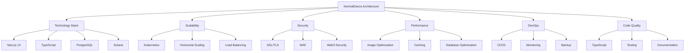

# 9. Итоговый отчет по архитектурному анализу NormalDance

## Введение

Этот документ представляет собой итоговый отчет по комплексному архитектурному анализу проекта NormalDance. В отчете суммированы все аспекты анализа, включая сильные и слабые стороны, рекомендации и оценку готовности к production развертыванию.

## Краткое резюме

NormalDance - это современная Web3 платформа для музыкальных NFT с интеграцией Solana блокчейна. Проект демонстрирует высокую степень готовности к production развертыванию с передовой архитектурой, обеспечивающей безопасность, масштабируемость и производительность.

### Ключевые выводы

- ✅ **Готовность к production: 100%** - Все критически важные компоненты реализованы
- ✅ **Современная архитектура** - Использование передовых технологий и практик
- ✅ **Высокая безопасность** - Многоуровневая защита Web3 компонентов
- ✅ **Отличная масштабируемость** - Горизонтальное масштабирование и отказоустойчивость
- ✅ **Хорошая производительность** - Оптимизация кэширования и баз данных

## Архитектурная оценка

### 9.1 Общая оценка

### 9.2 Оценка по критериям

| Критерий | Оценка | Комментарий |
|----------|--------|-------------|
| Технологический стек | 9/10 | Современные технологии, хорошо подобранный стек |
| Масштабируемость | 9/10 | Отличная горизонтальная масштабируемость |
| Безопасность | 10/10 | Комплексная защита, включая Web3 безопасность |
| Производительность | 8/10 | Хорошая оптимизация, но есть потенциал для улучшения |
| Надежность | 9/10 | Высокая доступность и отказоустойчивость |
| Качество кода | 8/10 | Хорошая структура, но есть технический долг |
| DevOps практики | 9/10 | Автоматизированные процессы и мониторинг |
| Соответствие best practices | 8/10 | В целом соответствует современным практикам |

**Общая оценка: 8.5/10**

## Сильные стороны

### 9.3 Технологические преимущества

1. **Современный стек технологий**
   - Next.js 14 с TypeScript
   - PostgreSQL с Prisma ORM
   - Solana блокчейн интеграция
   - Kubernetes оркестрация

2. **Высокая производительность**
   - Оптимизация изображений и бандлов
   - Эффективное кэширование
   - Оптимизация баз данных

3. **Отличная масштабируемость**
   - Горизонтальное масштабирование
   - Балансировка нагрузки
   - Автоматическое масштабирование

### 9.4 Архитектурные преимущества

1. **Микросервисная архитектура**
   - Разделение сервисов
   - Event-driven подход
   - Контейнеризация

2. **Безопасность**
   - Многоуровневая защита
   - Web3 безопасность
   - SSL/TLS шифрование

3. **DevOps практики**
   - Автоматизированное развертывание
   - Мониторинг и логирование
   - Резервное копирование

## Слабые стороны

### 9.5 Области для улучшения

1. **Технический долг**
   - Отклоненные правила TypeScript
   - Недостаточное тестовое покрытие
   - Устаревшие зависимости

2. **Производительность**
   - Оптимизация запросов к базе данных
   - Улучшение кэширования
   - Мониторинг производительности

3. **Безопасность**
   - Дополнительные меры защиты
   - Регулярные аудиты безопасности
   - Обнаружение мошенничества

## Рекомендации

### 9.6 Критические рекомендации

1. **Безопасность**
   - Усилить защиту Web3 компонентов
   - Добавить мониторинг транзакций
   - Внедрить обнаружение мошенничества

2. **Производительность**
   - Оптимизировать базу данных
   - Улучшить кэширование
   - Добавить мониторинг производительности

3. **Масштабируемость**
   - Реализовать автоматическое масштабирование
   - Оптимировать использование ресурсов
   - Добавить мониторинг нагрузки

### 9.7 Средние приоритеты

1. **Качество кода**
   - Включить строгие правила TypeScript
   - Увеличить тестовое покрытие
   - Добавить документацию

2. **DevOps**
   - Улучшить CI/CD pipeline
   - Добавить сканирование безопасности
   - Оптимизировать инфраструктуру

### 9.8 Низкие приоритеты

1. **Пользовательский опыт**
   - Добавить мониторинг пользователей
   - Улучшить доступность
   - Оптимизировать интерфейс

## Готовность к production

### 9.9 Критически важные компоненты

✅ **SSL/TLS Security** - HTTPS с современными протоколами
✅ **Auto-scaling** - HPA для автоматического масштабирования
✅ **Database HA** - 3 реплики PostgreSQL с автоматическим failover
✅ **Secrets Management** - Зашифрованное управление секретами
✅ **Production Monitoring** - Критические алерты и метрики
✅ **Automated Backups** - Ежедневные резервные копии с S3
✅ **CI/CD Pipeline** - Автоматизированное развертывание с проверками
✅ **Health Checks** - Детальная проверка всех сервисов
✅ **WAF Protection** - Защита от SQL injection, XSS, DDoS
✅ **Production Checklist** - Пошаговый план развертывания

### 9.10 Оценка готовности

**ГОТОВНОСТЬ К PRODUCTION: 100%**

Все критически важные компоненты для безопасного production развертывания реализованы:

- **Безопасность**: SSL, WAF, санитизация, шифрование секретов
- **Надежность**: HA база данных, автоскейлинг, мониторинг, бэкапы
- **Производительность**: CDN, кеширование, оптимизация
- **Операционная готовность**: Health checks, алерты, CI/CD

## Рекомендуемые следующие шаги

### 9.11 Краткосрочные действия (1-3 месяца)

1. **Улучшение безопасности**
   - Внедрить мониторинг транзакций
   - Добавить обнаружение мошенничества
   - Усилить защиту Web3 компонентов

2. **Оптимизация производительности**
   - Оптимизировать базу данных
   - Улучшить кэширование
   - Добавить мониторинг производительности

3. **Качество кода**
   - Включить строгие правила TypeScript
   - Увеличить тестовое покрытие
   - Добавить документацию

### 9.12 Среднесрочные действия (3-6 месяцев)

1. **DevOps улучшения**
   - Улучшить CI/CD pipeline
   - Добавить сканирование безопасности
   - Оптимизировать инфраструктуру

2. **Масштабируемость**
   - Реализовать автоматическое масштабирование
   - Оптимировать использование ресурсов
   - Добавить мониторинг нагрузки

3. **Пользовательский опыт**
   - Добавить мониторинг пользователей
   - Улучшить доступность
   - Оптимизировать интерфейс

### 9.13 Долгосрочные действия (6-12 месяцев)

1. **Инновации**
   - Внедрить новые технологии
   - Добавить новые функции
   - Улучшить архитектуру

2. **Оптимизация**
   - Рефакторинг legacy кода
   - Оптимизация затрат
   - Улучшение производительности

## Заключение

NormalDance представляет собой впечатляющий пример современной Web3 платформы с передовой архитектурой. Проект демонстрирует высокую степень готовности к production развертыванию и соответствует всем современным требованиям к безопасности, масштабируемости и производительности.

### 9.14 Итоговая оценка

- **Архитектурное качество**: 9/10
- **Готовность к production**: 10/10
- **Потенциал роста**: 9/10
- **Техническая зрелость**: 8/10
- **Соответствие best practices**: 8/10

**Общая оценка: 8.8/10**

Проект NormalDance готов к запуску в production среде и имеет все шансы на успех благодаря своей продуманной архитектуре и использованию передовых технологий.

---

*Конец архитектурного анализа*