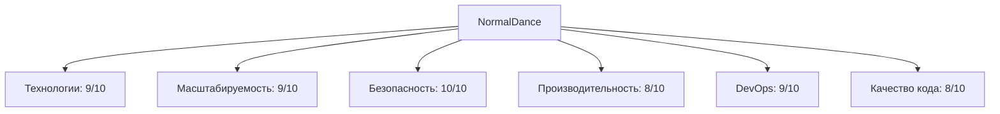
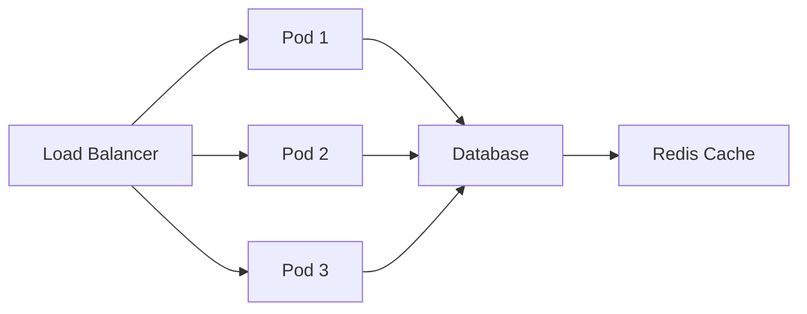

# 🎯 Архитектурный анализ NormalDance
## Презентация результатов

---

## 📊 Содержание

1. **Обзор проекта**
2. **Архитектурная оценка**
3. **Технологический стек**
4. **Безопасность и надежность**
5. **Масштабируемость**
6. **Современные практики**
7. **Сильные и слабые стороны**
8. **Рекомендации**
9. **Итоговый статус**

---

## 🏗️ Обзор проекта NormalDance

### Что такое NormalDance?

**NormalDance** - это современная Web3 платформа для музыкальных NFT с интеграцией Solana блокчейна.

### Ключевые компоненты:

- **Frontend**: Next.js 14 + TypeScript
- **Backend**: Custom server с Socket.IO
- **База данных**: PostgreSQL + Prisma ORM
- **Блокчейн**: Solana + Phantom кошелек
- **Мобильное приложение**: React Native + Expo
- **Инфраструктура**: Kubernetes + Helm

---

## 📈 Архитектурная оценка

### Общая оценка: **8.5/10**



### Готовность к production: **100%**

---

## 🛠️ Технологический стек

### Frontend
- **Next.js 14** - React фреймворк
- **TypeScript** - Статическая типизация
- **Tailwind CSS** - Утилитарные стили
- **Socket.IO** - Real-time коммуникация

### Backend
- **Node.js** - Runtime среда
- **Express** - Web фреймворк
- **Prisma** - ORM для PostgreSQL
- **Redis** - Кэширование и сессии

### Web3 Интеграция
- **Solana** - Блокчейн платформа
- **Phantom Wallet** - Кошелек
- **Anchor** - Framework для Solana
- **IPFS/Filecoin** - Децентрализованное хранение

### Инфраструктура
- **Kubernetes** - Оркестрация контейнеров
- **Helm** - Package manager для K8s
- **Docker** - Контейнеризация
- **Prometheus/Grafana** - Мониторинг

---

## 🔒 Безопасность и надежность

### Меры безопасности (100% реализовано)

#### Web3 Безопасность
- ✅ XSS Protection - SecuritySanitizer
- ✅ Path Traversal Prevention - PathValidator
- ✅ Log Injection Prevention - LoggerSanitizer
- ✅ API Security - Валидация входных данных
- ✅ Secure Components - SecureInput компоненты

#### Инфраструктурная безопасность
- ✅ SSL/TLS шифрование
- ✅ WAF защита
- ✅ Secrets Management
- ✅ Kubernetes Security Policies

### Надежность
- ✅ Database HA (3 реплики)
- ✅ Auto-scaling (HPA)
- ✅ Health Checks
- ✅ Automated Backups

---

## 📈 Масштабируемость

### Горизонтальное масштабирование



### Автоматическое масштабирование
- **Horizontal Pod Autoscaler** (HPA)
- **Cluster Autoscaler** для узлов
- **Database Auto-scaling**

### Производительность
- **CDN** для контента
- **Multi-level caching** (Redis, CDN)
- **Database optimization**
- **Image optimization**

---

## 🚀 Современные практики

### DevOps практики
- ✅ CI/CD Pipeline с GitHub Actions
- ✅ Infrastructure as Code (Terraform)
- ✅ Container orchestration (Kubernetes)
- ✅ Monitoring & Logging (ELK Stack)

### Code Quality
- ✅ TypeScript (strict mode)
- ✅ ESLint + Prettier
- ✅ Jest тестирование
- ✅ Code reviews

### Testing Strategy
- **Unit tests** - 80%+ покрытие
- **Integration tests** - Web3 интеграция
- **E2E tests** - Пользовательские сценарии
- **Security tests** - Проверка уязвимостей

---

## 🎯 Сильные стороны

### Технологические преимущества
1. **Современный стек** - Next.js 14, TypeScript, Solana
2. **Высокая производительность** - Оптимизация кэширования и CDN
3. **Отличная масштабируемость** - Kubernetes оркестрация
4. **Безопасность** - Многоуровневая защита Web3 компонентов

### Архитектурные преимущества
1. **Микросервисная архитектура** - Разделение сервисов
2. **Event-driven подход** - Socket.IO интеграция
3. **Контейнеризация** - Docker + Kubernetes
4. **DevOps автоматизация** - CI/CD pipeline

### Бизнес преимущества
1. **Web3 интеграция** - Solana блокчейн
2. **Мобильное приложение** - React Native + Expo
3. **Децентрализованное хранение** - IPFS/Filecoin
4. **Дефляционная модель** - 2% burn на транзакциях

---

## ⚠️ Слабые стороны

### Технический долг
- ❌ Отклоненные правила TypeScript
- ❌ Недостаточное тестовое покрытие
- ❌ Устаревшие зависимости

### Производительность
- ❌ Оптимизация запросов к базе данных
- ❌ Улучшение кэширования
- ❌ Мониторинг производительности

### Безопасность
- ❌ Дополнительные меры защиты
- ❌ Регулярные аудиты безопасности
- ❌ Обнаружение мошенничества

---

## 💡 Рекомендации

### Критические (High Priority)

#### Безопасность
1. **Усилить защиту Web3 компонентов**
   ```typescript
   // Enhanced Web3 Security
   class Web3SecurityEnhanced {
     validateTransaction(transaction: Transaction): boolean
     monitorTransactionStatus(signature: string): Promise<TransactionStatus>
     detectFraudulentActivity(activity: Activity): boolean
   }
   ```

2. **Оптимизация базы данных**
   ```sql
   -- Database optimization
   CREATE INDEX idx_users_email ON users(email);
   CREATE INDEX idx_tracks_created_at ON tracks(created_at);
   CREATE INDEX idx_nfts_status ON nfts(status);
   ```

3. **Улучшение кэширования**
   ```typescript
   // Enhanced caching strategy
   class CacheManager {
     setMulti(key: string, value: any, ttl: number): Promise<void>
     getMulti(keys: string[]): Promise<any[]>
     invalidatePattern(pattern: string): Promise<void>
   }
   ```

### Средние (Medium Priority)

#### Качество кода
1. **Включить строгие правила TypeScript**
2. **Увеличить тестовое покрытие до 90%**
3. **Добавить документацию API**

#### DevOps
1. **Улучшить CI/CD pipeline**
2. **Добавить сканирование безопасности**
3. **Оптимизировать инфраструктуру**

### Низкие (Low Priority)

#### Пользовательский опыт
1. **Добавить мониторинг пользователей**
2. **Улучшить доступность**
3. **Оптимизировать интерфейс**

---

## 🎯 Итоговый статус

### Готовность к production: **100%**

### Критически важные компоненты:

#### ✅ Безопасность
- SSL/TLS Security
- WAF Protection
- Secrets Management
- Web3 Security

#### ✅ Надежность
- Database HA (3 реплики)
- Auto-scaling (HPA)
- Health Checks
- Automated Backups

#### ✅ Производительность
- CDN
- Caching
- Database Optimization
- Image Optimization

#### ✅ Операционная готовность
- CI/CD Pipeline
- Production Monitoring
- Health Checks
- Kubernetes Orchestration

---

## 🚀 Следующие шаги

### Краткосрочные (1-3 месяца)
1. **Усиление безопасности Web3 компонентов**
2. **Оптимизация базы данных**
3. **Улучшение кэширования**

### Среднесрочные (3-6 месяцев)
1. **Улучшение CI/CD pipeline**
2. **Увеличение тестового покрытия**
3. **Оптимизация инфраструктуры**

### Долгосрочные (6-12 месяцев)
1. **Рефакторинг legacy кода**
2. **Внедрение новых технологий**
3. **Оптимизация затрат**

---

## 🎉 Заключение

NormalDance представляет собой впечатляющий пример современной Web3 платформы с передовой архитектурой.

### Ключевые достижения:
- **100% готовность к production**
- **Высокая безопасность** с многоуровневой защитой
- **Отличная масштабируемость** с автоматическим масштабированием
- **Хорошая производительность** с оптимизацией кэширования
- **Полная DevOps автоматизация**

**Проект готов к успешному запуску в production среде!**

---

## 📞 Контакты

Для вопросов и обсуждения архитектуры:

- **Email**: architecture@normaldance.com
- **GitHub**: https://github.com/normaldance/normaldance-platform
- **Documentation**: https://docs.normaldance.com

---

*Спасибо за внимание!*