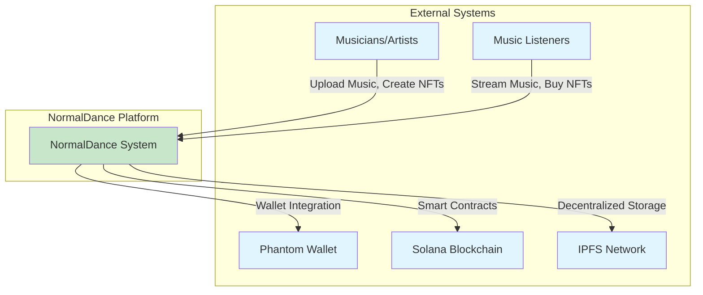
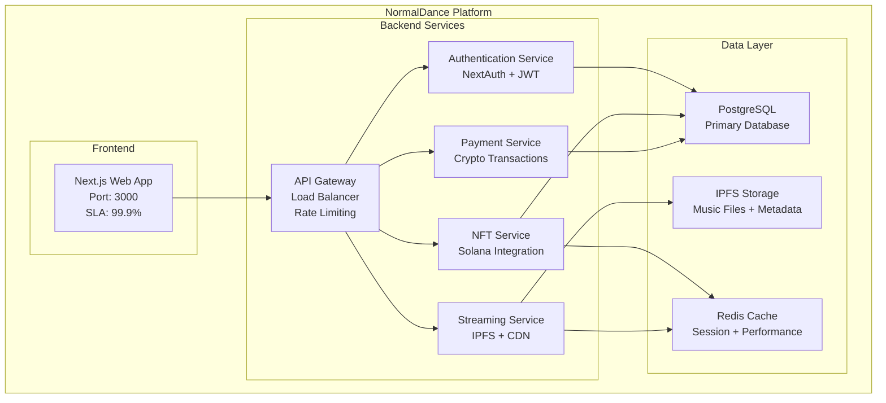
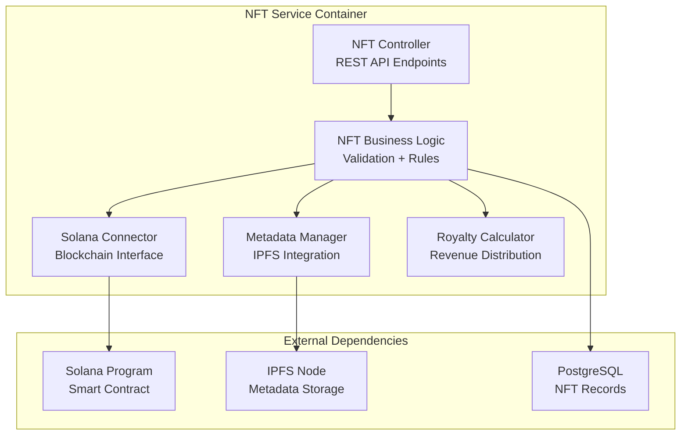
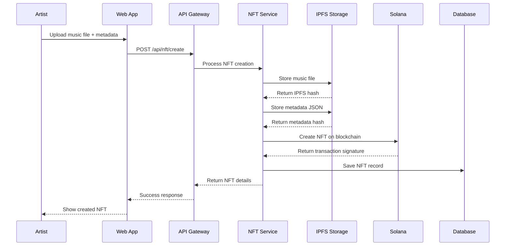
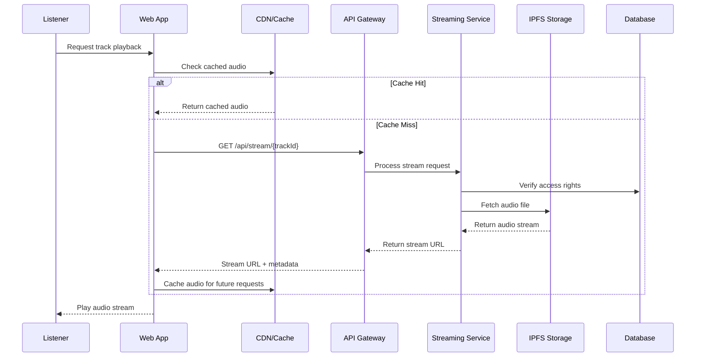
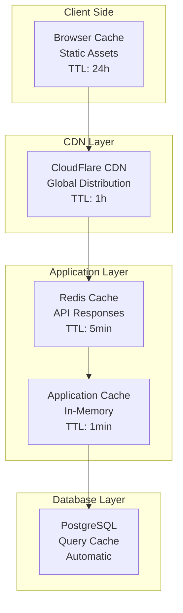
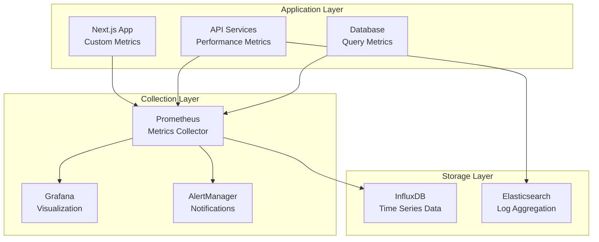
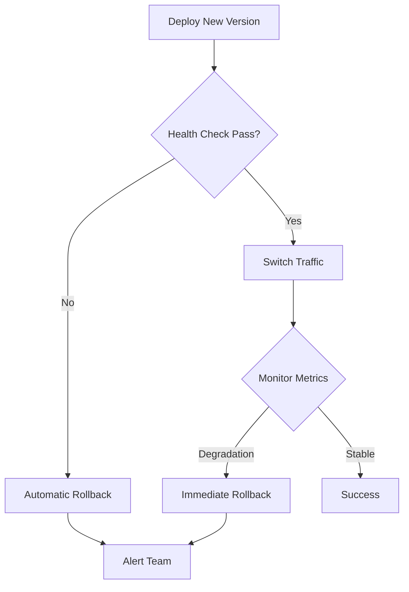
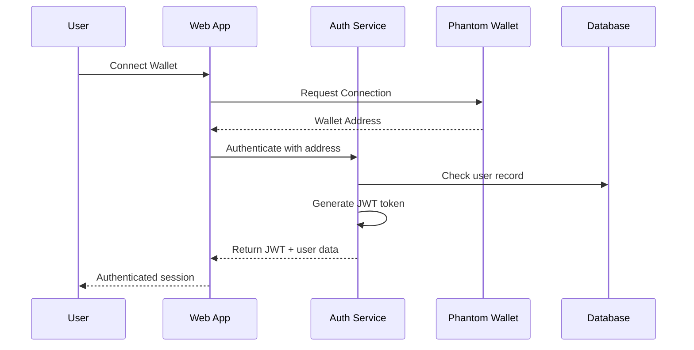

# NormalDance: Архитектурные диаграммы и схемы

## C4 Architecture Model

### Level 1: System Context


### Level 2: Container Diagram


### Level 3: Component Diagram - NFT Service


## Data Flow Architecture

### Music Upload & NFT Creation Flow


### Music Streaming Flow


## Network Architecture

### Docker Network Topology
```
┌─────────────────────────────────────────────────────────────┐
│                    Docker Host Network                      │
├─────────────────────────────────────────────────────────────┤
│                                                             │
│  ┌─────────────────┐    ┌─────────────────┐                │
│  │   Frontend      │    │   Reverse       │                │
│  │   Network       │    │   Proxy         │                │
│  │   172.25.1.0/24 │────│   nginx         │                │
│  │                 │    │   Port: 80,443  │                │
│  └─────────────────┘    └─────────────────┘                │
│           │                       │                        │
│  ┌─────────────────┐    ┌─────────────────┐                │
│  │   Backend       │    │   Cache         │                │
│  │   Network       │    │   Network       │                │
│  │   172.25.2.0/24 │────│   172.25.4.0/24 │                │
│  │                 │    │   Redis Cluster │                │
│  └─────────────────┘    └─────────────────┘                │
│           │                                                 │
│  ┌─────────────────┐                                       │
│  │   Database      │                                       │
│  │   Network       │                                       │
│  │   172.25.3.0/24 │                                       │
│  │   PostgreSQL    │                                       │
│  └─────────────────┘                                       │
│                                                             │
└─────────────────────────────────────────────────────────────┘
```

### Security Zones
```
Internet
    │
    ▼
┌─────────────────┐
│   DMZ Zone      │  ← Reverse Proxy, Load Balancer
│   Public Access │
└─────────────────┘
    │
    ▼
┌─────────────────┐
│ Application     │  ← Web App, API Services
│ Zone            │
└─────────────────┘
    │
    ▼
┌─────────────────┐
│ Data Zone       │  ← Database, Cache, Storage
│ Restricted      │
└─────────────────┘
```

## Performance Architecture

### Caching Strategy


### Load Balancing Strategy
```
                    ┌─────────────────┐
                    │   Load Balancer │
                    │   nginx/HAProxy │
                    └─────────────────┘
                            │
            ┌───────────────┼───────────────┐
            │               │               │
    ┌───────▼────┐  ┌───────▼────┐  ┌───────▼────┐
    │ App Node 1 │  │ App Node 2 │  │ App Node 3 │
    │ CPU: 70%   │  │ CPU: 65%   │  │ CPU: 72%   │
    │ RAM: 80%   │  │ RAM: 75%   │  │ RAM: 78%   │
    └────────────┘  └────────────┘  └────────────┘
            │               │               │
            └───────────────┼───────────────┘
                            │
                    ┌───────▼────┐
                    │ PostgreSQL │
                    │ Master/Slave│
                    └────────────┘
```

## Monitoring & Observability

### Metrics Collection Architecture


### Health Check Architecture
```yaml
# Health Check Endpoints
/api/health/live     # Liveness probe
/api/health/ready    # Readiness probe
/api/health/metrics  # Prometheus metrics

# Service Dependencies Check
services:
  - name: postgresql
    endpoint: tcp://postgres:5432
    timeout: 5s
  - name: redis
    endpoint: tcp://redis:6379
    timeout: 3s
  - name: ipfs
    endpoint: http://ipfs:5001/api/v0/version
    timeout: 10s
```

## Deployment Architecture

### Blue/Green Deployment
```
Production Traffic (100%)
         │
    ┌────▼────┐
    │ Router  │
    └────┬────┘
         │
    ┌────▼────┐     ┌─────────┐
    │ Blue    │     │ Green   │
    │ v1.2.3  │     │ v1.2.4  │ ← New version
    │ Active  │     │ Standby │
    └─────────┘     └─────────┘

# Deployment Process:
1. Deploy v1.2.4 to Green environment
2. Run health checks on Green
3. Switch router to Green (0 downtime)
4. Blue becomes new standby
```

### Rollback Strategy


## Security Architecture

### Authentication Flow


### Data Encryption
```
┌─────────────────────────────────────────────────────────┐
│                 Encryption Layers                       │
├─────────────────────────────────────────────────────────┤
│ Transport Layer: TLS 1.3 (HTTPS)                      │
│ Application Layer: JWT tokens (RS256)                  │
│ Database Layer: AES-256 encryption at rest            │
│ Storage Layer: IPFS content addressing (SHA-256)       │
│ Wallet Layer: Ed25519 signatures (Solana)             │
└─────────────────────────────────────────────────────────┘
```