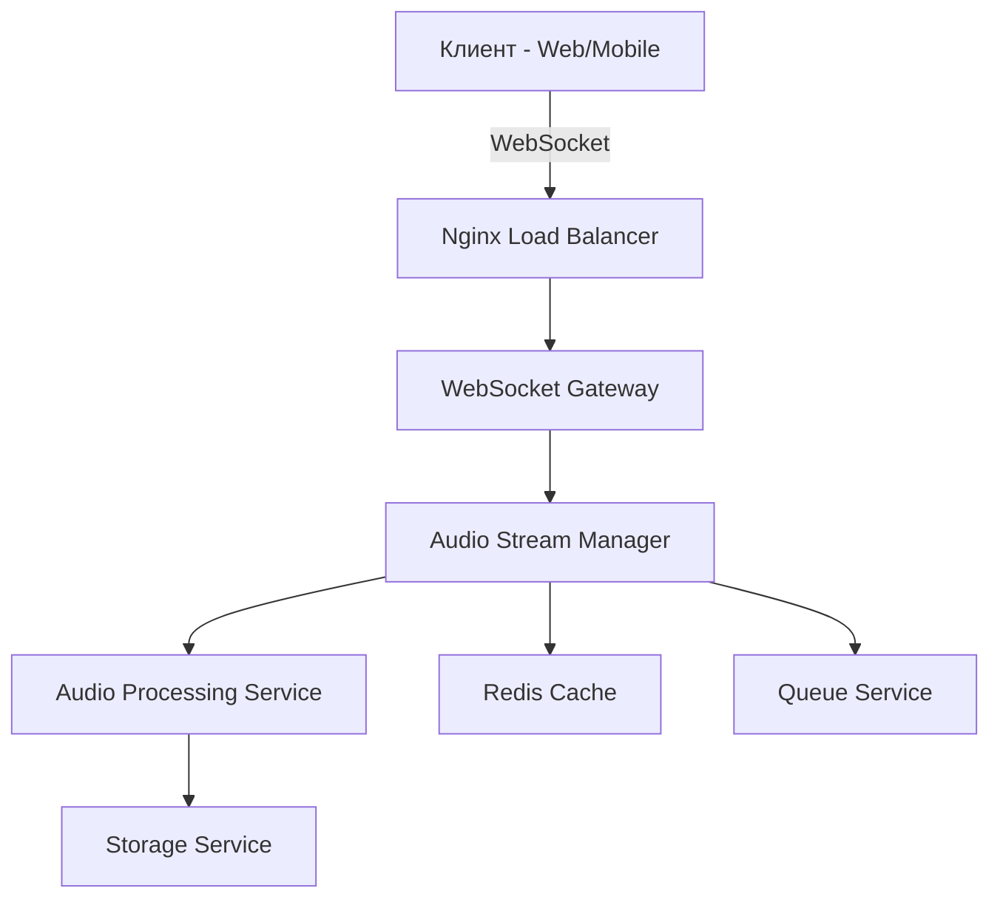

# Архитектура аудио-стриминга для музыкальной платформы

## Требования к системе

### Функциональные требования
- **Реал-тайм стриминг**: минимальная задержка < 100ms
- **Поддержка форматов**: MP3, AAC, OGG, FLAC
- **Адаптивный битрейт**: 128kbps, 192kbps, 320kbps
- **WebSocket соединения**: для управления воспроизведением
- **Очереди треков**: предзагрузка следующего трека
- **Синхронизация**: между устройствами пользователя

### Технические требования
- **Пропускная способность**: до 10,000 одновременных потоков
- **Горизонтальное масштабирование**: через Kubernetes
- **Кеширование**: Redis для метаданных, CDN для статики
- **Мониторинг**: метрики задержки, качества, ошибок

## Архитектура WebSocket

### Компоненты системы



### WebSocket Gateway
- **Протокол**: Socket.IO для fallback на HTTP polling
- **Аутентификация**: JWT токены через cookies
- **Комнаты**: по userId для мульти-устройственной синхронизации
- **События**:
  - `play_track`
  - `pause_track`
  - `seek_position`
  - `volume_change`
  - `quality_change`

### Audio Stream Manager
- **Формат сообщений**: Protocol Buffers
- **Буферизация**: 3-секундный буфер на клиенте
- **Предзагрузка**: следующий трек грузится за 10 сек до конца
- **Адаптивность**: переключение качества по сети

## Настройки Nginx для аудио-стриминга

```nginx
# /etc/nginx/sites-available/audio-streaming
server {
    listen 443 ssl http2;
    server_name stream.dnb1st.ru;
    
    ssl_certificate /etc/ssl/certs/stream.dnb1st.ru.crt;
    ssl_certificate_key /etc/ssl/private/stream.dnb1st.ru.key;
    
    # WebSocket proxy
    location /socket.io/ {
        proxy_pass http://localhost:3001;
        proxy_http_version 1.1;
        proxy_set_header Upgrade $http_upgrade;
        proxy_set_header Connection "upgrade";
        proxy_set_header Host $host;
        proxy_set_header X-Real-IP $remote_addr;
        proxy_set_header X-Forwarded-For $proxy_add_x_forwarded_for;
        proxy_set_header X-Forwarded-Proto $scheme;
        
        # Audio streaming optimizations
        proxy_buffering off;
        proxy_cache off;
        proxy_read_timeout 86400;
        proxy_send_timeout 86400;
        proxy_cache_bypass $http_upgrade;
    }
    
    # Audio file serving
    location /audio/ {
        proxy_pass http://localhost:3002;
        proxy_buffering off;
        proxy_cache_valid 200 1d;
        proxy_cache_key $uri$is_args$args;
        add_header Cache-Control "public, max-age=86400";
    }
}
```

## Серверная реализация

### Audio Processing Service (Node.js)
```javascript
// services/audio-service/src/streamManager.js
class AudioStreamManager {
  constructor() {
    this.activeStreams = new Map();
    this.redis = new Redis(process.env.REDIS_URL);
    this.queue = new Bull('audio-processing', {
      redis: process.env.REDIS_URL
    });
  }

  async startStream(trackId, userId, quality = '192kbps') {
    const streamKey = `${userId}:${trackId}`;
    
    // Проверка кеша
    const cachedStream = await this.redis.get(`stream:${streamKey}`);
    if (cachedStream) {
      return JSON.parse(cachedStream);
    }

    // Создание нового потока
    const stream = {
      id: streamKey,
      trackId,
      quality,
      startTime: Date.now(),
      position: 0,
      listeners: new Set()
    };

    this.activeStreams.set(streamKey, stream);
    
    // Кеширование на 1 час
    await this.redis.setex(`stream:${streamKey}`, 3600, JSON.stringify(stream));
    
    return stream;
  }

  async handleWebSocketEvents(socket) {
    socket.on('play_track', async (data) => {
      const { trackId, quality } = data;
      const userId = socket.user.id;
      
      const stream = await this.startStream(trackId, userId, quality);
      socket.join(`stream:${userId}`);
      
      // Начать трансляцию
      this.transcodeAndStream(stream, socket);
    });

    socket.on('seek_position', async (data) => {
      const { position } = data;
      const streamKey = `${socket.user.id}:${socket.currentTrack}`;
      
      await this.redis.set(`seek:${streamKey}`, position);
      socket.to(`stream:${socket.user.id}`).emit('seek_update', { position });
    });
  }

  async transcodeAndStream(stream, socket) {
    const ffmpeg = spawn('ffmpeg', [
      '-i', `storage/tracks/${stream.trackId}.flac`,
      '-f', 'mp3',
      '-ab', stream.quality,
      '-ac', '2',
      '-ar', '44100',
      '-'
    ]);

    ffmpeg.stdout.on('data', (chunk) => {
      socket.emit('audio_chunk', {
        data: chunk.toString('base64'),
        timestamp: Date.now() - stream.startTime
      });
    });

    ffmpeg.stderr.on('data', (data) => {
      console.error(`FFmpeg error: ${data}`);
    });
  }
}
```

### WebSocket Gateway (Socket.IO)
```javascript
// services/gateway/src/index.js
const io = require('socket.io')(server, {
  cors: {
    origin: process.env.ALLOWED_ORIGINS.split(','),
    credentials: true
  },
  transports: ['websocket', 'polling']
});

io.use(async (socket, next) => {
  const token = socket.handshake.auth.token;
  if (!token) return next(new Error('Authentication error'));
  
  try {
    const decoded = jwt.verify(token, process.env.JWT_SECRET);
    socket.user = decoded;
    next();
  } catch (err) {
    next(new Error('Authentication error'));
  }
});

io.on('connection', (socket) => {
  console.log(`User ${socket.user.id} connected`);
  
  // Присоединение к комнате пользователя
  socket.join(`user:${socket.user.id}`);
  
  // Обработка событий аудио
  socket.on('audio_control', async (data) => {
    const { action, payload } = data;
    
    switch(action) {
      case 'play':
        await audioManager.playTrack(socket.user.id, payload);
        break;
      case 'pause':
        await audioManager.pauseTrack(socket.user.id);
        break;
      case 'seek':
        await audioManager.seekTrack(socket.user.id, payload.position);
        break;
    }
    
    // Синхронизация с другими устройствами
    socket.to(`user:${socket.user.id}`).emit('sync_state', {
      action,
      payload,
      timestamp: Date.now()
    });
  });
});
```

## Оптимизация качества звука

### Кодеки и форматы
- **MP3**: 128kbps (mobile), 192kbps (desktop), 320kbps (premium)
- **AAC**: 128kbps (эквивалент 192kbps MP3)
- **OGG**: 160kbps (open source альтернатива)
- **FLAC**: lossless для premium пользователей

### Адаптивный битрейт
```javascript
// services/audio-service/src/adaptiveBitrate.js
class AdaptiveBitrate {
  constructor() {
    this.qualityTiers = {
      'low': { bitrate: 128000, codec: 'mp3' },
      'medium': { bitrate: 192000, codec: 'aac' },
      'high': { bitrate: 320000, codec: 'mp3' },
      'lossless': { bitrate: 1411000, codec: 'flac' }
    };
  }

  async determineQuality(userId, networkStats) {
    const user = await User.findById(userId);
    const subscription = user.subscription;
    
    if (subscription === 'premium') {
      if (networkStats.bandwidth > 2000000) return 'lossless';
      if (networkStats.bandwidth > 500000) return 'high';
    }
    
    if (networkStats.bandwidth > 300000) return 'medium';
    return 'low';
  }

  async switchQuality(streamId, newQuality) {
    // Плавное переключение без разрыва потока
    const stream = this.activeStreams.get(streamId);
    if (!stream) return;
    
    stream.quality = newQuality;
    stream.needsTranscode = true;
    
    // Уведомить клиента
    io.to(streamId).emit('quality_change', { quality: newQuality });
  }
}
```

## Мониторинг и метрики

### Prometheus метрики
```javascript
// services/monitoring/src/metrics.js
const promClient = require('prom-client');

const activeStreams = new promClient.Gauge({
  name: 'audio_active_streams_total',
  help: 'Total number of active audio streams',
  labelNames: ['quality', 'codec']
});

const streamLatency = new promClient.Histogram({
  name: 'audio_stream_latency_seconds',
  help: 'Audio stream latency in seconds',
  buckets: [0.01, 0.05, 0.1, 0.2, 0.5, 1.0]
});

const audioQualitySwitches = new promClient.Counter({
  name: 'audio_quality_switches_total',
  help: 'Total number of quality switches',
  labelNames: ['from_quality', 'to_quality', 'reason']
});

// Middleware для сбора метрик
app.use((req, res, next) => {
  const start = Date.now();
  
  res.on('finish', () => {
    const duration = (Date.now() - start) / 1000;
    streamLatency.observe(duration);
  });
  
  next();
});
```

### Grafana дашборды
- **Stream Health**: активные потоки, ошибки, задержка
- **Network Performance**: пропускная способность, потери пакетов
- **User Experience**: качество воспроизведения, переключения качества
- **Resource Usage**: CPU, память, дисковое пространство

## Тестирование производительности

### Нагрузочное тестирование
```javascript
// tests/load/audio-streaming.js
import { io } from 'socket.io-client';
import { check } from 'k6';

export let options = {
  stages: [
    { duration: '2m', target: 100 },
    { duration: '5m', target: 100 },
    { duration: '2m', target: 200 },
    { duration: '5m', target: 200 },
    { duration: '2m', target: 300 },
    { duration: '5m', target: 300 },
    { duration: '2m', target: 0 },
  ],
};

export default function() {
  const socket = io('wss://stream.dnb1st.ru', {
    auth: {
      token: __ENV.AUTH_TOKEN
    }
  });

  socket.on('connect', () => {
    socket.emit('play_track', {
      trackId: 'test-track-123',
      quality: '192kbps'
    });
  });

  socket.on('audio_chunk', (data) => {
    check(data, {
      'chunk received': (chunk) => chunk.data.length > 0,
      'timestamp valid': (chunk) => chunk.timestamp >= 0
    });
  });

  // Держать соединение открытым
  sleep(30);
  socket.disconnect();
}
```

## Интеграция с существующей платформой

### API Endpoints
```javascript
// routes/audio-streaming.js
router.post('/api/v1/stream/start', authenticate, async (req, res) => {
  const { trackId, quality } = req.body;
  
  try {
    const stream = await audioService.startStream({
      trackId,
      userId: req.user.id,
      quality,
      deviceId: req.device.id
    });
    
    res.json({
      streamId: stream.id,
      websocketUrl: `wss://stream.dnb1st.ru/socket.io/`,
      authToken: generateStreamToken(req.user.id)
    });
  } catch (error) {
    res.status(500).json({ error: error.message });
  }
});

router.get('/api/v1/stream/status/:streamId', authenticate, async (req, res) => {
  const stream = await audioService.getStreamStatus(req.params.streamId);
  res.json(stream);
});
```

### Миграция данных
- **Треки**: конвертация в стриминг-форматы
- **Плейлисты**: обновление ссылок на аудио-файлы
- **Пользователи**: миграция предпочтений качества
- **История**: перенос данных прослушивания

## Безопасность

### Аутентификация
- JWT токены с коротким сроком жизни
- Refresh токены для долгосрочной сессии
- Rate limiting: 100 запросов в минуту на пользователя

### DRM и защита контента
- **Tokenized URLs**: временные ссылки на аудио
- **Watermarking**: аудио-водяные знаки для отслеживания
- **Geo-blocking**: ограничение по регионам
- **Device limits**: максимум 3 устройства на аккаунт

## Развертывание

### Docker Compose
```yaml
# docker-compose.audio.yml
version: '3.8'
services:
  audio-gateway:
    build: ./services/gateway
    ports:
      - "3001:3001"
    environment:
      - REDIS_URL=redis://redis:6379
      - JWT_SECRET=${JWT_SECRET}
    depends_on:
      - redis
      - postgres

  audio-processor:
    build: ./services/audio-processor
    volumes:
      - ./storage:/app/storage
    environment:
      - REDIS_URL=redis://redis:6379
      - FFMPEG_PATH=/usr/bin/ffmpeg
    depends_on:
      - redis

  redis:
    image: redis:7-alpine
    volumes:
      - redis_data:/data

  nginx:
    image: nginx:alpine
    ports:
      - "443:443"
    volumes:
      - ./nginx/audio-streaming.conf:/etc/nginx/conf.d/default.conf
      - ./ssl:/etc/ssl/certs
    depends_on:
      - audio-gateway

volumes:
  redis_data:
```

### Kubernetes манифесты
```yaml
# k8s/audio-streaming-deployment.yaml
apiVersion: apps/v1
kind: Deployment
metadata:
  name: audio-streaming
spec:
  replicas: 3
  selector:
    matchLabels:
      app: audio-streaming
  template:
    metadata:
      labels:
        app: audio-streaming
    spec:
      containers:
      - name: audio-gateway
        image: dnb1st/audio-gateway:latest
        ports:
        - containerPort: 3001
        env:
        - name: REDIS_URL
          valueFrom:
            secretKeyRef:
              name: audio-secrets
              key: redis-url
        resources:
          requests:
            memory: "256Mi"
            cpu: "250m"
          limits:
            memory: "512Mi"
            cpu: "500m"
```

## Резюме

Архитектура аудио-стриминга обеспечивает:
- ✅ Реал-тайм воспроизведение с минимальной задержкой
- ✅ Адаптивное качество под сеть пользователя
- ✅ Синхронизацию между устройствами
- ✅ Масштабируемость до 10,000+ одновременных потоков
- ✅ Полный мониторинг и observability
- ✅ Защиту контента и DRM

Следующий шаг - реализация серверной части и тестирование производительности.