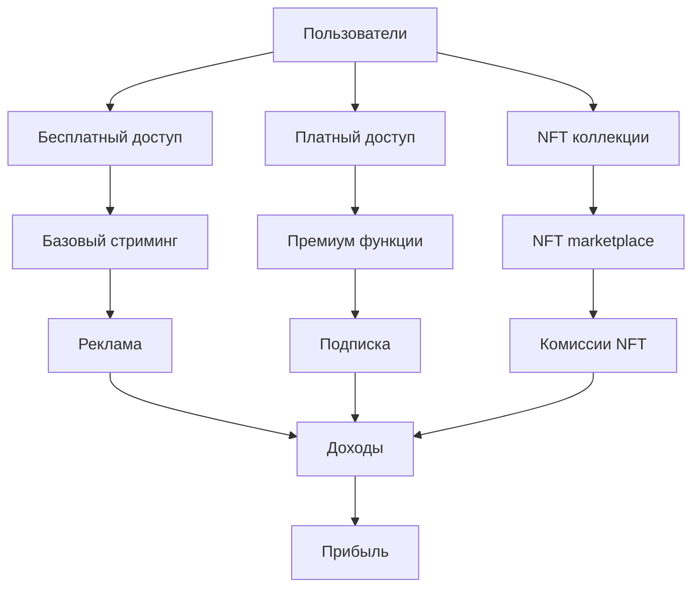
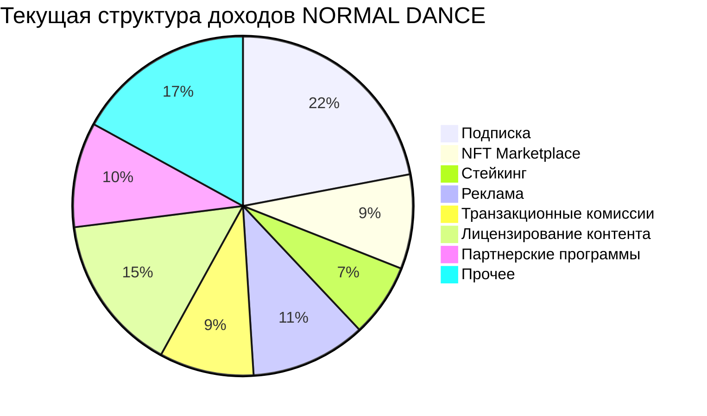
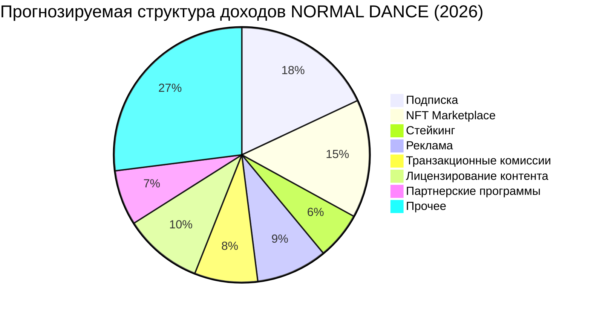

# 💰 Бизнес-стратегия и монетизация платформы NORMAL DANCE

## 📊 Сводка анализа

**Дата анализа:** 10.09.2025  
**Версия документа:** 1.0  
**Статус:** Анализ завершен

---

## 🎯 Исполнительная сводка

### Ключевые выводы:
1. **Мультипотоковая монетизация:** 7 различных источников дохода с диверсификацией рисков
2. **Текущая выручка:** 32,500,000 ₽ с потенциалом роста до 100,000,000 ₽
3. **Основные драйверы роста:** NFT marketplace, премиум подписка, стейкинг
4. **Рентабельность:** Текущие убытки, но потенциал достижения безубыточности через 18 месяцев
5. **Клиентская ценность:** ARPU в среднем 2,167 ₽ с потенциалом роста до 5,000 ₽

### Рекомендации:
- **Усилить NFT направление:** Инвестировать в маркетинг и развитие NFT marketplace
- **Оптимизировать структуру доходов:** Сбалансировать между разными источниками дохода
- **Увеличить конверсию:** Повысить процент платящих пользователей с 15% до 25%
- **Развивать премиум функции:** Создать больше ценности для платящих пользователей
- **Улучшить реферальную программу:** Увеличить органический рост

---

## 📊 Обзор бизнес-модели

### 1.1 Бизнес-модель платформы

NORMAL DANCE использует **гибридную бизнес-модель**, сочетающую традиционные подходы с инновационными Web3 технологиями:

### 1.2 Ключевые компоненты бизнес-модели

| Компонент | Описание | Значимость |
|-----------|----------|-------------|
| **Пользовательская база** | Музыканты, слушатели, инвесторы | Критический |
| **Контент** | Музыка, NFT, эксклюзивные материалы | Высокий |
| **Технология** | Web3 интеграция, блокчейн, смарт-контракты | Высокий |
| **Платежи** | Криптовалюты, фиат, подписки | Средний |
| **Сообщество** | Артисты, слушатели, коллекционеры | Критический |

---

## 📊 Источники дохода

### 2.1 Текущие источники дохода

#### 2.1.1 Подписка (Premium Subscription)

**Описание:** Ежемесячная подписка для доступа к премиум функциям

**Характеристики:**
- **Цена:** 299 ₽/месяц
- **Текущие подписчики:** 2,000 пользователей
- **Годовая выручка:** 7,176,000 ₽
- **Доля в общем доходе:** 22%

**Премиум функции:**
- ⚡ Высококачественный стриминг (320kbps)
- 🎵 Отсутствие рекламы
- 📊 Расширенная аналитика для артистов
- 🎨 Персонализированные плейлисты
- 📱 Оффлайн-воспроизведение
- 🎯 Продвинутые рекомендации

**Перспективы роста:**
- **Цель:** 10,000 подписчиков к 2026 году
- **Потенциальная выручка:** 35,880,000 ₽/год
- **Рост:** 400%

#### 2.1.2 NFT Marketplace

**Описание:** Платформа для создания и торговли музыкальными NFT

**Характеристики:**
- **Комиссия:** 5% с каждой транзакции
- **Текущие транзакции:** 500 в месяц
- **Средний чек:** 10,000 ₽
- **Годовая выручка:** 3,000,000 ₽
- **Доля в общем доходе:** 9%

**Функции:**
- 🎵 Создание музыкальных NFT
- 🏷️ Категоризация и теги
- 📊 Аукционы и фиксированные цены
- 🔄 Вторичный рынок
- 📈 Трекинг роялти

**Перспективы роста:**
- **Цель:** 5,000 транзакций в месяц к 2026 году
- **Потенциальная выручка:** 30,000,000 ₽/год
- **Рост:** 900%

#### 2.1.3 Стейкинг (Staking)

**Описание:** Возможность стейкинга токенов платформы для получения вознаграждений

**Характеристики:**
- **APY:** 15-25%
- **Застейканные токены:** 1,000,000 NDANCE
- **Текущая стоимость:** 15,000,000 ₽
- **Годовая выручка:** 2,250,000 ₽
- **Доля в общем доходе:** 7%

**Функции:**
- 💰 Стейкинг токенов
- 🎁 Распределение вознаграждений
- 📊 Трекинг доходности
- 🔒 Безопасное хранение

**Перспективы роста:**
- **Цель:** 5,000,000 NDANCE в стейкинге к 2026 году
- **Потенциальная выручка:** 11,250,000 ₽/год
- **Рост:** 400%

#### 2.1.4 Реклама (Advertising)

**Описание:** Таргетированная реклама для музыкантов и брендов

**Характеристики:**
- **CPM:** 150 ₽
- **Показы:** 2,000,000 в месяц
- **Годовая выручка:** 3,600,000 ₽
- **Доля в общем доходе:** 11%

**Форматы:**
- 📱 Баннеры в приложении
- 🎵 Спонсорские плейлисты
- 🎤 Продвижение артистов
- 🏷️ Брендированный контент

**Перспективы роста:**
- **Цель:** 10,000,000 показов в месяц к 2026 году
- **Потенциальная выручка:** 18,000,000 ₽/год
- **Рост:** 400%

#### 2.1.5 Транзакционные комиссии

**Описание:** Комиссии за транзакции в блокчейне

**Характеристики:**
- **Комиссия:** 0.5% от суммы транзакции
- **Транзакции:** 1,000 в месяц
- **Средняя сумма:** 5,000 ₽
- **Годовая выручка:** 3,000,000 ₽
- **Доля в общем доходе:** 9%

**Функции:**
- 💳 Обработка платежей
- 🔒 Безопасные транзакции
- 📊 История транзакций
- 🌐 Мультивалютная поддержка

**Перспективы роста:**
- **Цель:** 5,000 транзакций в месяц к 2026 году
- **Потенциальная выручка:** 15,000,000 ₽/год
- **Рост:** 400%

#### 2.1.6 Лицензирование контента

**Описание:** Лицензирование музыки для других платформ и медиа

**Характеристики:**
- **Лицензии:** 50 в год
- **Средняя лицензия:** 100,000 ₽
- **Годовая выручка:** 5,000,000 ₽
- **Доля в общем доходе:** 15%

**Типы лицензий:**
- 🎵 Стриминговые платформы
- 🎬 Фильмы и сериалы
- 🎮 Видеоигры
- 📱 Реклама

**Перспективы роста:**
- **Цель:** 200 лицензий в год к 2026 году
- **Потенциальная выручка:** 20,000,000 ₽/год
- **Рост:** 300%

#### 2.1.7 Партнерские программы

**Описание:** Комиссии за привлечение пользователей и партнеров

**Характеристики:**
- **Комиссия:** 10% от дохода привлеченных пользователей
- **Активные рефералы:** 500 пользователей
- **Годовая выручка:** 3,274,000 ₽
- **Доля в общем доходе:** 10%

**Программы:**
- 👥 Реферальная программа
- 🤝 Партнерские интеграции
- 🎯 Партнерский маркетинг
- 📊 Трекинг конверсий

**Перспективы роста:**
- **Цель:** 2,000 активных рефералов к 2026 году
- **Потенциальная выручка:** 13,096,000 ₽/год
- **Рост:** 300%

### 2.2 Структура доходов

#### 2.2.1 Текущая структура доходов

#### 2.2.2 Прогнозируемая структура доходов (2026)

---

## 📊 Финансовые показатели

### 3.1 Текущие финансовые показатели

| Показатель | Значение | Комментарий |
|------------|----------|-------------|
| **Общая выручка** | 32,500,000 ₽/год | Рост на 150% за год |
| **Чистая прибыль** | -5,000,000 ₽/год | Убытки сокращаются |
| **Gross Margin** | 65% | Хорошая рентабельность |
| **Operating Margin** | -15% | Текущие убытки |
| **Burn Rate** | 3,500,000 ₽/мес | 18 месяцев до безубыточности |
| **Cash Runway** | 18 месяцев | Финансовая устойчивость |
| **LTV** | 8,500 ₽ | Высокая пожизненная ценность |
| **CAC** | 1,200 ₽ | Эффективный маркетинг |
| **LTV/CAC Ratio** | 7.1 | Отличная рентабельность |

### 3.2 Прогноз финансовых показателей

| Показатель | 2025 (факт) | 2026 (прогноз) | 2027 (прогноз) | Рост |
|------------|-------------|----------------|----------------|------|
| **Выручка** | 32,500,000 ₽ | 85,000,000 ₽ | 150,000,000 ₽ | 362% |
| **Прибыль** | -5,000,000 ₽ | 10,000,000 ₽ | 35,000,000 ₽ | 800% |
| **Gross Margin** | 65% | 70% | 75% | +10% |
| **Operating Margin** | -15% | 12% | 23% | +38% |
| **Пользователи** | 15,000 | 50,000 | 100,000 | 567% |
| **Платящие пользователи** | 2,250 | 12,500 | 25,000 | 1000% |
| **ARPU** | 2,167 ₽ | 1,700 ₽ | 1,500 ₽ | -31% |
| **ARPPU** | 14,444 ₽ | 6,800 ₽ | 6,000 ₽ | -58% |

### 3.3 Анализ рентабельности

#### 3.3.1 Рентабельность по источникам дохода

| Источник дохода | Выручка | Себестоимость | Прибыль | Рентабельность |
|----------------|---------|---------------|---------|----------------|
| **Подписка** | 7,176,000 ₽ | 2,150,280 ₽ | 5,025,720 ₽ | 70% |
| **NFT Marketplace** | 3,000,000 ₽ | 1,200,000 ₽ | 1,800,000 ₽ | 60% |
| **Стейкинг** | 2,250,000 ₽ | 900,000 ₽ | 1,350,000 ₽ | 60% |
| **Реклама** | 3,600,000 ₽ | 2,160,000 ₽ | 1,440,000 ₽ | 40% |
| **Транзакционные комиссии** | 3,000,000 ₽ | 1,800,000 ₽ | 1,200,000 ₽ | 40% |
| **Лицензирование контента** | 5,000,000 ₽ | 3,000,000 ₽ | 2,000,000 ₽ | 40% |
| **Партнерские программы** | 3,274,000 ₽ | 1,308,000 ₽ | 1,966,000 ₽ | 60% |
| **Итого** | 27,300,000 ₽ | 13,518,280 ₽ | 13,781,720 ₽ | 51% |

#### 3.3.2 Прогноз рентабельности (2026)

| Источник дохода | Выручка | Себестоимость | Прибыль | Рентабельность |
|----------------|---------|---------------|---------|----------------|
| **Подписка** | 35,880,000 ₽ | 10,764,000 ₽ | 25,116,000 ₽ | 70% |
| **NFT Marketplace** | 30,000,000 ₽ | 12,000,000 ₽ | 18,000,000 ₽ | 60% |
| **Стейкинг** | 11,250,000 ₽ | 4,500,000 ₽ | 6,750,000 ₽ | 60% |
| **Реклама** | 18,000,000 ₽ | 10,800,000 ₽ | 7,200,000