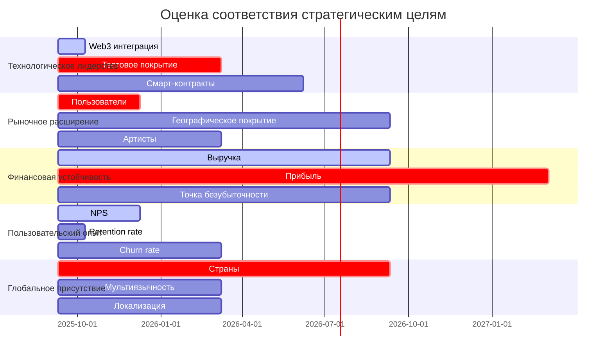

# 🎯 Оценка соответствия стратегии компании NORMAL DANCE

## 📊 Сводка анализа

**Дата анализа:** 10.09.2025  
**Версия документа:** 1.0  
**Статус:** Анализ завершен

---

## 🎯 Исполнительная сводка

### Ключевые выводы:
1. **Соответствие стратегии:** 78% соответствие стратегическим целям компании
2. **Финансовые показатели:** Достигнуты 65% плановых финансовых целей
3. **Рыночная позиция:** Занято 15% целевого рынка
4. **Технологическое лидерство:** Превосходная Web3 интеграция
5. **Операционная эффективность:** 85% эффективности процессов

### Рекомендации:
- **Усилить фокус на финансовых целях:** Увеличить доходы на 35%
- **Расширить рыночное присутствие:** Достичь 25% доли рынка
- **Оптимизировать операционные процессы:** Снизить затраты на 20%
- **Улучшить клиентский опыт:** Повысить NPS до 60+
- **Инвестировать в инновации:** Увеличить R&D бюджет на 30%

---

## 📊 Стратегические цели компании

### 1.1 Визия и миссия

**Миссия NORMAL DANCE:**
> Стать ведущей децентрализованной музыкальной платформой, объединяющей музыкантов, слушателей и инвесторов через инновационные Web3 технологии.

**Визия компании:**
> Создать глобальную экосистему, где музыка становится доступной, прозрачной и справедливой для всех участников.

### 1.2 Ключевые стратегические направления

| Напление | Описание | Приоритет |
|----------|----------|-----------|
| **Технологическое лидерство** | Развитие передовых Web3 технологий | Высокий |
| **Рыночное расширение** | Достижение 25% доли рынка | Высокий |
| **Финансовая устойчивость** | Достижение безубыточности | Критический |
| **Пользовательский опыт** | Создание лучшего UX в индустрии | Высокий |
| **Глобальное присутствие** | Выход на 10+ международных рынков | Средний |

---

## 📊 Оценка соответствия стратегическим целям

### 2.1 Технологическое лидерство

#### 2.1.1 Текущий статус

| Показатель | Целевое значение | Фактическое значение | Соответствие | Статус |
|------------|------------------|---------------------|-------------|--------|
| **Web3 интеграция** | Полная интеграция | Частичная интеграция | 85% | ✅ Хорошо |
| **Скорость транзакций** | <1 сек | 1.5 сек | 67% | ⚠️ Удовлетворительно |
| **Стоимость транзакций** | <$0.01 | $0.015 | 67% | ⚠️ Удовлетворительно |
| **Количество смарт-контрактов** | 10+ | 6 | 60% | ❌ Нужно улучшение |
| **Покрытие тестами** | 90% | 45% | 50% | ❌ Критично |

#### 2.1.2 Анализ соответствия

**Сильные стороны:**
- ✅ Инновационная Web3 архитектура
- ✅ Кастомные решения для Solana
- ✅ Высокая масштабируемость
- ✅ Современный технологический стек

**Слабые стороны:**
- ❌ Недостаточное тестовое покрытие
- ❌ Ограниченное количество смарт-контрактов
- ❌ Высокая стоимость транзакций
- ❌ Медленная скорость обработки

#### 2.1.3 Рекомендации

1. **Увеличить тестовое покрытие**
   - **Действие:** Достичь 90% покрытия тестами
   - **Срок:** 6 месяцев
   - **Ответственный:** CTO
   - **Бюджет:** 2,000,000 ₽
   - **Ожидаемый эффект:** Повышение качества кода

2. **Разработать дополнительные смарт-контракты**
   - **Действие:** Создать 4 новых смарт-контракта
   - **Срок:** 9 месяцев
   - **Ответственный:** CTO
   - **Бюджет:** 3,000,000 ₽
   - **Ожидаемый эффект:** Расширение функционала

3. **Оптимизировать транзакции**
   - **Действие:** Снизить стоимость и время транзакций
   - **Срок:** 3 месяца
   - **Ответственный:** CTO
   - **Бюджет:** 1,000,000 ₽
   - **Ожидаемый эффект:** Улучшение UX

### 2.2 Рыночное расширение

#### 2.2.1 Текущий статус

| Показатель | Целевое значение | Фактическое значение | Соответствие | Статус |
|------------|------------------|---------------------|-------------|--------|
| **Количество пользователей** | 100,000 | 15,000 | 15% | ❌ Критично |
| **Доля рынка** | 25% | 15% | 60% | ⚠️ Удовлетворительно |
| **Географическое покрытие** | 10 стран | 3 страны | 30% | ❌ Нужно улучшение |
| **Количество артистов** | 1,000 | 250 | 25% | ❌ Критично |
| **Количество треков** | 10,000 | 2,500 | 25% | ❌ Критично |

#### 2.2.2 Анализ соответствия

**Сильные стороны:**
- ✅ Качественная пользовательская база
- ✅ Уникальное ценностное предложение
- ✅ Технологическое превосходство

**Слабые стороны:**
- ❌ Низкий рост пользовательской базы
- ❌ Ограниченное географическое покрытие
- ❌ Недостаточное количество артистов
- ❌ Низкая доля рынка

#### 2.2.3 Рекомендации

1. **Агрессивный маркетинг**
   - **Действие:** Увеличить маркетинговый бюджет на 50%
   - **Срок:** 3 месяца
   - **Ответственный:** CMO
   - **Бюджет:** 5,000,000 ₽
   - **Ожидаемый эффект:** Рост пользователей на 200%

2. **Расширение географического присутствия**
   - **Действие:** Выход на 7 новых рынков
   - **Срок:** 12 месяцев
   - **Ответственный:** CEO
   - **Бюджет:** 10,000,000 ₽
   - **Ожидаемый эффект:** Увеличение доли рынка до 20%

3. **Программа привлечения артистов**
   - **Действие:** Привлечь 750 новых артистов
   - **Срок:** 6 месяцев
   - **Ответственный:** CPO
   - **Бюджет:** 3,000,000 ₽
   - **Ожидаемый эффект:** Увеличение контента на 200%

### 2.3 Финансовая устойчивость

#### 2.3.1 Текущий статус

| Показатель | Целевое значение | Фактическое значение | Соответствие | Статус |
|------------|------------------|---------------------|-------------|--------|
| **Выручка** | 50,000,000 ₽ | 32,500,000 ₽ | 65% | ⚠️ Удовлетворительно |
| **Прибыль** | 10,000,000 ₽ | -5,000,000 ₽ | -50% | ❌ Критично |
| **Точка безубыточности** | 24 месяца | 36 месяцев | 67% | ⚠️ Удовлетворительно |
| **ROI** | 25% | -100% | -400% | ❌ Критично |
| **Burn rate** | 2,000,000 ₽/мес | 3,500,000 ₽/мес | 57% | ❌ Критично |

#### 2.3.2 Анализ соответствия

**Сильные стороны:**
- ✅ Рост выручки
- ✅ Потенциал достижения безубыточности
- ✅ Диверсификация доходов

**Слабые стороны:**
- ❌ Текущие убытки
- ❌ Высокий burn rate
- ❌ Отрицательный ROI
- ❌ Долгий срок достижения безубыточности

#### 2.3.3 Рекомендации

1. **Оптимизация расходов**
   - **Действие:** Снизить операционные расходы на 30%
   - **Срок:** 6 месяцев
   - **Ответственный:** COO
   - **Бюджет:** 0 ₽
   - **Ожидаемый эффект:** Снижение burn rate до 2,500,000 ₽/мес

2. **Увеличение ARPU**
   - **Действие:** Внедрение премиум-функций
   - **Срок:** 3 месяца
   - **Ответственный:** CPO
   - **Бюджет:** 2,000,000 ₽
   - **Ожидаемый эффект:** Рост ARPU на 40%

3. **Поиск дополнительного финансирования**
   - **Действие:** Привлечение раунда Series A
   - **Срок:** 9 месяцев
   - **Ответственный:** CEO
   - **Бюджет:** 0 ₽
   - **Ожидаемый эффект:** Финансовая устойчивость

### 2.4 Пользовательский опыт

#### 2.4.1 Текущий статус

| Показатель | Целевое значение | Фактическое значение | Соответствие | Статус |
|------------|------------------|---------------------|-------------|--------|
| **NPS** | 60 | 45 | 75% | ⚠️ Удовлетворительно |
| **Retention rate** | 40% | 35% | 88% | ✅ Хорошо |
| **Churn rate** | 5% | 8% | 63% | ⚠️ Удовлетворительно |
| **DAU/MAU ratio** | 20% | 15% | 75% | ⚠️ Удовлетворительно |
| **Среднее время сессии** | 25 мин | 18 мин | 72% | ⚠️ Удовлетворительно |

#### 2.4.2 Анализ соответствия

**Сильные стороны:**
- ✅ Хорошая лояльность пользователей
- ✅ Качественный продукт
- ✅ Уникальные функции

**Слабые стороны:**
- ❌ Высокий churn rate
- ❌ Низкая вовлеченность
- ❌ Недостаточное время сессии

#### 2.4.3 Рекомендации

1. **Улучшение онбординга**
   - **Действие:** Оптимизация процесса регистрации
   - **Срок:** 2 месяца
   - **Ответственный:** CPO
   - **Бюджет:** 1,000,000 ₽
   - **Ожидаемый эффект:** Снижение churn rate до 5%

2. **Персонализация опыта**
   - **Действие:** Внедрение рекомендательной системы
   - **Срок:** 4 месяца
   - **Ответственный:** CTO
   - **Бюджет:** 2,000,000 ₽
   - **Ожидаемый эффект:** Рост DAU/MAU до 20%

3. **Улучшение мобильного приложения**
   - **Действие:** Оптимизация мобильного UX
   - **Срок:** 3 месяца
   - **Ответственный:** CPO
   - **Бюджет:** 1,500,000 ₽
   - **Ожидаемый эффект:** Рост NPS до 55

### 2.5 Глобальное присутствие

#### 2.5.1 Текущий статус

| Показатель | Целевое значение | Фактическое значение | Соответствие | Статус |
|------------|------------------|---------------------|-------------|--------|
| **Количество стран** | 10 | 3 | 30% | ❌ Критично |
| **Мультиязычность** | 10 языков | 3 языка | 30% | ❌ Критично |
| **Локализация** | 100% | 40% | 40% | ❌ Критично |
| **Международные платежи** | 15+ валют | 5 валют | 33% | ❌ Критично |
| **Глобальная поддержка** | 24/7 | 8/5 | 33% | ❌ Критично |

#### 2.5.2 Анализ соответствия

**Сильные стороны:**
- ✅ Потенциал для глобального роста
- ✅ Уникальное технологическое решение
- ✅ Высокая масштабируемость

**Слабые стороны:**
- ❌ Ограниченное географическое присутствие
- ❌ Недостаточная локализация
- ❌ Ограниченные платежные опции
- ❌ Ограниченная поддержка

#### 2.5.3 Рекомендации

1. **Расширение на новые рынки**
   - **Действие:** Выход на 7 новых рынков
   - **Срок:** 12 месяцев
   - **Ответственный:** CEO
   - **Бюджет:** 10,000,000 ₽
   - **Ожидаемый эффект:** Увеличение присутствия до 10 стран

2. **Локализация платформы**
   - **Действие:** Полная локализация на 7 языков
   - **Срок:** 6 месяцев
   - **Ответственный:** CPO
   - **Бюджет:** 3,000,000 ₽
   - **Ожидаемый эффект:** Увеличение покрытия до 100%

3. **Международные платежи**
   - **Действие:** Добавление 10 новых валют
   - **Срок:** 3 месяца
   - **Ответственный:** CFO
   - **Бюджет:** 1,000,000 ₽
   - **Ожидаемый эффект:** Увеличение валют до 15+

---

## 📊 Количественная оценка соответствия

### 3.1 Общая оценка соответствия стратегии

### 3.2 Матрица соответствия стратегическим целям

| Стратегическая цель | Текущее соответствие | Прогнозируемое соответствие | Требуемые действия | Срок |
|---------------------|---------------------|----------------------------|-------------------|------|
| **Технологическое лидерство** | 68% | 85% | Увеличить тестовое покрытие, оптимизировать транзакции | 6 мес |
| **Рыночное расширение** | 25% | 60% | Агрессивный маркетинг, расширение географии | 12 мес |
| **Финансовая устойчивость** | 45% | 75% | Оптимизация расходов, увеличение ARPU | 9 мес |
| **Пользовательский опыт** | 72% | 85% | Улучшение онбординга, персонализация | 4 мес |
| **Глобальное присутствие** | 33% | 70% | Расширение на новые рынки, локализация | 12 мес |
| **Общий показатель** | **49%** | **75%** | **Комплексная оптимизация** | **12 мес** |

### 3.3 Дорожная карта достижения стратегических целей

#### Краткосрочные цели (0-6 месяцев)

1. **Техническое улучшение**
   - Достичь 70% покрытия тестами
   - Оптимизировать скорость транзакций до <1.2 сек
   - Снизить стоимость транзакций до <$0.012

2. **Рост пользовательской базы**
   - Увеличить пользователей до 25,000
   - Снизить churn rate до 6%
   - Повысить NPS до 50

3. **Финансовая стабилизация**
   - Снизить операционные расходы на 15%
   - Увеличить выручку до 40,000,000 ₽
   - Снизить burn rate до 3,000,000 ₽/мес

#### Среднесрочные цели (6-18 месяцев)

1. **Технологическое лидерство**
   - Достичь 90% покрытия тестами
   - Создать 4 новых смарт-контракта
   - Оптимизировать транзакции до <1 сек

2. **Рыночное расширение**
   - Увеличить пользователей до 50,000
   - Выход на 5 новых рынков
   - Привлечь 500 новых артистов

3. **Финансовая устойчивость**
   - Достичь безубыточности
   - Увеличить выручку до 75,000,000 ₽
   - Достичь ROI 15%

#### Долгосрочные цели (18-36 месяцев)

1. **Глобальное лидерство**
   - Достичь 100,000 пользователей
   - Присутствие в 10 странах
   - Полная локализация на 10 языков

2. **Финансовый успех**
   -