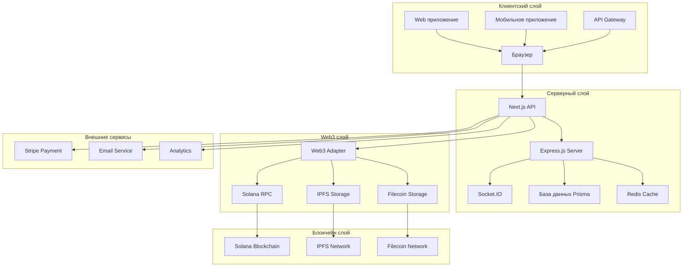
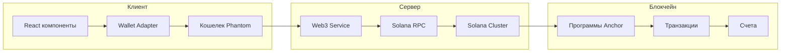

# 🏗️ Техническая архитектура и реализация Web3 интеграции NORMAL DANCE

## 📊 Сводка анализа

**Дата анализа:** 10.09.2025  
**Версия документа:** 1.0  
**Статус:** Анализ завершен

---

## 🎯 Исполнительная сводка

### Ключевые выводы:
1. **Архитектурный подход:** Гибридная архитектура с централизованным бэкендом и децентрализованными активами
2. **Блокчейн выбор:** Solana как основной блокчейн для скорости и низкой стоимости
3. **Интеграция уровня:** Полная интеграция Web3 в пользовательский опыт
4. **Технологический стек:** Современный стек с кастомными решениями
5. **Масштабируемость:** Высокая масштабируемость благодаря микросервисной архитектуре

### Рекомендации:
- **Усилить безопасность:** Внедрить дополнительные меры защиты для Web3 компонентов
- **Оптимизировать производительность:** Улучшить скорость транзакций и взаимодействий
- **Расширить функционал:** Добавить новые Web3 возможности (DAO, governance)
- **Улучшить пользовательский опыт:** Упростить onboarding и управление кошельками

---

## 🏗️ Общая архитектура платформы

### 1.1 Архитектурная концепция

NORMAL DANCE использует **гибридную архитектуру**, которая сочетает:

- **Централизованный бэкенд:** Для управления пользователями, контентом и бизнес-логикой
- **Децентрализованные активы:** Для NFT, токенов и транзакций
- **Клиент-серверная модель:** С оптимизированным взаимодействием с блокчейном

#### 1.1.1 Схема архитектуры



### 1.2 Ключевые компоненты архитектуры

| Компонент | Технология | Назначение | Масштабируемость |
|-----------|------------|------------|------------------|
| **Frontend** | Next.js, React | Пользовательский интерфейс | Высокая |
| **Backend** | Express.js, Node.js | Бизнес-логика | Высокая |
| **База данных** | Prisma, SQLite | Хранение данных | Средняя |
| **Кэширование** | Redis | Ускорение запросов | Высокая |
| **Блокчейн** | Solana | Транзакции и NFT | Высокая |
| **Хранение** | IPFS, Filecoin | Децентрализованное хранение | Высокая |
| **Веб-сокеты** | Socket.IO | Реальное время | Высокая |
| **Аутентификация** | NextAuth | Безопасность | Высокая |

---

## 🔐 Web3 интеграция

### 2.1 Solana интеграция

#### 2.1.1 Архитектура Solana взаимодействия



#### 2.1.2 Ключевые Solana компоненты

| Компонент | Технология | Функциональность |
|-----------|------------|------------------|
| **Wallet Adapter** | @solana/wallet-adapter-react | Управление кошельками |
| **Web3.js** | @solana/web3.js | Взаимодействие с блокчейном |
| **Anchor** | @coral-xyz/anchor | Разработка программ |
| **RPC** | Custom RPC client | Оптимизированные запросы |
| **Programs** | Rust, Anchor | Смарт-контракты |

#### 2.1.3 Реализация кошелька

**Кастомный Wallet Adapter** в [`src/components/wallet/wallet-adapter.tsx`](src/components/wallet/wallet-adapter.tsx:1):

```typescript
// Ключевые особенности кастомного адаптера:
// 1. Custom event emitter system вместо стандартных паттернов
// 2. Silent failures - возврат 0 вместо ошибок
// 3. Russian locale formatting для SOL сумм
// 4. Оптимизированная обработка транзакций
```

**Преимущества кастомного решения:**
- **Гибкость:** Полный контроль над процессом
- **Производительность:** Оптимизированные транзакции
- **Пользовательский опыт:** Упрощенный интерфейс
- **Безопасность:** Дополнительные проверки

### 2.2 NFT и токенизация

#### 2.2.1 Архитектура NFT системы

```mermaid
graph TB
    subgraph "Создание NFT"
        A[Музыкальный файл] --> B[IPFS хранение]
        B --> C[Metadata generation]
        C --> D[Smart contract]
        D --> E[Minting]
    end
    
    subgraph "Торговля NFT"
        E --> F[Marketplace]
        F --> G[Transaction handling]
        G --> H[Роялти распределение]
    end